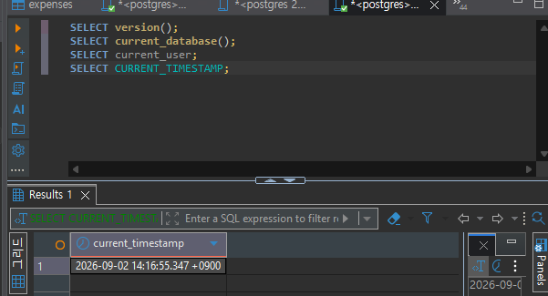
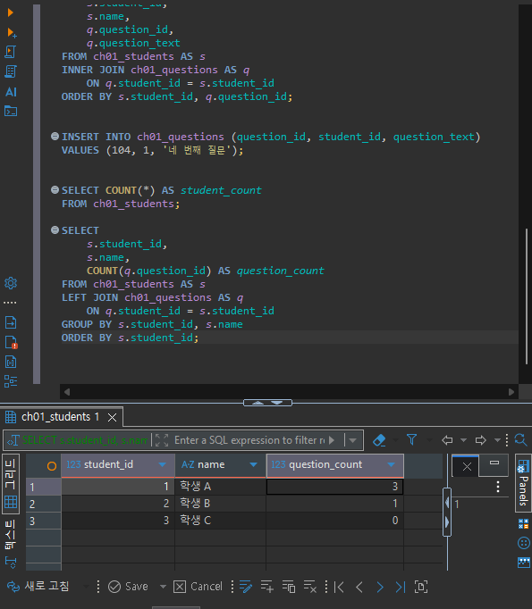
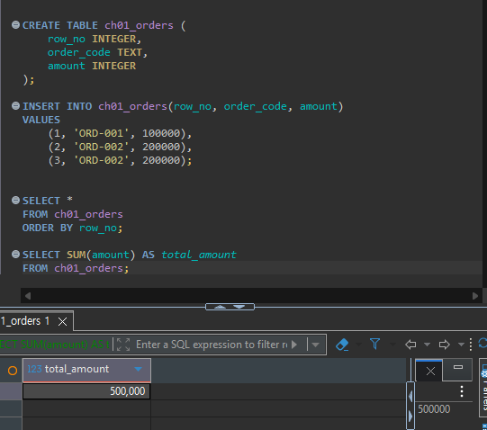
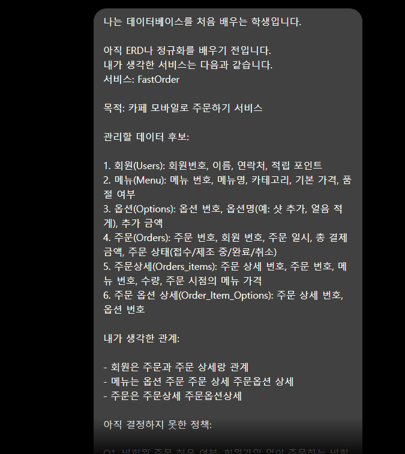
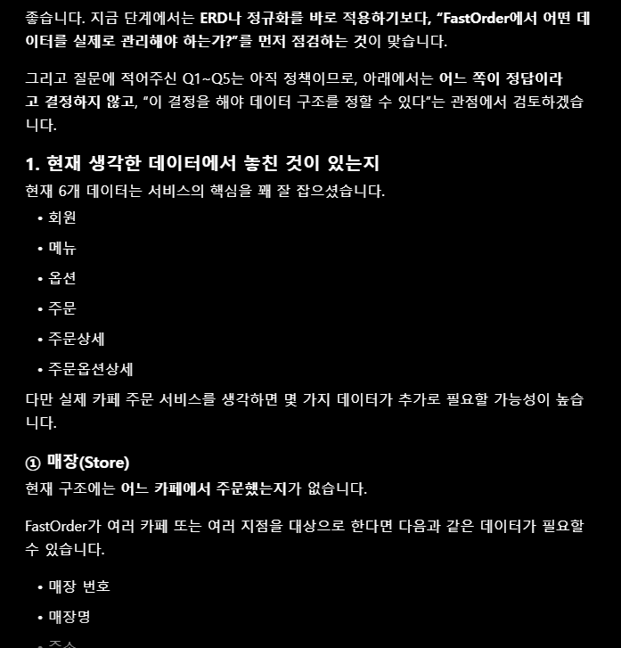
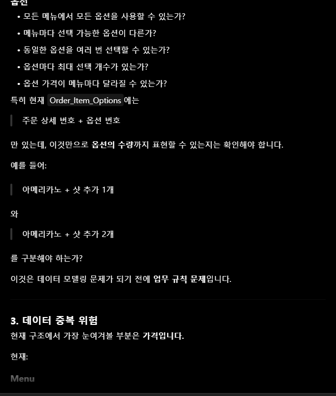

# Chapter 01 확장 실습 답안 템플릿

> **과제:** AI 시대에 데이터베이스를 왜 배워야 하는가  
> **사용 방법:** 이 파일을 내려받아 **본인의 GitHub 저장소**에 `chapter01_answer.md`라는 이름으로 저장한 뒤 답안을 작성합니다.  
> **제출 방법:** LMS에는 파일을 업로드하지 않고, **본인 GitHub 저장소의 `chapter01_answer.md` 파일 URL**을 제출합니다.

---

## 0. 학생 정보

| 항목 | 작성 내용 |
| --- | --- |
| 학번 |  |
| 이름 | 박진 |
| GitHub 계정 | jeanpark0115@naver.com  |
| 과제 작성일 | 2026.09.02 |
| 사용한 AI 도구 | Claude |

> 실제 비밀번호, API Key, 전체 DB 접속 URL, 개인정보는 이 파일이나 캡처 화면에 기록하지 않습니다.

---

# 1. PostgreSQL 실행 환경 확인

## 1-1. 실행한 SQL

```sql
SELECT version();
SELECT current_database();
SELECT current_user;
SELECT CURRENT_TIMESTAMP;
```

## 1-2. 실행 결과 기록

```text
PostgreSQL 버전: PostgreSQL 18.4 on x86_64-windows, compiled by msvc-19.44.35227, 64-bit
현재 데이터베이스: temp
현재 사용자: postgres
현재 시각: 2026-09-02 14:15:29.989 +0900
```

## 1-3. 내가 확인한 내용

1. SQL을 작성하는 프로그램과 PostgreSQL은 같은 프로그램인가요?

```text
나의 답: 네 같습니다.
```

2. `current_database()` 결과는 무엇을 의미하나요?

```text
나의 답:현재 DB 스키마를 보여줍니다. 
```

3. SQL이 실행되었다는 사실만으로 데이터 내용도 올바르다고 할 수 있나요?

```text
나의 답: 네 그렇게 생각합니다.
```

## 1-4. 증거 화면

아래 경로에 캡처 이미지를 저장하는 것을 권장합니다.

```text
assignments/chapter01/images/step01_environment.png
```

이미지를 저장했다면 아래 링크의 파일명을 실제 파일명에 맞게 수정합니다.

```markdown

```

**이미지 삽입 위치:**

<!-- 아래 줄의 주석을 지우고 실제 이미지 Markdown을 넣어도 됩니다. -->

`여기에 STEP 1 증거 화면을 삽입하세요.`

---

# 2. Chapter 01 핵심 내용 복습

교재 문장을 그대로 복사하지 말고 자신의 말로 작성합니다.

| 본문의 핵심 | 나의 설명 |
| --- | --- |
| AI가 SQL을 만들어도 DB를 배워야 한다 |  |
| 데이터 구조가 중요하다 |  |
| SQL 결과를 검증해야 한다 |  |
| 데이터 품질이 AI 답변 품질에 영향을 준다 |  |
| 저장 방식은 데이터 양만 보고 선택하지 않는다 |  |

## 가장 중요하다고 생각한 한 문장

```text
    AI가 SQL을 만들어도 DB를 배워야 한다.
```

---

# 3. 실행 성공과 결과 정확성의 차이

## 3-1. SQL 실행 전 예상

학생 A는 질문 2개, 학생 B는 질문 1개, 학생 C는 질문이 없습니다.

```text
전체 학생 수: 3 명
전체 질문 수: 3 개
질문이 있는 학생 수: 2 명
질문이 없는 학생 수: 1 명
```

## 3-2. 임시 테이블 생성 및 데이터 입력 완료 확인

- [o] `ch01_students` 생성
- [o] `ch01_questions` 생성
- [o] 학생 3명 입력
- [o] 질문 3건 입력
- [o] 두 테이블의 데이터를 직접 조회

## 3-3. 잘못된 학생 수 SQL 실행 결과

실행한 SQL:

```sql
SELECT COUNT(*) AS student_count
FROM ch01_students AS s
INNER JOIN ch01_questions AS q
    ON q.student_id = s.student_id;
```

실행 결과:

```text
3
```

## 3-4. JOIN 상세 결과 관찰

```text
학생 A가 나타난 행 수: 2
학생 B가 나타난 행 수: 1 
학생 C가 나타난 행 수: 0 
```

다음 질문에 답합니다.

### Q1. 학생 C가 왜 결과에서 사라졌나요?

```text
질문을 하지 않았음
```

### Q2. 학생 A가 왜 여러 행으로 나타났나요?

```text
질문을 2번함
```

### Q3. 위 `COUNT(*)`가 실제로 세고 있었던 것은 무엇인가요?

```text
학생의 질문 수
```

### Q4. 결과 숫자가 우연히 실제 학생 수와 같아도 바로 믿으면 안 되는 이유는 무엇인가요?

```text
실제 뱉어내는 값이 우리가 원하는 값과 다를 수 있다.
```

## 3-5. 질문 한 건을 추가한 뒤 다시 실행

추가한 데이터:

```text
INSERT INTO ch01_questions (question_id, student_id, question_text)
VALUES (104, 1, '네 번째 질문');
```

다시 실행한 결과: 여전히 학생 C는 질문을 하지 않음 

```text
AI SQL 결과: 3
실제 학생 수: 3
```

### 결과 해석

```text
데이터가 바뀐 뒤 무엇이 달라졌는지: 바뀐 데이터는 질문 수 밖에 없음

실제 학생 수는 왜 그대로인지: 학생 수를 추가하지 않았기 떄문에
 
이 실험을 통해 알게 된 점: AI가 직접 짜도 SQL문을 알아야 이해하고 디버깅이 가능하다
```

## 3-6. 학생 테이블을 직접 센 결과

```sql
SELECT COUNT(*) AS student_count
FROM ch01_students;
```

결과:

```text
3
```

### 두 SQL의 차이를 내 말로 설명

```text
첫 번째 SQL은 질문한 학생 숫자를 세고 있었다.

두 번째 SQL은 모든 학생 숫자와 질문 수를 세고 있었다.

따라서 SQL을 검토할 때는 문법보다 먼저
값?을 확인해야 한다.
```

## 3-7. 증거 화면

권장 경로:

```text
assignments/chapter01/images/step03_join_result.png
```

`여기에 STEP 3 핵심 증거 화면을 삽입하세요.`

---

# 4. 잘못된 데이터가 결과를 바꾸는 과정

## 4-1. 주문 데이터 확인

다음 데이터를 입력한 뒤 실제 결과를 확인합니다.

```text
ORD-001, 100000
ORD-002, 200000
ORD-002, 200000
```

## 4-2. 실행 전 예상

업무적으로 주문이 `ORD-001`, `ORD-002` 두 건이고 `order_code`가 주문을 고유하게 구분한다고 **가정할 경우** 예상 합계:

```text
300000 원
```

> 위 가정 자체가 실제 업무 규칙인지 확인해야 한다는 점도 기억합니다.

## 4-3. SQL 합계

```sql
SELECT SUM(amount) AS total_amount
FROM ch01_orders;
```

실제 결과:

```text
500000 원
```

## 4-4. 결과 해석

### `SUM` 문법 자체가 잘못된 것인가요?

```text
아니요, 그냥 sum에 조건문이 없어서 다 합쳐짐
```

### 결과 차이의 원인은 무엇인가요?

```text
조건문 또는 select문
```

### SQL이 정확하게 실행되어도 업무 숫자가 잘못될 수 있는 이유를 설명하세요.

```text
중복된 값도 포함되서 SUM이 될 수 있다..
```

## 4-5. AI에게 같은 데이터를 분석시킨 결과

AI가 계산한 합계:

```text
총 주문 금액은 500,000원 (중복 제거 시 300,000원)
```

AI가 중복 가능성을 언급했나요?

```text
네
```

AI가 `ORD-002` 두 행이 실제 두 주문인지 중복 입력인지 스스로 확정할 수 있나요? 이유도 적으세요.

```text
아니요, 저희가 준 쿼리문 가지고는 알 수 없는거 같습니다.
```

추가로 확인해야 할 업무 규칙:

```text
1.
2.
3.
```

내가 최종적으로 내린 판단:

```text

```

## 4-6. 증거 화면

권장 경로:

```text

```

`여기에 STEP 4 핵심 증거 화면을 삽입하세요.`

---

# 5. 파일·스프레드시트·DBMS 선택 연습

각 사례에 대해 **AI에게 묻기 전에 먼저 본인의 판단을 작성**합니다.

## 사례 A. 개인 독서 기록

```text
나의 선택: 파일
선택 이유: 얼마 자주 안사용하는거 같다
어떤 조건이 추가되면 다른 방식으로 바꿀 것인지: 권한?
```

## 사례 B. 동아리 행사 신청 명단

```text
나의 선택: 스프레드시트
선택 이유: 공유하면서 빠르게 수정할 수 있어서
어떤 조건이 추가되면 다른 방식으로 바꿀 것인지: 단기간이 아닌 장기간
```

## 사례 C. 온라인 강의 서비스

```text
나의 선택: DBMS
선택 이유: 관계가 많고 권한과 복구가 중요하다 해서
어떤 조건이 추가되면 다른 방식으로 바꿀 것인지: x
```

## 판단 기준 체크

- [ v] 데이터 증가
- [ v] 여러 사용자의 동시 수정
- [ v] 데이터 사이의 관계
- [ v] 반복 조회와 집계
- [ v] 정확성·일관성
- [ v] 변경 이력
- [ v] 권한 구분
- [ v] 백업·복구
- [ v] 웹·앱에서 지속 사용

### 데이터가 적으면 무조건 스프레드시트를 사용해야 하나요?

```text
나의 답: 그거는 아닌거같다.
```

---

# 6. 나만의 서비스 데이터 구조 초안

> 이 내용은 이후 Chapter에서 계속 확장할 수 있으므로 신중하게 작성합니다.

## 6-1. 서비스 정의

```text
서비스 이름: FastOrder

이 서비스는
카페 주문하기 서비스이다.
```

## 6-2. 관리할 데이터 후보

```text
1. 회원(Users): 회원번호, 이름, 연락처, 적립 포인트
2. 메뉴(Menu): 메뉴 번호, 메뉴명, 카테고리, 기본 가격, 품절 여부
3. 옵션(Options): 옵션 번호, 옵션명(예: 샷 추가, 얼음 적게), 추가 금액
4. 주문(Orders): 주문 번호, 회원 번호, 주문 일시, 총 결제 금액, 주문 상태(접수/제조 중/완료/취소) 
5. 주문상세(Orders_items): 주문 상세 번호, 주문 번호, 메뉴 번호, 수량, 주문 시점의 메뉴 가격
6. 주문 옵션 상세(Order_Item_Options): 주문 상세 번호, 옵션 번호
```

## 6-3. 한 행의 의미

| 데이터 후보 | 한 행의 의미 |
| 회원 | 등록된 '특정 회원 1명'의 정보 |
| 메뉴 | 카페에서 판매하는 '특정 단품 메뉴 1개' (예: 아메리카노) |
| 옵션 | 메뉴에 추가할 수 있는 '특정 옵션 종류 1개' (예: 샷 추가) |
| 주문 | 고객이 한 번 결제할 때 발생한 '주문건 1건' |
| 주문 상세 | 하나의 주문건 안에 담긴 '특정 메뉴 1종류의 주문 내역' (예: 주문 번호 1번의 아메리카노 2잔) |
| 주문 옵션 상세 | 주문한 특정 메뉴 1개에 선택 적용된 '특정 옵션 1개' (예: 첫 번째 아메리카노에 들어간 '샷 추가') |

## 6-4. 관계를 자연어로 설명

```text
1. 회원 - 주문: 한 회원은 여러 번 주문할 수 있지만, 한 주문건은 반드시 한 명의 회원에게 속합니다. (1:N)
2. 주문 - 주문 상세: 한 주문건에는 여러 개의 주문 상세(메뉴들)가 포함될 수 있고, 한 주문 상세 항목은 하나의 주문건에만 포함됩니다. (1:N)
3. 메뉴 - 주문 상세: 하나의 메뉴는 여러 주문 상세에 지정될 수 있으며, 한 주문 상세 항목은 하나의 메뉴를 가리킵니다. (1:N)
4. 주문 상세 - 옵션 (주문 옵션 상세): 하나의 주문 상세 항목에는 여러 옵션을 선택해 붙일 수 있고, 하나의 옵션도 여러 주문 상세에서 선택될 수 있습니다. (N:M 관계 -> '주문 옵션 상세' 매개 테이블로 풀어서 관리)
```

## 6-5. 아직 결정하지 않은 정책

```text
Q1. 비회원 주문 허용 여부: 회원가입 없이 주문하는 비회원 주문을 허용할 것인가? (허용 시 주문 테이블의 회원 번호가 NULL 가능해짐)
Q2. 메뉴 가격 변동 처리: 추후 메뉴 가격이 인상되면 이전 주문 내역의 결제 금액도 영향을 받는가? (방지하기 위해 주문 상세에 '주문 당시 가격'을 별도 저장할지 여부)
Q3. 옵션의 메뉴별 종속성: '샷 추가' 같은 옵션을 모든 메뉴에 다 적용할 수 있게 할 것인가, 음료/디저트 등 카테고리별로 선택 가능한 옵션을 제한할 것인가?
Q4. 주문 취소 및 환불 정책: 제조가 시작된 단계(제조 중)에서도 고객이 주문을 취소할 수 있게 허용할 것인가?
Q5. 포인트 적립/사용 기준: 결제 금액의 몇 %를 적립할 것이며, 얼마 이상부터 현금처럼 사용할 수 있게 할 것인가?
```

> 확정되지 않은 정책을 AI가 임의로 결정한 경우 그대로 받아들이지 않습니다.

---

# 7. AI를 검토자로 활용하기

## 7-1. 내가 AI에게 전달한 핵심 프롬프트

개인정보나 비밀번호 등 민감한 내용은 제거한 뒤 기록합니다.

```
1. 놓친 데이터가 있는지,
2. 서로 다른 의미의 데이터를 한 항목으로 섞은 것은 없는지,
3. 추가로 확인해야 할 업무 질문은 무엇인지,
4. 파일, 스프레드시트, 관계형 DBMS 중 무엇이 적합해 보이는지
초보자가 이해할 수 있게 검토해달라. 한 프롬프트

```

## 7-2. AI의 주요 제안과 나의 판단

최소 5개를 작성합니다.

| AI의 제안 | 수용 / 수정 / 거절 | 나의 판단 근거 |
| 데이터가 필요할수 있다| 거절 | 매장번호, 매장명, 주소, 연락처, 영업여부가 들어가 있어서 | 
| 결제정보 | 거절 | 환불 금액 또는 환불 상태를 생각함, 아직은 실제 결제가 아니기에 |
| 포인트 사용/적립 내역 | 수용 | 회원의 현재 포인트가 왜 3,000점인 이유가 무엇인가에 대한 정보가 없음 |
| 주문 옵션의 가격 | 수용 | 몇 달 전에 주문한 "샷 추가"의 가격은 500원인가, 현재 가격인 700원인가?를 보는 주문 당시의 옵션 가격을 별도로 보관할 필요가 있을거 같다. |


## 7-3. AI에게 자기 답변을 다시 비판하도록 요청한 결과

첫 번째 답변과 달라진 점:

```text
매장이 필요할 수 있다는 말이 없었다는걸 인정함,
결제 데이터도 반드시 필요하다고 보면 안된다는걸 인정함
포인트 이력도 반드시 별도 테이블이어야 하는 것은 아니라고 함. 처음 답변에서는 포인트 변동 내역을 별도로 관리할 필요가 있다고 함

```

AI가 처음에 임의로 가정했던 내용:

```text
매장 테이블 
실제 결제 테이블
포인트 이력 변동사항
```

추가로 업무 담당자에게 확인해야 한다고 판단한 내용:

```text
주문의 범위
한 주문에 여러 메뉴를 담을 수 있는가?
같은 메뉴를 여러 개 주문할 수 있는가?
주문한 메뉴의 일부만 취소할 수 있는가?
주문 전체만 취소 가능한가?
주문 취소 가능 시점은 언제인가?
주문 상태 변경 이력을 저장해야 하는가?
가격
메뉴 가격은 변경 가능한가?
변경되면 과거 주문 금액은 그대로 유지해야 하는가?
옵션 가격도 변경 가능한가?
옵션 가격도 주문 당시 가격을 보존해야 하는가?
할인이나 쿠폰이 존재하는가?
할인 금액은 어디에 반영되는가?
여기서 처음 답변에서 특히 보완할 부분은 할인/쿠폰입니다.

현재 총 결제 금액만 있기 때문에, 만약 할인 정책이 추가되면:

상품 가격 합계 → 할인 → 포인트 사용 → 최종 결제 금액
```

## 7-4. AI 활용에 대한 나의 평가

```text
가장 유용했던 부분: 초반 아이디어를 끄집어 내기에 좋았다

수정하거나 거절한 부분: 매장 테이블을 구현해야한다, 결제 테이블도 구현해야한다를 다 거절함

그렇게 판단한 근거: 내가 계획한 범위에는 없었고 아직은 필요없다고 판단

AI가 없었다면 놓쳤을 가능성이 있는 질문:  
1. 놓친 데이터가 있는지,
2. 서로 다른 의미의 데이터를 한 항목으로 섞은 것은 없는지,
3. 추가로 확인해야 할 업무 질문은 무엇인지,
4. 파일, 스프레드시트, 관계형 DBMS 중 무엇이 적합해 보이는지
```

## 7-5. AI 활용 증거 화면

권장 경로:

```text

```

AI 대화 전체를 캡처할 필요는 없습니다. 핵심 요청과 검토 과정이 보이는 화면 1장 정도면 충분합니다.

`여기에 AI 활용 증거 화면을 삽입하세요.`




---

# 8. 기준 데이터·파생 데이터·AI 생성 결과 구분

내 서비스에 맞게 작성합니다.

| 구분 | 내 서비스의 예 | 판단 이유 |
| --- | --- | --- |
| 기준 데이터 | 메뉴 데이터 | 메뉴명, 카테고리, 기본 격 등 관리자가 직접 등록하고 관리한다. |
| 파생 데이터 | 주문의 총 결제 금액 | 주문상세의 메뉴 가격과 수량, 선택한 옵션의 추가 금액 등을 이용하여 계산한다. |
| AI 생성 결과 | 메뉴 추천 | 회원의 과거 주문 내역이나 인기 메뉴 등의 데이터를 AI가 분석하여 회원에게 적합한 메뉴를 추천. |

### 기준 데이터가 변경되면 파생 데이터는 어떻게 해야 하나요?

```text
파생 데이터는 크게 변경될건 없다고 생각한다.
```

### AI 결과만 있고 원본 데이터가 없다면 결과를 충분히 검증할 수 있나요?

```text
아니요.. 어렵습니다
```

---

# 9. 최종 성찰

아래 세 문장은 반드시 **본인의 말**로 작성합니다.

```text
1. SQL이 실행되어도 결과를 바로 믿으면 안 되는 이유는 중복된 컬럼이나 값이 들어가진 계산식이 생길수도있다.

2. AI를 데이터베이스 학습에 활용할 때 가장 중요한 것은 내가 하고자 하는 사항을 잘 정리해 주고 직접 쳐보고 눈으로 확인해본다.

3. 이번 실습 이후 내가 더 확인하고 싶은 것은 프롬프트의 중요성 이다.
```

## 이번 Chapter에서 새롭게 알게 된 점 3가지

```text
1. 요구사항을 제대로 주지 않으면 AI는 마음대로 데이터를 추가하고자 한다
2.
3.
```

## 아직 이해가 명확하지 않은 부분

```text
1. 없습니다.
```

---

# 10. 제출 전 자기 점검

- [ v ] PostgreSQL 실행 화면을 확인했다.
- [ v ] SQL 실행 전에 예상 결과를 먼저 작성했다.
- [ v ] `INNER JOIN` 예제에서 누락과 반복을 설명할 수 있다.
- [ v ] 숫자가 우연히 같아도 의미가 다를 수 있음을 설명했다.
- [ v ] 중복 데이터가 집계 결과에 미치는 영향을 확인했다.
- [ v ] 저장 방식을 데이터 양만으로 판단하지 않았다.
- [ v ] 개인 서비스 주제를 하나 정했다.
- [ v ] 데이터 후보와 한 행의 의미를 작성했다.
- [ v ] 미확정 정책을 최소 3개 작성했다.
- [ v ] AI 제안을 수용·수정·거절로 구분했다.
- [ v ] AI 제안에 대한 판단 근거를 작성했다.
- [ v ] 기준 데이터·파생 데이터·AI 결과를 구분했다.
- [ v ] 핵심 증거 이미지가 Markdown에서 정상적으로 보인다.
- [ v ] 비밀번호·API Key·개인정보가 노출되지 않았다.

---

# 11. LMS 제출 정보

## 내 GitHub 답안 파일 URL

아래에는 **교수자 템플릿 URL이 아니라 본인이 작성한 답안 파일의 GitHub URL**을 기록합니다.

```text
https://github.com/<본인-GitHub-ID>/<본인-저장소>/blob/main/assignments/chapter01/chapter01_answer.md
```

내 실제 제출 URL:

```text
https://github.com/jin-park0115/ai-database-book/blob/main/chapter01/chapter01_answer_template.md
```

> LMS에는 위 **본인 저장소의 `chapter01_answer.md` 파일 URL 하나**를 제출합니다.

---

## 권장 학생 저장소 구조

```text
<본인-저장소>/
└── assignments/
    └── chapter01/
        ├── chapter01_answer.md
        └── images/
            ├── step01_environment.png
            ├── step03_join_result.png
            ├── step04_duplicate_result.png
            └── step07_ai_review.png
```

이 구조를 사용하면 이후 Chapter 02, Chapter 03도 같은 방식으로 계속 추가할 수 있습니다.