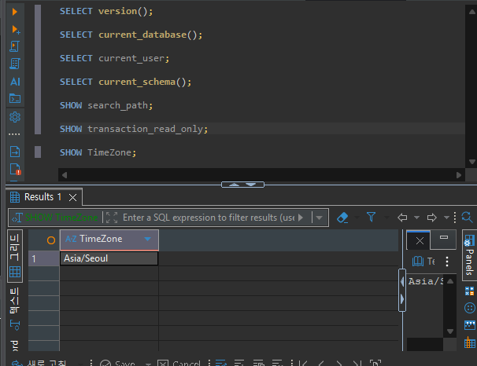
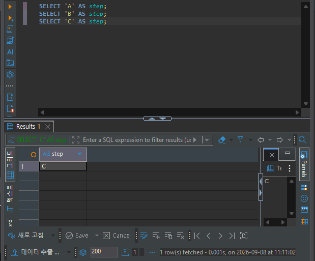

# Chapter 03 확장 실습 답안 템플릿

> **과제:** PostgreSQL과 DBeaver로 실습 환경 검증하기  
> **사용 방법:** 이 파일을 내려받아 본인의 GitHub 저장소에 `chapter03_answer.md`라는 이름으로 저장한 뒤 실습하면서 바로 작성합니다.  
> **제출 방법:** LMS에는 파일을 직접 업로드하지 않고, **본인 GitHub 저장소의 `chapter03_answer.md` 파일 URL**을 제출합니다.

---

## 제출 전 보안 주의

이 과제 파일과 캡처 화면에는 다음 정보를 올리지 않습니다.

```text
실제 PostgreSQL 비밀번호
전체 DB 접속 URL
API Key / Token
개인정보
공개할 필요가 없는 사내 서버 주소
```

LMS에서 제출자를 확인할 수 있으므로 공개 저장소의 답안 파일에 학번이나 실명을 반드시 적을 필요는 없습니다.

```text
GitHub 계정 또는 별칭:
과제 작성일:
사용한 AI 도구:
```

---

# 1. PostgreSQL과 DBeaver 환경 확인

## 1-1. 내 환경

| 항목 | 작성 내용 |
| --- | --- |
| 운영체제 | ms |
| PostgreSQL 버전 |  |
| DBeaver 버전 | 26.1.4 |
| Host | 비밀정보가 아니라면 기록, 아니면 `localhost`/`마스킹` |
| Port | 5432 |
| Database | PostgreSQL |
| Username | 필요하면 마스킹 |

> 비밀번호는 기록하지 않습니다.

## 1-2. PostgreSQL과 DBeaver 역할 설명

```text
PostgreSQL은: 데이터를 실제 저장, 관리, 조회하는

DBeaver는: 클라이언트 툴이다.

두 프로그램의 차이는: 실제 데이터를 저장하는 곳괴, 데이터 베이스 자체가 아니며, 데이터베이스를 쉽게 조작할 수 있는 툴
```

---

# 2. 연결 테스트와 첫 SQL

## 2-1. DBeaver 연결 결과

- [ v ] PostgreSQL 연결 유형 선택
- [ v ] Host 확인
- [ v ] Port 확인
- [ v ] Database 확인
- [ v ] Username 확인
- [ v ] Test Connection 성공

### 연결 성공 화면

권장 이미지 경로:

```text
assignments/chapter03/images/step02_connection.png
```

`여기에 연결 성공 화면을 삽입하세요.`
저번 챕터때 했던거라 삽입을 따로 하지는 않겠습니다.

## 2-2. 첫 SQL 실행

```sql
SELECT 1 + 1 AS result;
```

실행 전 예상:

```text
    2
```

실제 결과:

```text
    2
```

이 결과가 의미하는 것:

```text
    select에서도 연산이 되는구나
```

---

# 3. 현재 연결 위치를 SQL로 검증

다음 SQL을 실행합니다.

```sql
SELECT version();
SELECT current_database();
SELECT current_user;
SELECT current_schema();
SHOW search_path;
SHOW transaction_read_only;
SHOW TimeZone;
```

## 3-1. 결과 기록

| 확인 항목 | 실제 결과 | 내가 이해한 의미 |
| --- | --- | --- |
| `version()` | PostgreSQL 18.4 on x86_64-windows, compiled by msvc-19.44.35227, 64-bit |  |
| `current_database()` | postgres |  |
| `current_user` | postgres |  |
| `current_schema()` | practice_assignments |  |
| `search_path` | practice_assignments, "$user", public |  |
| `transaction_read_only` | off |  |
| `TimeZone` | Asia/Seoul |  |

## 3-2. 반드시 설명할 것

### DBeaver 연결 이름과 `current_database()`는 왜 같은 개념이 아닌가요?

```text
DBeaver 연결 이름은 DBeaver 안에서 사용자가 연결을 구분하기 위해 붙이는 표시용 이름입니다.
예를 들어 "로컬 PostgreSQL", "실습용 DB"처럼 자유롭게 정할 수 있으며, 이름을 바꾸어도
PostgreSQL 서버의 데이터베이스 이름은 바뀌지 않습니다.

반면 current_database()는 현재 세션이 실제로 접속한 PostgreSQL 데이터베이스의 이름을
반환하는 서버 함수입니다. 즉, DBeaver의 연결 이름은 클라이언트 도구의 관리 정보이고,
current_database()의 결과는 서버에서 확인한 실제 접속 대상입니다.
```

### `current_schema()`와 `search_path`는 어떤 관계가 있나요?

```text
search_path는 스키마 이름을 생략한 객체를 찾을 때 PostgreSQL이 탐색하는 스키마의 순서입니다.
예를 들어 search_path가 "$user", public이면 먼저 사용자 이름과 같은 스키마를 찾고,
그다음 public 스키마를 찾습니다.

current_schema()는 현재 search_path에서 실제로 사용할 수 있는 첫 번째 스키마를 반환합니다.
따라서 보통 search_path에 public이 포함되어 있고 앞선 후보 스키마가 없으면
current_schema()의 결과는 public입니다. 두 값은 관련되어 있지만, search_path는 탐색 목록
전체이고 current_schema()는 그 목록에서 선택된 현재 스키마 하나라는 차이가 있습니다.
```

### `transaction_read_only = off`라는 결과만으로 모든 테이블을 만들 권한이 있다고 단정할 수 있나요?

```text
아니요. transaction_read_only = off는 현재 트랜잭션이 읽기 전용으로 강제되어 있지 않아
쓰기 작업을 시도할 수 있다는 뜻일 뿐입니다.

실제로 테이블을 만들려면 접속한 데이터베이스에 대한 CREATE 권한과, 테이블을 만들 스키마에
대한 CREATE 권한이 필요합니다. 또한 다른 사용자가 소유한 스키마나 권한이 제한된 스키마에는
테이블을 만들 수 없습니다. 따라서 이 설정은 필요 조건 중 하나일 뿐이며, 권한은 별도로
확인해야 합니다.
```

## 3-3. 증거 화면

권장 경로:

```text
assignments/chapter03/images/step03_location_check.png
```

`여기에 현재 DB/사용자/스키마/search_path 결과 화면을 삽입하세요.`

---

# 4. `ai_database_book` 데이터베이스 확인

## 4-1. 현재 데이터베이스

```sql
SELECT current_database();
```

실제 결과:

```text
postgres
```

- [ v ] 결과가 `ai_database_book`이다.
- [ v ] 다른 DB라면 올바른 연결로 전환했다.

## 4-2. 연결을 바꾼 뒤 다시 검증

```text
전환 전 데이터베이스: postgres
전환 후 데이터베이스: ai_database_book
전환 여부를 판단한 근거: 화면에서 연결 변경 → SQL로 실제 위치 재검증

```

### 화면에서 보이는 연결 이름만 믿지 않고 SQL을 다시 실행해야 하는 이유

```text
연결이 다르게 되있을 수 있다.
```

---

# 5. SQL 실행 범위 실험

SQL Editor에 다음 세 문장을 입력합니다.

```sql
SELECT 'A' AS step;
SELECT 'B' AS step;
SELECT 'C' AS step;
```

## 5-1. 한 문장 실행

```text
내가 실행한 문장: SELECT 'A' AS step;
실제 결과: A
```

## 5-2. 선택 영역 실행

```text
선택한 문장: 
SELECT 'A' AS step;
SELECT 'B' AS step;
실제 결과: B
```

## 5-3. 전체 스크립트 실행

```text
실제 결과: C
결과 탭 또는 실행 순서에서 관찰한 점: ;이 있
```

## 5-4. 결과 해석

```text
한 문장 실행과 전체 스크립트 실행의 차이: 한 문장은 단 하나의 문장만 추출하여 실행 하고 전체는 모든 문장을 위에서부터 순서대로 끝까지 연속 실행한다.

변경 SQL에서 실행 범위를 잘못 선택하면 위험한 이유: 데이터가 유실될 수 있다.
```

### 증거 화면

권장 경로:

```text
assignments/chapter03/images/step05_execution_scope.png
```

`여기에 실행 범위 비교 화면을 삽입하세요.`

---

# 6. 제공된 환경 확인 SQL 실행

Public 저장소의 Chapter 03 파일을 사용합니다.

```text
code/chapter03/setup_check.sql
code/chapter03/setup_validate_local.sql
```

## 6-1. `setup_check.sql`

실행 결과에서 확인한 항목:

```text
PostgreSQL 버전:
현재 DB: ai_database_book
현재 사용자:
현재 스키마: public
search_path:
읽기 전용 여부: True
TimeZone: Asia/Seoul
1 + 1 결과: 2 
public 스키마 존재 여부: True
public USAGE 권한: 
public CREATE 권한:
```

### 이 파일을 여러 번 실행해도 비교적 안전한 이유

```text
셋업을 체크할 수 있다.
```

## 6-2. `setup_validate_local.sql`

```text
실행 결과:
PASS / FAIL: PASS
```

실패했다면 실패 항목:

```text
```

그 실패가 실제 문제인지 환경 차이인지 판단한 근거:

```text

```

---

# 7. 안전한 오류 진단 실습

실제 오류가 있었다면 그 오류를 사용합니다. 오류가 없었다면 **데이터를 삭제하거나 서버를 강제로 중지하지 말고**, 안전한 SQL 문법 오류를 하나 만들어 관찰합니다.

예:

```sql
SELEC 1;
```

> 오류를 확인한 뒤 올바른 `SELECT 1;`로 복구합니다.

## 7-1. 오류 기록

```text
오류 메시지 핵심 문장: 구문 오류

내가 먼저 생각한 원인 1: 구문에 오류가 있구나

내가 먼저 생각한 원인 2: 오타가 있구나

실제로 확인한 방법: 눈으로 확인

실제 원인: T가 빠졌다

수정한 내용: select로 해줬다
```

## 7-2. 수정 후 재검증

```sql
SELECT 1;
SELECT current_database();
```

```text
재검증 결과: 1, ai_database_book
```

## 7-3. 오류를 유형으로 분류

- [ ] 서버 실행 문제
- [ ] Host 문제
- [ ] Port 문제
- [ ] Database 문제
- [ ] Username/인증 문제
- [ v ] SQL 문법 문제
- [ ] 권한 문제
- [ ] 기타

선택 이유:

```text
구문 오류였기 때문에
```

---

# 8. AI를 오류 분석 보조 도구로 사용

## 8-1. AI에게 전달한 프롬프트

비밀번호·개인정보·전체 접속 URL은 제거하고 기록합니다.

```text
나는 PostgreSQL과 DBeaver를 처음 배우는 학생입니다.
아래 오류를 바로 하나의 원인으로 단정하지 말고,
초보자가 안전하게 확인할 순서대로 분석해 주세요.
다음 형식으로 설명해 주세요.
1. 오류 메시지에서 확인되는 사실
2. 가능한 원인 후보
3. 각 원인을 확인하는 안전한 방법
4. 확인 결과에 따라 다음에 할 행동
5. 실행하면 위험할 수 있어 피해야 할 명령
실제 비밀번호나 개인정보는 포함하지 않았습니다.
[구문오류] 

```

## 8-2. AI 답변 검토

| AI가 제안한 확인 방법 | 실제로 확인했는가? | 결과 | 수용 / 수정 / 거절 |
| --- | --- | --- | --- |
| DBeaver 실행 범위 확인하기 | Y | 구문오류 | 거절 |
| at or near 단어 확인하기 | Y | 없음 | 거절 |
| 예약어 키워드 오타 확인하기 | Y | 오타있음 | 수용 |

### AI가 오류 원인을 너무 빨리 단정한 부분이 있었나요?

```text
아니요
```

### 오류 메시지와 실제 환경 중 무엇을 확인해서 최종 판단했나요?

```text
구문을 보며 오타가 있나 확인해서 오타로 판단함.
```

### AI 활용에서 가장 유용했던 점

```text
비슷한 유형의 오류들을 알려주어서 유용했다
```

### AI 답변을 그대로 실행하지 않고 확인해야 하는 이유

```text
AI가 직접 확인을 하지 못한체 있는 오류들을 나열해서
```

---

# 9. Chapter 01~02 개인 서비스와 연결

앞에서 선택한 개인 서비스가 PostgreSQL을 사용한다고 가정합니다.

```text
서비스 이름: FastOrder

사용할 데이터베이스 이름 후보: fastorder, fastorder_db, cafe_order, fastorder_service

사용할 스키마 이름 후보: public, fastorder, cafe

앞으로 만들고 싶은 테이블 후보 3개:
1. users
2. mesnus
3. options
```

### 아직 SQL을 만들지 않고 이름과 역할만 정하는 이유

```text
기본 SQL을 익혀야 해서
```

### Chapter 02에서 정리했던 한 행의 의미 중 수정할 부분이 있나요?

```text
아직은 없습니다.
```

---

# 10. 초보자용 연결 가이드 작성

친구가 자신의 PC에서 같은 실습을 시작한다고 가정합니다. 아래 순서를 자신의 말로 작성합니다.

```text
1. PostgreSQL 서버가 실행되는지 확인하는 방법:
   - 윈도우: [작업 관리자] -> [서비스] 탭에서 'postgresql' 항목이 '실행 중(Running)'인지 확인하거나, Win+R 키를 누르고 'services.msc'를 입력하여 PostgreSQL 서비스 상태가 '시작됨'인지 확인합니다.
   - Mac: 터미널을 열고 `brew services list`를 입력하여 postgresql의 Status가 'started'인지 확인합니다.

2. DBeaver에서 PostgreSQL 연결을 만드는 방법:
   - DBeaver를 실행하고 좌측 상단 플러그 모양 아이콘('새 데이터베이스 연결')을 클릭합니다.
   - 목록에서 'PostgreSQL'을 선택하고 [Next]를 누릅니다.
   - [Main] 설정 탭에서 Host, Port, Database, Username, Password 정보를 입력합니다.
   - 좌측 하단의 [Test Connection] 버튼을 눌러 연결 성공(Connected) 메세지가 뜨는지 확인한 뒤 [Finish]를 클릭합니다.

3. Host / Port / Database / Username의 의미:
   - Host: 데이터베이스가 존재하는 컴퓨터의 주소입니다. (내 PC의 경우 `localhost` 또는 `127.0.0.1`)
   - Port: 데이터베이스 프로그램으로 들어가는 전용 문 번호입니다. (PostgreSQL의 기본 포트는 `5432`)
   - Database: 여러 방 중 내가 작업할 특정 데이터 저장소의 이름입니다. (실습용: `ai_database_book`)
   - Username: 데이터베이스에 접속하는 사용자 계정 아이디입니다. (기본 관리자 계정: `postgres`)

4. ai_database_book에 연결되었는지 확인하는 방법:
   - DBeaver 좌측 '데이터베이스 탐색기(Database Navigator)' 목록에서 방금 만든 연결 항목 옆의 데이터베이스 이름을 확인합니다.
   - 상단 툴바의 DB/Schema 선택 드롭다운 박스에 `ai_database_book`이 기본으로 지정되어 있는지 확인합니다.

5. 현재 위치를 확인하는 SQL:
   - SELECT current_database(), current_schema(), current_user;
   - 위 쿼리를 실행하여 현재 내가 접속한 DB 이름, 스키마 이름, 접속 유저명을 직관적으로 조회할 수 있습니다.

6. 한 문장과 전체 스크립트 실행을 구분해야 하는 이유:
   - '한 문장 실행(Ctrl+Enter)'은 커서가 있는 단 하나의 쿼리만 안전하게 수행하지만, '전체 스크립트 실행(Alt+X)'은 파일 전체를 위에서부터 연속으로 수행합니다.
   - 작성해 둔 예전 데이터 삭제/수정(UPDATE/DELETE) 쿼리가 파일 안에 남아있는 상태에서 스크립트를 전체 실행하면 의도치 않게 데이터를 날리거나 서버 오류를 발생시킬 위험이 크기 때문입니다.

7. 비밀번호를 GitHub나 AI 프롬프트에 넣으면 안 되는 이유:
   - GitHub는 누구나 접속 가능한 공개 공간이므로, 비밀번호가 노출되면 외부 악성 공격자(해커)가 데이터베이스에 무단 접속하여 데이터를 탈취하거나 삭제할 수 있습니다.
   - AI 프롬프트에 들어간 데이터 역시 모델 학습 데이터로 활용되거나 로그에 기록되어 보안 유출 사고로 이어질 수 있으므로 절대 공유하면 안 됩니다.
```

---

# 11. 최종 성찰

아래 문장은 반드시 본인의 말로 작성합니다.

```text
1. DBeaver와 PostgreSQL의 가장 중요한 차이는 postgresql은 데이터 저장 창고 이고, DBeaver는 창고를 편리하게 조작하는 툴이다.

2. 내가 지금 어느 데이터베이스에 연결되어 있는지 확인할 때
   화면 이름만 보지 않고 SELECT current_database(); 쿼리를 직접 실행하여 실제 접속된 DB를 정확히 확인 해야 한다.

3. PostgreSQL 오류가 발생했을 때 가장 먼저 해야 할 일은
   오류 메시지 전문과 표시된 단어/위치(at or near)를 주의 깊게 읽는 것 이다.

4. AI를 오류 해결에 사용할 때 가장 중요한 것은
   오류 메시지 전체와 상황(SQL 코드, 사용 목적)을 그대로 전달하되, 비밀번호나 개인정보는 절대 포함하지 않는 것 이다.
```

---

# 12. 제출 체크리스트

- [ ] `chapter03_answer.md`의 빈 필수 항목을 작성했다.
- [ ] PostgreSQL과 DBeaver의 역할 차이를 설명했다.
- [ ] `current_database/current_user/current_schema/search_path`를 실제로 확인했다.
- [ ] `ai_database_book` 연결 여부를 SQL로 검증했다.
- [ ] SQL 실행 범위 세 가지를 비교했다.
- [ ] `setup_check.sql`을 실행했다.
- [ ] `setup_validate_local.sql` 결과를 확인했다.
- [ ] 오류 원인을 먼저 스스로 추정한 뒤 AI를 사용했다.
- [ ] AI 제안을 실제 환경에서 검증했다.
- [ ] 핵심 캡처 3~4장만 골라 넣었다.
- [ ] 캡처에 비밀번호·개인정보·전체 접속 URL이 없다.
- [ ] Markdown 이미지가 GitHub 웹 화면에서 실제로 보인다.
- [ ] 최종 답안 파일을 commit/push했다.

---

# 13. LMS 제출 URL

아래 형식의 **본인 GitHub 파일 URL**을 LMS에 제출합니다.

```text
https://github.com/<본인-GitHub-ID>/<본인-저장소>/blob/main/assignments/chapter03/chapter03_answer.md
```

내 제출 URL:

```text

```

> 저장소 메인 URL, 교수자 템플릿 URL, Raw URL이 아니라 **작성 완료된 본인 `chapter03_answer.md` 파일 화면 URL**을 제출합니다.