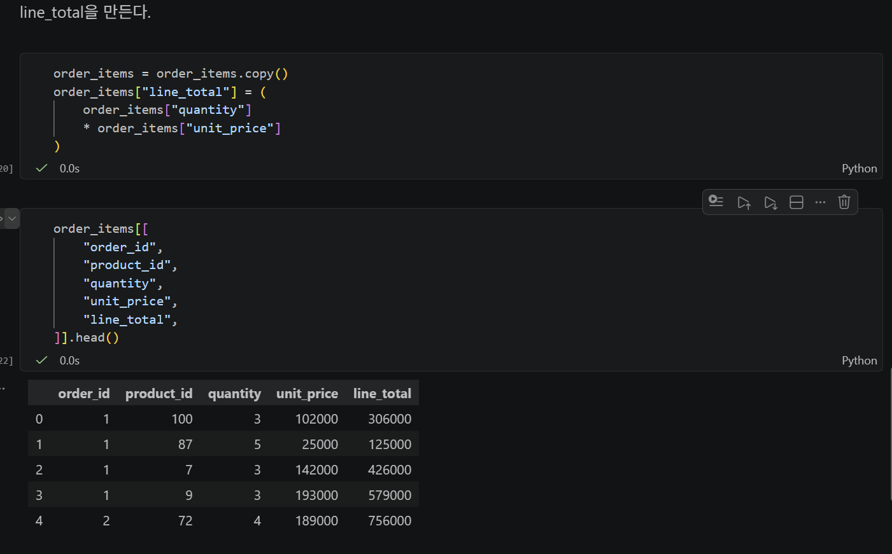
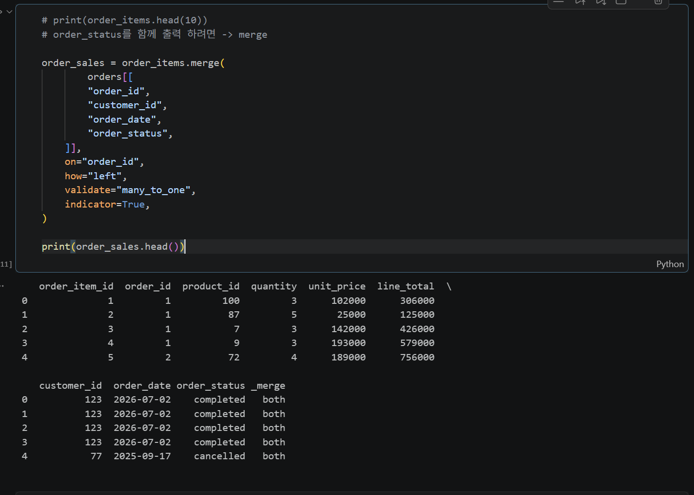
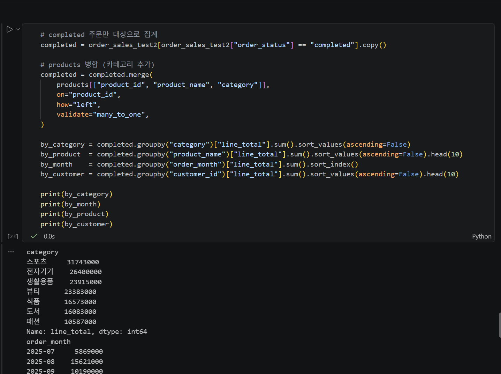
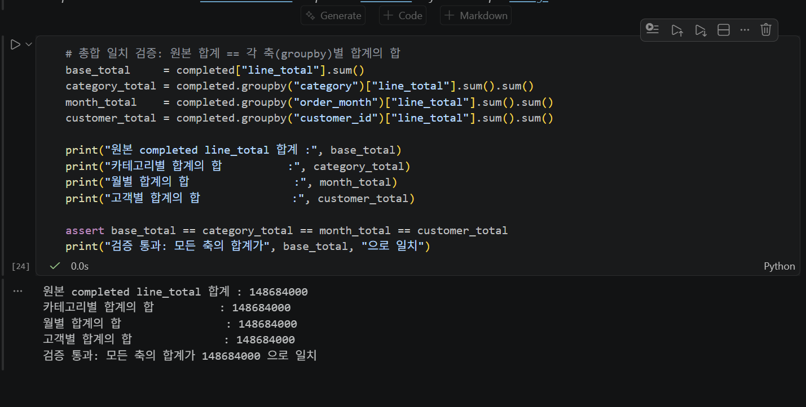
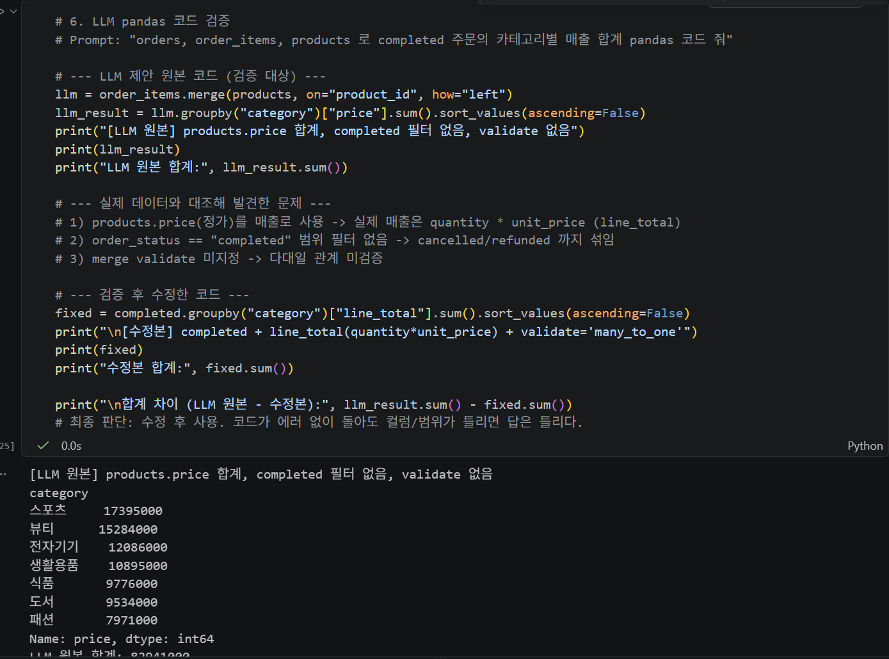

# Chapter 04 제출 답안 양식. pandas로 데이터에 질문하기

> 주 제출물은 실행 완료 Notebook `chapter04/chapter04.ipynb`입니다. 이 양식의 항목을 Notebook의 Markdown 셀로 추가해 작성합니다.

## 0. 제출 정보
- 이름: 박진
- GitHub ID: jin-park0115
- 작성일: 2026-09-10
- 최종 제출 URL: https://github.com/jin-park0115/ai-database-book/blob/main/chapter04/assignment.md

## 1. 질문과 필요한 데이터 선택
### 내가 확인하려는 질문
- 주문(orders)은 어떤 상태(order_status)와 결제 수단(payment_method)으로 구성되어 있는가?
- 30세 이상 고객은 몇 명이고 연령 분포는 어떤가?
- 회원은 어느 도시에 몰려 있는가? 서울·부산·인천 고객만 따로 보면 몇 명인가?

### 사용한 파일/컬럼
- `data/raw/customers.csv` (150행, 6컬럼): `customer_id`, `name`, `gender`, `age`, `city`, `signup_date`
- `data/raw/orders.csv` (300행, 5컬럼): `order_id`, `customer_id`, `order_date`, `payment_method`, `order_status`
- `data/raw/order_items.csv` (764행, 5컬럼): `order_item_id`, `order_id`, `product_id`, `quantity`, `unit_price`
- `data/raw/products.csv`: `product_id`, `product_name`, `category`, `price`
- 이번 단계에서 실제로 질문에 사용한 컬럼: `orders.order_status`, `orders.payment_method`, `customers.age`, `customers.city`

### 결과 관찰
- `orders.info()` / `customers.info()`: 결측치 없음(모든 컬럼 Non-Null), `order_date`·`signup_date`는 아직 문자열(str) 타입.
- `order_status` 값 분포: `completed` 184, `cancelled` 64, `refunded` 52 (합계 300).
- `payment_method` 값 분포: `kakao_pay` 79, `naver_pay` 77, `bank_transfer` 74, `card` 70 (합계 300).
- `customers[customers["age"] >= 30]` → 111행. `age` 최소 30, 최대 69, 평균 약 48.7, 중앙값 50.
- `city` 값 분포(10개 도시): 성남 21, 광주 17, 부산 16, 대구 15, 서울 15, 울산 14, 인천 14, 대전 14, 수원 13, 고양 11.
- `city`가 서울·부산·인천인 고객: 부산 16, 서울 15, 인천 14 (합계 45명).

### 나의 해석과 판단
왜 이 컬럼과 범위를 선택했는지 작성하세요.
- 매출 분석의 출발점이 "어떤 주문을 유효 매출로 볼 것인가"이므로 `order_status`를 먼저 확인했다. `completed`만 매출로 집계할 근거를 만들기 위함이다.
- `payment_method`는 값 분포가 네 종류로 고르게 나뉘어 있어, 특정 결제 수단 편중으로 인한 해석 왜곡 가능성은 낮다고 판단했다.
- `age >= 30` 범위는 "주 구매층" 가설을 세우기 위한 임의 기준이며, 경계값(30 포함)을 명확히 하려고 `>=`를 사용했다.
- `city.isin([...])`로 서울·부산·인천을 묶은 이유는 대도시 3곳의 고객 규모를 한 번에 비교하기 위해서다.

### 업무·분석적 의미
- 상태별 분포를 먼저 고정해 두면, 이후 집계에서 취소/환불 주문이 섞여 매출이 과대 계상되는 실수를 예방할 수 있다.
- 도시별 회원 수는 지역 마케팅 예산 배분이나 배송 거점 판단의 1차 근거가 된다.

### 한계와 추가 확인 사항
- `value_counts`는 "주문 건수"이지 "매출 금액"이 아니다. 상태별 금액 비중은 별도 집계가 필요하다.
- `age`, `city`는 회원 테이블 기준이며, 실제 구매가 있는 고객만 따로 봐야 구매층을 말할 수 있다.
- `order_date`, `signup_date`가 문자열이라 기간 필터·월별 분석 전에 datetime 변환이 필요하다.

## 2. 필터링·정렬·파생 컬럼
- 적용한 필터 조건:
  - `customers["age"] >= 30` (불리언 마스크) → 111행
  - `customers["city"].isin(["서울", "부산", "인천"])` → 45행
- 정렬 기준: 별도 `sort_values` 적용 없음. 분포 확인은 `value_counts()`의 기본 내림차순 정렬을 사용.
- 만든 파생 컬럼: `order_items["line_total"]` (라인 합계 금액)
- `line_total` 계산식: `line_total = quantity * unit_price`

### 결과 관찰
- `order_items.info()`: 764행, 5개 int64 컬럼, 결측치 없음.
- `line_total` 추가 후 6개 컬럼. 예) 1행: `quantity=3 * unit_price=102000 = 306000`.
- 필터 결과 행 수: 전체 고객 150명 중 30세 이상 111명(약 74%), 서울·부산·인천 거주 45명(약 30%).

### 나의 해석과 판단
필터 기준이 달라지면 결과가 어떻게 달라질지 작성하세요.
- `age >= 30`을 `age >= 40`으로 올리면 대상이 111명에서 크게 줄고, 평균 연령·구매력 가정도 달라진다.
- `isin` 목록에 수원·고양 같은 수도권 도시를 추가하면 "수도권 고객" 규모가 60명 이상으로 늘어, 지역 구분의 의미가 달라진다.
- `line_total`은 할인·환불을 반영하지 않은 "정가 기준 라인 금액"이므로, 실제 청구액과 차이가 날 수 있다.

### 업무·분석적 의미
- `line_total`은 이후 카테고리별·상품별·월별 매출 집계의 기본 단위가 된다. 이 값이 틀리면 모든 상위 집계가 틀린다.
- 필터 기준(연령·지역)은 타깃 세그먼트 정의이며, 기준을 문서화해야 재현 가능한 분석이 된다.

### 한계와 추가 확인 사항
- `unit_price`(주문 시점 단가)와 `products.price`(현재 정가)가 다를 수 있어, 둘을 비교 검증해야 한다.
- 필터는 회원 속성 기준이라 "주문한 고객"과 "주문하지 않은 고객"이 섞여 있다.
- 단계별 캡처는 `images/step01.png` ~ `step05.png`로 저장되어 있다.

## 3. merge 검증
- 병합한 데이터: `order_items` (좌, 764행) + `orders`의 일부 컬럼 `["order_id", "customer_id", "order_date", "order_status"]`
- 사용한 key: `on="order_id"`, `how="left"`
- `validate` 결과: `validate="many_to_one"` 통과 (오른쪽 `orders`의 `order_id` 유일함 확인. `orders["order_id"].duplicated().sum()` == 0)
- `indicator` 결과: `_merge` 컬럼 전 행 `both` (764/764). left_only / right_only 없음
- 병합 전/후 행 수: 764행 → 764행 (변화 없음)

### 결과 관찰
- 병합 후 컬럼 10개(`order_item_id` ~ `_merge`), 행 수 764로 동일.
- `_merge`가 모두 `both`이므로 매칭되지 않은 주문 항목(고아 레코드)이 없다.
- 병합 직후 `order_date`, `order_status`는 문자열(str) 타입으로 들어온다.
- 이후 `order_sales_test2`에서 `order_date`를 `pd.to_datetime(..., errors="coerce")`로 변환했고, 의도적으로 넣은 잘못된 값 `"2026-02-30"`은 `NaT`로 처리되어 결측 1건이 발생 → `dropna()`로 제거.
- 정상 변환 사본(`order_sales_test`)은 `errors` 옵션 없이도 764행 전부 `datetime64[us]`로 변환됨.

### 나의 해석과 판단
이번 병합이 안전하다고 판단한 근거를 작성하세요. 행 수가 증가/감소했다면 이유를 설명하세요.
- `validate="many_to_one"`이 에러 없이 통과했다: `order_items`(다) 여러 라인이 `orders`(일) 한 주문에 붙는 관계가 맞다.
- `how="left"` + `_merge` 전부 `both`: 좌측 기준이 모두 매칭되어 행이 늘거나 줄지 않았다. 카티전 곱(행 폭증)이나 매칭 실패(행 손실)가 없다.
- 행 수 764 유지 → 병합으로 인한 중복·누락 없음.

### 업무·분석적 의미
잘못된 merge가 분석 결과에 어떤 영향을 줄 수 있는지 작성하세요.
- `orders` key에 중복이 있었다면 `many_to_one` 검증에서 에러가 났을 것이고, 방치했다면 라인이 복제되어 매출이 실제보다 부풀려진다.
- key 매칭 실패를 확인하지 않으면 일부 주문 금액이 통째로 빠진 채 집계되어 매출이 과소 계상된다.
- `_merge` / `validate`는 "숫자를 보기 전에" 병합 품질을 보증하는 안전장치다.

### 한계와 추가 확인 사항
- 아직 `products`(카테고리)와 `customers`(도시·연령)를 붙이지 않아, 카테고리별·고객속성별 분석은 다음 병합이 필요하다.
- `order_date` 변환 시 `errors="coerce"`는 잘못된 날짜를 조용히 `NaT`로 만든다. 몇 건이 사라졌는지 항상 `isna().sum()`으로 확인해야 한다.

## 4. completed 주문 범위와 집계
- 분석 범위 정의: `order_sales_test2`에서 `order_status == "completed"` 인 주문 항목(라인)만 대상. 매출 지표는 `line_total = quantity * unit_price`. `products`를 `product_id` 기준 `validate="many_to_one"`로 병합해 `category`, `product_name` 추가.
- 대상 규모: completed 라인 473개 / 주문 184건 / 고객 100명 / 상품 98종 / 카테고리 7종 / 월 13개(2025-07 ~ 2026-07)
- 카테고리별 결과 (`groupby("category")["line_total"].sum()`, 내림차순):
  - 스포츠 31,743,000 / 전자기기 26,400,000 / 생활용품 23,915,000 / 뷰티 23,383,000 / 식품 16,573,000 / 도서 16,083,000 / 패션 10,587,000
- 상품별 결과 (상위 5): 스포츠 상품 041 5,705,000 / 식품 상품 012 4,375,000 / 스포츠 상품 009 3,860,000 / 뷰티 상품 072 3,780,000 / 전자기기 상품 071 3,703,000
- 월별 결과 (`groupby("order_month")["line_total"].sum()`): 최고 2025-10 25,766,000, 최저 2026-07 2,188,000. 2025년 하반기 77,759,000 vs 2026년 상반기 70,925,000
- 고객별 결과 (상위 5): 117번 4,100,000 / 102번 3,996,000 / 83번 3,880,000 / 30번 3,590,000 / 40번 3,523,000 (고객 1인 평균 약 1,486,840)

### 결과 관찰
수치에서 직접 확인한 상위/하위 또는 변화 패턴을 작성하세요.
- completed `line_total` 총합 148,684,000. 카테고리 7종 중 스포츠가 21.3%로 1위, 패션이 7.1%로 최하위 → 약 3배 차이.
- 상위 5개 카테고리(스포츠·전자기기·생활용품·뷰티·식품)가 전체의 약 84%를 차지.
- 월별로는 2025-10(25,766,000)이 뚜렷한 피크. 2026-06(2,826,000)·2026-07(2,188,000)의 급감은 데이터 수집 기간이 그 시점에 끝나 월이 불완전한 것으로 보인다.
- 고객 100명 중 상위 5명이 각 352만~410만 원, 1인 평균 약 149만 원 → 특정 고객으로의 매출 쏠림은 크지 않다.

### 나의 해석과 판단
어떤 결과가 가장 중요하다고 판단했는지와 이유를 작성하세요.
- 가장 중요하게 본 결과는 카테고리별 매출 순위(스포츠 > 전자기기 > 생활용품)다. 카테고리는 재고·마케팅 단위로 바로 연결되고, 표본이 473라인으로 충분해 순위 자체는 안정적이라고 판단했다.
- 월별 추세는 2026-06~07 급감이 실제 매출 하락인지 데이터 절단인지 구분되지 않아, 단독 근거로는 신뢰하지 않았다.
- 고객별 결과는 상위 편중이 약해(상위 5명이 총합의 약 13%) "핵심 고객 집중"보다 폭넓은 고객 기반이 특징이라고 읽었다.

### 업무·분석적 의미
다음 의사결정/분석으로 어떻게 연결할지 작성하세요.
- 카테고리 순위는 다음 분기 매입 예산·프로모션 배분의 1차 근거가 된다. 하위인 패션·도서는 매출 기여가 낮은 이유(수요 부족 vs 노출 부족)를 별도로 확인할 대상이다.
- 월별 시계열은 절단 구간(2026-06~07)을 제외하고 다시 그려야 계절성 판단이 가능하다.

### 한계와 추가 확인 사항
`total_sales`가 회계상 순매출과 같다고 단정할 수 없는 이유를 포함하세요.
- `line_total`은 `quantity * unit_price`일 뿐 할인·쿠폰·부분 환불·배송비·세금을 반영하지 않는다.
- `completed` 이후에 발생한 반품/부분취소가 별도 테이블에 있다면 순매출은 더 낮아진다.
- 분석 베이스 `order_sales_test2`는 cell 17에서 잘못된 날짜(`"2026-02-30"`)를 주입한 뒤 `dropna()`한 프레임이라, 실제 completed 매출 1건(`order_item_id=1`, 2026-05-07, 306,000원)이 빠져 있다. 오염 없는 값은 474라인 / 148,990,000이며, cell 22의 베이스를 `order_sales_test`로 바꿔 재집계해야 한다.
- 2026-06~07 급감은 월 불완전 가능성이 크므로 `order_date` 최댓값을 확인해야 한다.

## 5. 총합 일치 검증
- 원본 completed `line_total` 합계: 148,684,000 (`completed["line_total"].sum()`)
- 카테고리 합계: 148,684,000 (`completed.groupby("category")["line_total"].sum().sum()`)
- 월별 합계: 148,684,000 (`completed.groupby("order_month")["line_total"].sum().sum()`)
- 고객별 합계: 148,684,000 (`completed.groupby("customer_id")["line_total"].sum().sum()`, 고객 100명)
- 차이 여부: 네 값 모두 148,684,000으로 동일. 차이 0, `assert base == cat == month == customer` 통과.

### 나의 해석과 판단
총합 검증이 필요한 이유와 불일치 시 확인할 순서를 작성하세요.
- 서로 다른 축(`groupby` 키)으로 나눠 더한 합계가 원본 총합과 같아야, 집계 과정에서 행 누락·중복·필터 오류가 없었다고 말할 수 있다.
- 불일치 시 확인 순서: (1) 필터 조건이 각 집계에서 동일한지 → (2) `groupby` 키에 결측(`NaN`)이 있어 `dropna` 기본값으로 빠졌는지 → (3) 병합 단계에서 행이 늘었는지 → (4) 파생 컬럼(`line_total`, `order_month`) 계산 오류.
- 이번 검증은 네 축이 모두 일치해 "집계 단계"에는 오류가 없음을 보여준다. 다만 검증은 베이스 프레임을 기준으로만 성립하므로, 베이스 자체가 상류(cell 17~20)에서 1행(306,000원)을 잃은 사실(148,684,000 vs 정상 148,990,000)은 이 검증으로 잡히지 않는다. 총합 검증과 별개로 "입력 행 수"를 병합 직후 값과 비교해야 한다.

## 6. LLM pandas 코드 검증
- LLM Prompt 요약: completed 주문 카테고리별 매출 코드 요청
- 제안 코드 요약: order_items+products merge 후 groupby("category")["price"].sum()
- 실제 컬럼/범위와 맞지 않은 부분:
  · products의 `price`(정가)를 매출로 씀 → 실제 매출은 order_items의 quantity*unit_price
  · order_status 필터 없음 → cancelled/refunded 포함됨
  · validate 미지정
- 수정한 내용: line_total 파생컬럼 추가, completed 필터 추가, validate="many_to_one" 추가
- 최종 판단: 수정 후 사용

### 나의 해석과 판단
LLM 코드가 에러 없이 실행돼도, price(정가)와 unit_price*quantity(실매출)를 혼동하거나 completed 필터를 빠뜨리면 숫자는 나오지만 답은 틀리다. 실제 컬럼,범위,merge 안전성을 사람이 대조해야 신뢰할 수 있다.

## 7. Chapter 04 최종 인사이트
### 가장 의미 있다고 생각한 결과 2가지
1. completed 매출은 카테고리 간 격차가 크다 — 스포츠 31,743,000(21.3%)이 최상위, 패션 10,587,000(7.1%)이 최하위로 약 3배 차이. 상위 5개 카테고리가 전체의 약 84%.
2. 매출은 특정 고객에 쏠려 있지 않다 — 고객 100명, 1인 평균 약 149만 원, 상위 5명 합계가 총합의 약 13%에 불과.

### 그 결과를 뒷받침하는 수치/표
- `completed.groupby("category")["line_total"].sum()` → 스포츠 31,743,000 / 전자기기 26,400,000 / 생활용품 23,915,000 / 뷰티 23,383,000 / 식품 16,573,000 / 도서 16,083,000 / 패션 10,587,000 (합계 148,684,000)
- 총합 검증: 원본·카테고리·월·고객 네 축 모두 148,684,000 (차이 0)
- 고객별: n=100, 평균 1,486,840, 상위 117번 4,100,000 / 102번 3,996,000 / 83번 3,880,000
- 월별: 최고 2025-10 25,766,000, 2025년 하반기 77,759,000 ↔ 2026년 상반기 70,925,000
- 상태 필터 근거: `orders["order_status"].value_counts()` → completed 184 / cancelled 64 / refunded 52
- 병합 안전성: `_merge` 전부 `both`, `order_items` 764행 → 병합 후 764행, `orders["order_id"].duplicated().sum()` == 0

### 추가로 확인하고 싶은 질문
- 하위 카테고리(패션·도서)는 수요가 적은 것인가, 상품 수·노출이 적은 것인가? (카테고리별 상품 수·주문 건수 대비 매출)
- 2026-06~07 매출 급감은 실제 하락인가, 데이터 수집 종료로 인한 월 불완전인가? (`order_date` 최댓값 확인)
- `unit_price`(주문 시 단가)와 `products.price`(현재가) 차이가 큰 상품이 있는가?
- 30세 이상 / 서울·부산·인천 고객의 실제 구매 비중은 회원 비중(74% / 30%)과 일치하는가?

### 현재 결과의 한계
- 분석 베이스 `order_sales_test2`가 cell 17의 잘못된 날짜 주입 → `dropna()`로 실제 completed 1건(306,000원)을 잃었다. 정확한 총합은 148,990,000이며 재집계가 필요하다.
- `line_total`은 정가×수량이라 할인·환불·세금 미반영 → 회계상 순매출과 다르다.
- `customers`(연령·도시)와 아직 병합하지 않아 고객 속성별(30세 이상, 서울·부산·인천) 매출 분석은 미완이다.
- 2026-06~07 구간은 월 불완전 가능성이 커 시계열 해석에서 제외 검토가 필요하다.

## 최종 제출 체크
- [ v ] 핵심 셀 Output이 남아 있습니다.
- [ v ] merge와 총합 검증 Evidence가 있습니다.
- [ v ] 결과 관찰과 해석이 구분되어 있습니다.
- [ v ] LLM 코드를 검증했습니다.
- [ v ] 개인정보/Secret이 없습니다.
- [ v ] `chapter04/chapter04.ipynb`가 GitHub에서 정상 표시됩니다.
- [ v ] 최종 Notebook 파일 URL을 제출합니다.
