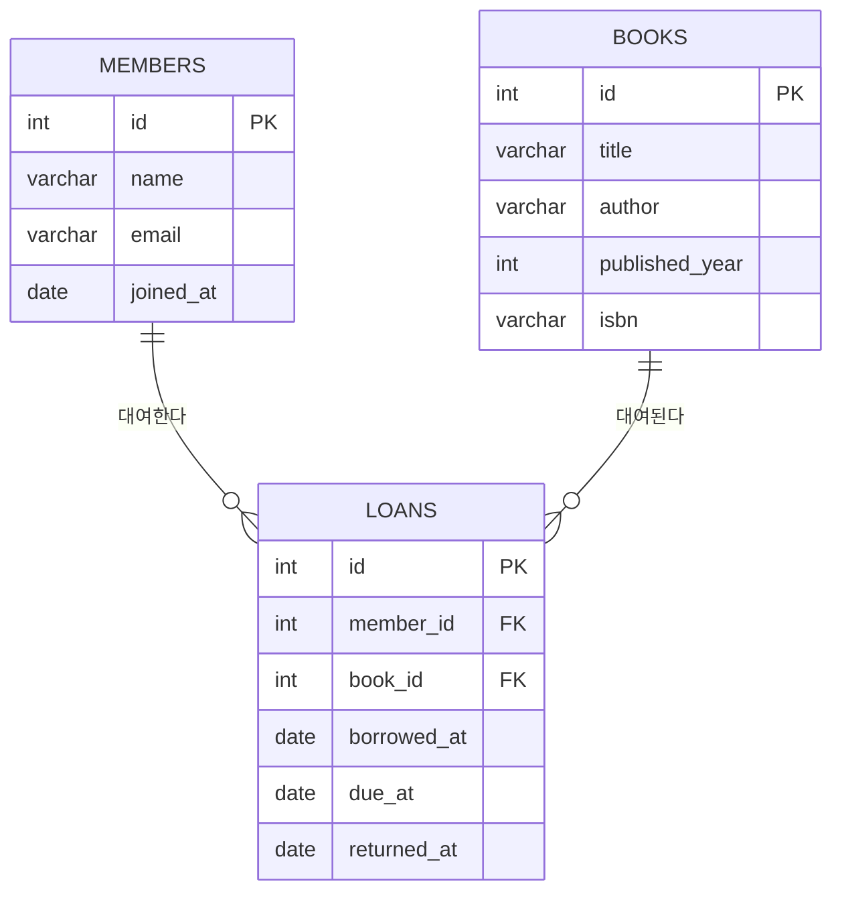
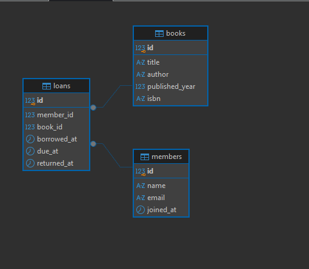

# Chapter 05 확장 실습 답안 템플릿

> **과제:** 요구사항에서 데이터 모델과 ERD 만들기  
> **사용 방법:** 이 파일을 내려받아 본인의 GitHub 저장소에 `chapter05_answer.md`라는 이름으로 저장한 뒤 실습하면서 바로 작성합니다.  
> **제출 방법:** LMS에는 파일을 직접 업로드하지 않고, **본인 GitHub 저장소의 `chapter05_answer.md` 파일 URL**을 제출합니다.

---

## 제출 전 주의

이 파일과 캡처 화면에는 실제 비밀번호, 전체 DB 접속 URL, API Key, 개인정보를 기록하지 않습니다.

```text
GitHub 계정 또는 별칭: jin-park0115
과제 작성일: 2026-09-10
사용한 AI 도구: claude
```

---

# 1. Chapter 05 핵심 개념 복습

본문을 보지 않고 먼저 작성합니다.

```text
요구사항에서 바로 테이블부터 만들면 위험한 이유: 
명사를 보이는 대로 테이블로 만들면 속성일 뿐인 것(이메일, ISBN)까지 테이블이 되거나, 반대로 대여, 반납을 놓친다.

한 행의 의미를 먼저 정해야 하는 이유:
한 행의 의미가 곧 PK의 기준이다. (loans 한 행 = "회원 한 명이 도서 한 권을 빌린 한 번의 사건")

확정 요구사항과 미확정 정책을 구분해야 하는 이유:
확정된 것만 제약조건(NOT NULL, UNIQUE, FK, CHECK, 삭제 규칙)으로 구현해야 한다.

PK와 업무상 고유값 후보의 차이:
업무 고유값은 정책에 따라 바뀐다. 중복이 나중에 허용될 수도, NULL이 생길 수도 있다

N:M 관계를 그대로 두지 않고 연결 테이블을 검토하는 이유:
관계형 DB는 N:M을 직접 표현 못 한다. 물리적으로 연결 테이블이 반드시 필요하다.
```

---

# 2. 도서 대여 요구사항 R-01~R-07 다시 분해

| 요구사항 | 관리 대상 / 사건 | 속성 후보 | 관계 / 규칙 후보 | 미확정 질문 |
| --- | --- | --- | --- | --- |
| R-01 | 회원 | member_id | 회원은  시스템에 등록/존재한다 | 탈퇴 회원의 삭제 기능 |
| R-02 | 회원의 속성 정의 | name, email, joined_at | 이메일은 회원 식별에 쓰이는 고유값 후보 | 이메일이 필수인가? |
| R-03 | 도서 | title, author, isbn | 관리한다 = 필수 저장할 수 있다 = 선택 ISBN은 업무 고유값 후보 | 저자가 2명 이상이면? |
| R-04 | 사건 엔터티 대여(loans) | member_id | 회원 한 명 -> 대여 여러 건 | 동시 대여 권수 상한이 있나? |
| R-05 | loans | book_id | N:M | 같은 시점에 한 책이 한명에게만? 예약 기능이있나? |
| R-06 | loans의 속성 정의 | loaned_at | 반납예정일은 대여일 기준으로 계산된다. | 대여 기간이 고정인가? |
| R-07 | loans 상태 규칙 | returned_at | 대여 중 상태를 별도 컬럼 없이 표현 | 분실/연체로 반납 안 된 건도 NULL로 두나 |

### 본문과 비교한 뒤 수정한 내용

```text
처음에 놓친 부분:

처음에 잘못 분류한 부분:

수정한 이유:
```

---

# 3. 확정 규칙과 미확정 정책 구분

## 3-1. 확정된 규칙

```text
1. 회원은 이름, 이메일, 가입일을 가진다.
2. 도서는 제목과 저자를 관리한다.
3. 회원 한 명은 여러 권의 책을 대여할 수 있다.
4. 책 한 권은 시간에 따라 여러 번 대여될 수 있다.
5. 대여 기록에는 대여일, 반납예정일, 실제반납일을 저장하며, 아직 반납 안 된 경우 실제반납일은 비어 있을 수 있다. 
```

## 3-2. 미확정 질문

최소 5개를 작성합니다.

```text
Q1. ISBN이 없는 도서를 허용하는가
Q2. 한 도서에 저자가 2명 이상이면 author 컬럼 하나로 어떻게 표현하는가?
Q3. 회원 한 명이 동시에 대여할 수 있는 책 권수에 상한이 있는가?
Q4. 반납예정일은 대여일 기준 고정 기간(예: 14일)으로 자동 계산되는가
Q5. 회원이 탈퇴하면 그 회원의 대여 기록은 삭제되는가, 남겨두는가? 
```

### 미확정 정책을 바로 `UNIQUE`, `CHECK`, 삭제 규칙으로 구현하면 위험한 이유

```text
 나중에 정책이 실제로 정해졌을 때 요구사항과 다르면(예: "가족이 이메일 공유 허용"으로 정해짐) 제약조건을 다시 뜯어야 하고, 이미 들어간 데이터 중 제약을 위반하는 행이 있으면 마이그레이션 자체가 막힌다.
```

---

# 4. 엔터티·속성·사건 후보 구분

| 후보 | 대상 엔터티 / 사건 엔터티 / 속성 | 판단 근거 | 독립 식별 필요? |
| --- | --- | --- | --- |
| 회원 | 대상 엔터티 | 시간이 지나도 유지되는 관리 대상(회원 자체) | 예 — member_id 필요 |
| 도서 | 대상 엔터티 | 대여와 무관하게 존재하는 관리 대상(도서 자체) | 예 — book_id 필요 |
| 대여 기록 | 사건 엔터티 | 특정 시점에 발생하고 날짜 속성(대여일/반납예정일/반납일)을 가지는 사건 | 예 — loan_id 필요(같은 회원·같은 책이라도 여러 번 반복되므로) |
| 이메일 | 속성 | 회원이라는 대상을 설명하는 값 하나일 뿐, 그 자체로 관리할 사건/대상이 아님 | 아니오 — members.email |
| ISBN | 속성 | 도서를 설명하는 값 하나, 독자적으로 존재/변화하는 대상이 아님 | 아니오 — books.isbn |
| 반납예정일 | 속성 | 대여라는 사건에 딸린 값일 뿐 그 자체로 독립된 대상이 아님 | 아니오 — loans.due_at |

### “명사가 보이면 무조건 테이블”이 아닌 이유

```text
이메일·ISBN처럼
명사이지만 실제로는 상위 대상(회원, 도서)의 속성인 것을 테이블로 만들면 불필요한 조인과 중복
관리 부담만 늘어난다.
```

---

# 5. 테이블별 한 행의 의미와 키 후보

| 테이블 | 한 행의 의미 | PK 후보 | 업무상 고유값 후보 | FK 후보 |
| --- | --- | --- | --- | --- |
| `members` | 회원 한 명 | `id`(대리키) | `email` | — |
| `books` | 이 장에서 대여 대상으로 다루는 도서 항목 한 건 | `id`(대리키) | `isbn` | — |
| `loans` | 특정 회원이 특정 도서를 대여한 사건 한 건 | `id`(대리키) | (별도 자연키 없음, 시스템 발급 사건) | `member_id → members.id`, `book_id → books.id` |

### `members.email`을 지금 바로 UNIQUE라고 확정하지 않는 이유

```text
이메일 중복 허용 여부(가족 공유, 임시 가입 등)가 아직 업무적으로 결정되지 않았기 때문이다.
```

### `books.isbn`을 지금 바로 NOT NULL + UNIQUE라고 확정하지 않는 이유

```text
"저장할 수 있다"고 표현해 ISBN이 없는 도서(오래된 책, 자체 제작물 등)를 허용할 가능성이
있다.
```

---

# 6. 관계를 양방향 문장으로 작성

## 6-1. `members ↔ loans`

```text
회원 한 명은 대여 기록을 0건 이상 여러 건 가질 수 있다.

대여 기록 한 건은 정확히 한 명의 회원에게 속한다.

카디널리티: members 1 : N loans
선택성에서 확인할 점: 회원 쪽은 선택(대여 이력이 없는 회원 존재 가능, loans.member_id는 NOT NULL이라
                     loans 쪽은 필수 — 회원 없는 대여는 있을 수 없다.
```

## 6-2. `books ↔ loans`

```text
도서 한 건은 도서 한 건은 대여 기록을 0건 이상 여러 건 가질 수 있다.

대여 기록 한 건은 정확히 한 권의 도서를 가리킨다..

카디널리티: books 1 : N loans
선택성에서 확인할 점: 도서 쪽은 선택(한 번도 대여되지 않은 도서 존재 가능), loans 쪽은 필수
                     (book_id NOT NULL — 도서 없는 대여는 있을 수 없다).
```

## 6-3. `members ↔ books`를 직접 N:M으로 저장하지 않고 `loans`를 두는 이유

```text
회원과 도서 사이의 N:M을 연결 테이블 하나로만 두면 회원이 같은 책을 여러 번, 다른 날짜에 대여한 이력"을 표현할 수 없다.
```

### `loans`가 단순 연결표가 아니라 사건 엔터티라고 볼 수 있는 이유

```text
loans는 같은 회원·같은 도서
조합이 서로 다른 날짜로 여러 번 반복될 수 있다
```

---

# 7. 도서 대여 ERD 초안

아래 항목이 보이도록 ERD를 작성합니다.



권장 이미지 경로:

```text
assignments/chapter05/images/step07_library_erd.png
```

Markdown 예시:

```markdown

```

`여기에 ERD 이미지를 삽입하세요.`

### ERD를 그린 뒤 수정한 부분

```text

```

---

# 8. PostgreSQL로 도서 대여 모델 구현 확인

## 8-1. 현재 환경 확인

```sql
SELECT current_database();
SELECT current_user;
SELECT current_schema();
SHOW search_path;
SHOW transaction_read_only;
```

```text
현재 DB: ai_database_book
현재 사용자: postgres
현재 스키마: public
search_path: "$user", public
읽기 전용 여부: false
``` 

- [ v ] 현재 DB가 `ai_database_book`이다.
- [ v ] 실행 범위를 확인했다.
- [ v ] Auto-commit 상태를 확인했다.

## 8-2. 스키마 생성 SQL 실행

사용 파일:

```text
chapter05/01_library_schema.sql
```

실행 전 예상:

```text
생성될 테이블 수: 3
생성 순서: members-> books -> loans
각 테이블 예상 행 수: 4~5개
```

실행 후 실제:

```text
members 존재: v
books 존재: v
loans 존재: v
각 테이블 행 수: memeber 4, books 5, loans 6
```

### `loans`를 마지막에 만드는 이유

```text
loans.member_id, loans.book_id가 각각 members.id, books.id를 참조하는 FK이기 때문이다.
```

---

# 9. 샘플 데이터 입력과 관계 관찰

사용 파일:

```text
chapter05/02_library_seed.sql
```

## 9-1. 실행 전 예상

```text
members 예상 행 수: 5
books 예상 행 수: 5
loans 예상 행 수: 6
미반납 예상 건수: 3
회원 101 대여 예상 건수: 2
도서 201 대여 예상 건수: 2
```

## 9-2. 실제 결과

```text
members 실제 행 수: 3
books 실제 행 수: 3
loans 실제 행 수: 4
미반납 실제 건수: 3
회원 101 대여 실제 건수: 2

도서 201 대여 실제 건수: 2
```

### 샘플 데이터에서 확인한 1:N 관계

```text

```

### `returned_at = NULL`이 의미하는 것

```text
회원 101(김민지)이 loan 1001(도서 201)과 loan 1002(도서 202) 두 건을 가진다 → members 1:N
```

### 증거 화면

권장 경로:

```text
assignments/chapter05/images/step09_seed_result.png
```

`여기에 샘플 데이터 또는 관계 확인 화면을 삽입하세요.`
(./images/step02.png)
---

# 10. 검증 SQL 실행

사용 파일:

```text
chapter05/03_library_validation.sql
```

## 10-1. 결과 기록

```text
members = 3
books = 3
loans = 4
미반납 건수 = 3
회원 101 대여 이력 = 2
도서 201 대여 이력 = 2
회원 참조 고아 행 = 0
도서 참조 고아 행 = 0
loans FK 개수 = 2
검증 최종 메시지 = "Chapter 05 library model validation passed"
```

### 단순히 테이블 3개가 생성되었다고 설계 검증이 끝난 것이 아닌 이유

```text
테이블이 존재하는 것과 그 테이블이 요구사항을 올바르게 표현하는 것은 다른 문제다. FK가 실제로
걸려 있는지(고아 행이 없는지), 반복 관계(회원 101, 도서 201)가 실제로 여러 행으로 저장되는지,
선택 속성(returned_at, isbn)이 의도대로 NULL을 허용하는지까지 데이터로 확인해야 설계가 요구사항
그대로 구현됐다고 말할 수 있다. 03_library_validation.sql이 단순 존재 확인을 넘어 이 모든 조건을
검사하는 이유가 여기에 있다.
```

### 증거 화면

권장 경로:

```text
assignments/chapter05/images/step10_validation.png
```

`여기에 검증 PASS 화면을 삽입하세요.`
(./images/step03.png)
---

# 11. 작은 시나리오로 모델 검증

아래 시나리오를 현재 모델이 표현할 수 있는지 판단합니다.

| 시나리오 | 표현 가능? | 이유 | 추가 확인할 정책 |
| --- | --- | --- | --- |
| 회원 A가 서로 다른 책 2권을 대여 | 가능 | loans 행 2개(member_id 같음, book_id 다름)로 표현됨 | 동시 대여 상한 정책 |
| 같은 책을 시간 차를 두고 다시 대여 | 가능 | loans가 사건 엔터티라 (member_id, book_id) 반복 허용 | 재대여 최소 간격 제한 여부 |
| 아직 반납하지 않은 대여 | 가능 | returned_at NULL 허용으로 표현 | 연체 기준(due_at 초과) 별도 계산 필요 |
| 회원은 있지만 대여 기록이 없음 | 가능 | members 쪽은 선택 관계(0..N), loans가 없어도 회원 행은 유효 | 없음 |
| ISBN이 없는 도서 | 가능 | books.isbn이 NULL 허용 | ISBN 없는 도서를 검색/식별하는 대체 방법 |
| 같은 ISBN의 실물 복본 2권 | 불가능 | books 한 행 = 도서 "항목" 하나일 뿐, 실물 개체(복본) 단위가 없음 | 복본을 별도 엔터티(copies)로 분리할지 |
| 한 도서에 저자 2명 | 불가능 | author가 단일 VARCHAR 컬럼이라 저자 1명(또는 문자열 조합)만 표현 | authors 별도 테이블 + N:M 연결 필요 |
| 같은 도서를 두 명이 동시에 대여 | 표현은 되지만 의미상 허용 여부 미정 | 스키마상으로는 book_id가 같은 loans 2건이 겹치는 기간에 존재해도 막지 않음 | 동시 대여 금지 규칙(같은 책은 미반납 중 재대여 불가)이 필요한지 |
### 현재 Chapter 05 모델의 한계 3가지

```text
1. 도서가 "제목·저자·ISBN을 가진 항목" 단위로만 존재해, 같은 책의 실물 복본 여러 권을
   구분해서 관리할 수 없다.
2. author가 단일 컬럼이라 공동 저자를 표현하지 못한다.
3. 같은 도서를 여러 명이 동시에(미반납 상태 겹치게) 대여하는 것을 막는 제약이 없어, 실물
   재고가 1권뿐이라는 전제를 스키마가 강제하지 않는다.
```

---

# 12. Chapter 01~04 개인 서비스 요구사항 작성

지금까지 선택한 개인 서비스 아이디어를 사용합니다.

```text
서비스 이름: FastOrder
서비스 목적: 카페 주문하기 서비스 (회원이 메뉴와 옵션을 선택해 주문하고, 주문 이력을 관리한다)
```

## 12-1. 요구사항

최소 8개를 작성합니다.

```text
P05-R01. 회원은 이름, 이메일, 가입일을 가진다.
P05-R02. 카페는 여러 메뉴를 판매하며, 메뉴는 이름, 카테고리, 가격을 가진다.
P05-R03. 카페는 여러 옵션(샷 추가, 시럽 추가 등)을 제공하며, 옵션은 이름과 추가 금액을 가진다.
P05-R04. 회원은 여러 번 주문할 수 있다.
P05-R05. 한 주문에는 하나 이상의 메뉴가 담길 수 있다(주문 상세 단위로 관리).
P05-R06. 주문 상세 한 건에는 여러 옵션을 선택할 수 있고, 같은 옵션이 여러 주문 상세에서
         반복해서 선택될 수 있다.
P05-R07. 주문에는 주문 시각과 상태(접수/제조중/완료/취소)가 기록된다.
P05-R08. 주문 상세에는 주문 당시의 수량과 단가가 저장된다.
```

> 화면 기능보다 **저장해야 할 사실, 반복 사건, 상태와 관계**를 중심으로 작성합니다.

## 12-2. 미확정 질문

최소 3개를 작성합니다.

```text
P05-Q01. 비회원(로그인 없이)도 주문할 수 있는가? 허용 시 orders.user_id가 NULL 가능해진다.
P05-Q02. 메뉴 가격이 나중에 오르면 과거 주문의 결제 금액도 영향을 받는가, 주문 시점 가격을
         주문 상세에 별도로 저장해 고정할 것인가?
P05-Q03. 옵션이 모든 메뉴에 공통 적용되는가, 아니면 메뉴 카테고리별로 선택 가능한 옵션이
         제한되는가?
```

---

# 13. 개인 서비스 모델 초안

## 13-1. 엔터티·사건 후보표

| 후보 | 대상 / 사건 | 한 행의 의미 | 주요 속성 | PK 후보 | 업무 식별자 후보 |
| --- | --- | --- | --- | --- | --- |
| `users` | 대상 엔터티 | 등록된 회원 한 명 | name, email, joined_at | `user_id` | `email` |
| `menus` | 대상 엔터티 | 판매 중인 메뉴 한 종류 | name, category, price | `menu_id` | (없음, 이름 중복 가능성 있어 미확정) |
| `options` | 대상 엔터티 | 선택 가능한 옵션 한 종류 | name, extra_price | `option_id` | (없음) |
| `orders` | 사건 엔터티 | 회원이 한 번 주문한 사건 한 건 | ordered_at, status | `order_id` | (없음, 시스템 발급 사건) |
| `order_items` | 사건 엔터티 | 한 주문 안에서 특정 메뉴를 담은 한 줄 | quantity, unit_price_at_order | `order_item_id` | (없음) |
| `order_item_options` | 연결 사건 엔터티 | 주문 상세 한 건에 옵션 한 개가 선택된 사실 | (선택 시점 추가금액 후보) | `order_item_id`+`option_id` 복합 | (없음) |

## 13-2. 관계 문장

최소 3쌍을 양방향으로 작성합니다.

```text
관계 1: users ↔ orders
회원 한 명은 주문을 0건 이상 여러 건 가질 수 있다.
주문 한 건은 정확히 한 명의 회원에게 속한다(비회원 허용 시 예외, Q01 미확정).

관계 2: orders ↔ order_items
주문 한 건은 하나 이상의 주문 상세(메뉴 담긴 줄)를 가진다.
주문 상세 한 건은 정확히 하나의 주문에 속한다.

관계 3: menus ↔ order_items
메뉴 한 종류는 여러 주문 상세에서 선택될 수 있다.
주문 상세 한 건은 정확히 하나의 메뉴를 가리킨다.
```

## 13-3. N:M 관계 검토

```text
N:M 관계 후보: order_items ↔ options (주문 상세 하나가 옵션 여러 개를 가질 수 있고, 옵션
             하나도 여러 주문 상세에서 반복 선택될 수 있다)
연결 테이블 후보: order_item_options (order_item_id, option_id)
연결 테이블 한 행의 의미: 특정 주문 상세에 특정 옵션이 선택된 사실 한 건
연결 테이블 자체에 필요한 사건 속성: 선택 시점의 옵션 추가금액(extra_price_at_order) — 옵션
             가격이 나중에 바뀌어도 과거 주문 금액이 흔들리지 않게 하려면 필요할 수 있음(미확정)
```

---

# 14. 개인 서비스 ERD 초안

ERD에 최소 다음을 표시합니다.

```text
erDiagram
    USERS ||--o{ ORDERS : "주문한다"
    ORDERS ||--o{ ORDER_ITEMS : "포함한다"
    MENUS ||--o{ ORDER_ITEMS : "선택된다"
    ORDER_ITEMS ||--o{ ORDER_ITEM_OPTIONS : "옵션을 가진다"
    OPTIONS ||--o{ ORDER_ITEM_OPTIONS : "선택된다"

    USERS {
        int user_id PK
        varchar name
        varchar email
        date joined_at
    }
    MENUS {
        int menu_id PK
        varchar name
        varchar category
        int price
    }
    OPTIONS {
        int option_id PK
        varchar name
        int extra_price
    }
    ORDERS {
        int order_id PK
        int user_id FK
        timestamp ordered_at
        varchar status
    }
    ORDER_ITEMS {
        int order_item_id PK
        int order_id FK
        int menu_id FK
        int quantity
        int unit_price_at_order
    }
    ORDER_ITEM_OPTIONS {
        int order_item_id PK,FK
        int option_id PK,FK
    }
```

권장 이미지 경로:

```text
assignments/chapter05/images/step14_my_erd.png
```

`여기에 개인 서비스 ERD 이미지를 삽입하세요.`

### ERD의 각 테이블이 어떤 요구사항에서 나왔는지 설명

| 테이블 | 근거 요구사항 ID | 한 행의 의미 |
| --- | --- | --- |
| `users` | P05-R01 | 등록된 회원 한 명 |
| `menus` | P05-R02 | 판매 중인 메뉴 한 종류 |
| `options` | P05-R03 | 선택 가능한 옵션 한 종류 |
| `orders` | P05-R04, P05-R07 | 회원이 한 번 주문한 사건 한 건 |
| `order_items` | P05-R05, P05-R08 | 주문 안에서 메뉴 하나를 담은 한 줄 |
| `order_item_options` | P05-R06 | 주문 상세 한 건에 옵션 하나가 선택된 사실 |

---

# 15. 요구사항 추적표

| 요구사항 ID | 데이터 모델 반영 위치 | 검증 방법 | 상태 |
| --- | --- | --- | --- |
| P05-R01 | `users`(name, email, joined_at) | users 샘플 행 조회 | 반영 |
| P05-R02 | `menus`(name, category, price) | menus 샘플 행 조회 | 반영 |
| P05-R03 | `options`(name, extra_price) | options 샘플 행 조회 | 반영 |
| P05-R04 | `users 1:N orders` | 특정 user_id로 orders 여러 건 조회 | 반영 |
| P05-R05 | `orders 1:N order_items` | 특정 order_id로 order_items 여러 건 조회 | 반영 |
| P05-R06 | `order_item_options` 연결 테이블 | 같은 option_id가 여러 order_item_id에 걸리는지 조회 | 반영 |
| P05-R07 | `orders.ordered_at`, `orders.status` | orders 샘플 행에서 값 확인 | 반영 |
| P05-R08 | `order_items.quantity`, `order_items.unit_price_at_order` | order_items 샘플 행에서 값 확인 | 반영 |

### ERD 그림만으로 요구사항 누락을 발견하기 어려운 이유

```text
ERD는 테이블과 관계선만 보여줄 뿐, 각 요구사항 문장이 실제로 어느 컬럼·관계에 대응하는지는
알려주지 않는다. 예를 들어 order_items에 unit_price_at_order 컬럼이 없어도 ERD 상으로는
"order_items 테이블이 있다"는 사실만 보이지, P05-R08(주문 당시 가격 저장)이 빠졌다는 것은
요구사항과 컬럼을 한 줄씩 대조하는 추적표 없이는 드러나지 않는다.
```

---

# 16. 개인 서비스 작은 데이터 시나리오 검증

가상 데이터만 사용합니다.

```text
사용자/대상 A: 회원 김민지(user_id=1)
사용자/대상 B: 회원 이준호(user_id=2)
대상 X: 아메리카노(menu_id=1, 4500원)
대상 Y: 샷 추가 옵션(option_id=1, +500원)
사건 1: 김민지가 아메리카노 1잔 + 샷 추가로 주문 1건 생성 (order_id=1, order_item_id=1)
사건 2: 이준호가 같은 아메리카노를 옵션 없이 1잔 주문 (order_id=2, order_item_id=2)
사건 3: 김민지가 다음 날 다시 아메리카노 2잔을 옵션 없이 주문 (order_id=3, order_item_id=3)
사건 4: 이준호의 주문이 취소됨 (order_id=2, status='취소')
```

### 이 시나리오를 현재 ERD로 저장할 수 있는가?

```text
가능하다. 회원 1:N 주문, 주문 1:N 주문상세, 메뉴 1:N 주문상세, 주문상세 N:M 옵션(연결테이블)
구조로 사건 1~4가 모두 자연스럽게 행으로 표현된다. 주문 취소는 orders.status 값을 바꾸는 것으로
표현된다.
```

### 저장하기 어려운 상황 또는 모호한 부분

```text
"주문 취소"가 발생했을 때 이미 담긴 order_items, order_item_options를 그대로 둘지 삭제할지가
모델에 규칙으로 없다(현재는 status만 바뀌고 하위 행은 그대로 남는 것으로 가정). 또한 옵션
가격이 나중에 바뀌면 order_item_options에 "선택 당시 추가금액"이 없어 과거 주문 금액을 다시
계산하면 현재 가격이 섞여 들어갈 위험이 있다.
```

### 시나리오 검증 후 수정한 ERD 내용

```text
```text
order_item_options에 extra_price_at_order 컬럼을 추가 후보로 검토하기로 했다(13-3의 미확정
사항과 연결). 아직 확정은 아니며, 정책(P05-Q02)이 정해지면 반영한다.
```

---

# 17. AI를 설계자가 아니라 리뷰어로 활용

## 17-1. AI에게 전달한 핵심 자료

```text
요구사항: P05-R01~R08 (위 12번 항목)
미확정 질문: P05-Q01~Q03 (위 12번 항목)
테이블별 한 행 의미: 13-1 표
관계 문장: 13-2, 13-3
ERD 설명: 14번 mermaid ERD
```

## 17-2. AI 검토 요청

실제로 사용한 프롬프트 또는 핵심 내용을 기록합니다.

```text
"도서 대여 예제(members/books/loans)와 같은 방식으로, 내 개인 서비스(FastOrder, 카페 주문)의
요구사항 P05-R01~R08을 엔터티/속성/사건으로 분해하고, N:M 관계와 연결 테이블 필요 여부를
검토해줘. 아직 확정하면 안 되는 정책이 있으면 UNIQUE/CHECK로 확정하지 말고 질문으로 남겨줘."
```

## 17-3. AI 제안 검토

| AI 제안 또는 질문 | 수용 / 수정 / 보류 / 거절 | 실제 근거 요구사항 | 나의 판단 이유 |
| --- | --- | --- | --- |
| order_items ↔ options는 N:M이므로 연결 테이블이 필요하다 | 수용 | P05-R06 | 옵션이 여러 주문상세에서 반복 선택된다는 요구사항과 정확히 일치 |
| menus.name을 UNIQUE로 걸자 | 거절 | (해당 없음) | 같은 이름의 메뉴가 시즌 한정으로 재등록될 수 있어 아직 확정할 근거가 없음 |
| order_items에 주문 당시 가격(unit_price_at_order)을 저장하자 | 수용 | P05-R08 | 메뉴 가격이 바뀌어도 과거 주문 금액이 흔들리면 안 된다는 요구를 이미 반영하고 있었음 |
| orders.user_id를 NOT NULL로 확정하자 | 보류 | P05-Q01 | 비회원 주문 허용 여부가 아직 정책으로 정해지지 않아 확정하지 않고 질문으로 남김 |
| order_item_options에 옵션 선택 당시 가격도 저장하자 | 수정(검토 중으로 표시) | P05-Q02 | 필요성은 동의하지만 아직 정책 미확정이라 컬럼을 바로 추가하지 않고 16번 시나리오에 미확정 사항으로만 기록 |
### AI가 요구사항에 없는 정책을 임의로 확정한 부분이 있었나요?

```text
있었다. AI가 처음 제안에서 menus.name을 UNIQUE로 걸자고 했는데, 이는 요구사항 P05-R02에
없는 내용이었다. 메뉴 이름 중복 허용 여부는 정해진 바가 없어 그대로 받아들이지 않았다.
```

### AI 검토를 받고도 채택하지 않은 제안 하나와 그 이유

```text
menus.name UNIQUE 제안을 채택하지 않았다. 시즌 한정 메뉴가 이름이 같은 채로 다시 등록될 수도
있다는 실제 카페 운영 상황을 배제할 근거가 없어서, 이 정책은 요구사항이 아니라 가정에 불과하다고
판단했기 때문이다.
```

---

# 18. 선택 — PostgreSQL DDL 초안

> 이 단계는 완성된 구현이 아니라 **현재 데이터 모델을 SQL 구조로 옮겨 보는 연습**입니다. Chapter 06에서 정규화와 제약조건을 더 엄격하게 검토합니다.

```sql
-- 개인 서비스 DDL 초안
CREATE TABLE public.fo_users (
    user_id INTEGER GENERATED BY DEFAULT AS IDENTITY PRIMARY KEY,
    name VARCHAR(50) NOT NULL,
    email VARCHAR(100) NOT NULL,
    joined_at DATE NOT NULL
);
```

### 아직 구현하지 않은 미확정 정책

```text
1. orders.user_id의 NOT NULL 여부 (비회원 주문 허용 여부 미정이라 지금은 NULL 허용 상태로 둠)
2. menus.name, email 등에 대한 UNIQUE 제약 (중복 허용 정책 미확정)
3. fo_order_item_options에 옵션 선택 당시 추가금액을 별도로 저장할지 여부
```

---

# 19. 최종 성찰

아래 문장은 반드시 본인의 말로 작성합니다.

```text
1. 요구사항에서 바로 테이블을 만들지 않고 중간 설계 과정을 거쳐야 하는 이유는
   요구사항 문장을 엔터티/속성/사건으로 먼저 분해하지 않으면 화면 구조가 그대로 저장 구조로
   굳어지고, 아직 정해지지 않은 정책까지 성급히 제약조건으로 확정하게 되기 때문이다.

2. 테이블의 한 행 의미가 중요한 이유는
   한 행의 의미가 그 테이블의 PK 기준이 되고, 의미가 흐리면 서로 다른 성격의 사실이 한 행에
   섞여 중복·갱신 이상으로 이어지기 때문이다.

3. 미확정 정책을 그대로 남겨 두는 것이 좋은 설계 활동일 수 있는 이유는
   아직 결정되지 않은 것을 질문으로 명시해두면, 나중에 정책이 바뀌어도 스키마를 무리하게
   되돌릴 필요가 없고 결정권자와 논의할 명확한 근거가 남기 때문이다.

4. N:M 관계에서 연결 엔터티가 필요한 이유는
   관계형 DB가 N:M을 직접 표현하지 못하기 때문이기도 하지만, 그 관계 자체에 딸린 사건 정보
   (대여일, 옵션 선택 사실 등)를 저장할 자리가 필요하기 때문이다.

5. AI가 ERD를 만들어 주더라도 사람이 반드시 확인해야 하는 것은
   AI가 요구사항에 없는 정책(예: menus.name UNIQUE)을 임의로 확정하지 않았는지, 그리고 각
   테이블/컬럼이 실제 요구사항 문장과 정확히 대응하는지이다.
```

---

# 20. 제출 체크리스트

- [ v ] `chapter05_answer.md`를 본인 저장소에 만들었다.
- [ v ] R-01~R-07을 직접 재분해했다.
- [ v ] 확정 규칙과 미확정 질문을 구분했다.
- [ v ] `members/books/loans`의 한 행 의미를 설명했다.
- [ v ] 관계를 양방향 문장으로 작성했다.
- [ v ] 도서 대여 ERD를 작성했다.
- [ v ] `01_library_schema.sql`을 실행했다.
- [ v ] `02_library_seed.sql`을 실행했다.
- [ v ] `03_library_validation.sql` 결과를 확인했다.
- [ v ] 작은 시나리오로 모델의 한계를 확인했다.
- [ v ] 개인 서비스 요구사항을 8개 이상 작성했다.
- [ v ] 개인 서비스 미확정 질문을 3개 이상 작성했다.
- [ v ] 개인 서비스 ERD를 작성했다.
- [ v ] 요구사항 추적표를 작성했다.
- [ v ] 개인 서비스 작은 데이터 시나리오를 검증했다.
- [ v ] AI 제안을 수용/수정/보류/거절로 판단했다.
- [ v ] 핵심 캡처 또는 ERD 이미지 3~4장 이내로 정리했다.
- [ v ] 이미지가 GitHub 웹 화면에서 실제로 보인다.
- [ v ] 답안 파일을 commit/push했다.

---

# 21. LMS 제출 URL

아래 형식의 **본인 GitHub 파일 URL**을 LMS에 제출합니다.

```text
https://github.com/<본인-GitHub-ID>/<본인-저장소>/blob/main/assignments/chapter05/chapter05_answer.md
```

내 제출 URL:

```text
https://github.com/jin-park0115/ai-database-book/blob/main/chapter05/chapter05_answer.md
```

> 저장소 메인 URL, 교수자 템플릿 URL, Raw URL이 아니라 **작성 완료된 본인 `chapter05_answer.md` 파일 화면 URL**을 제출합니다.