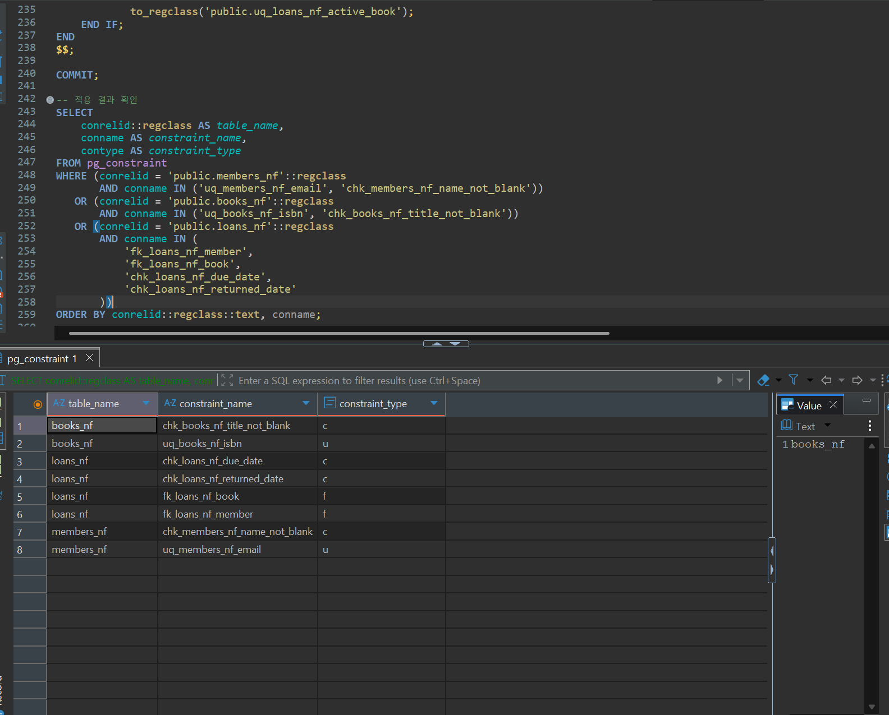
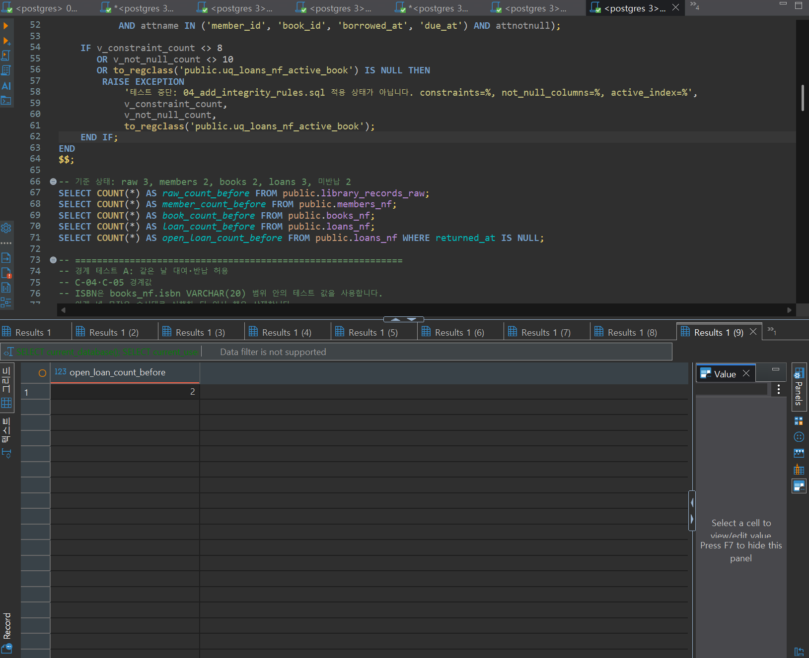
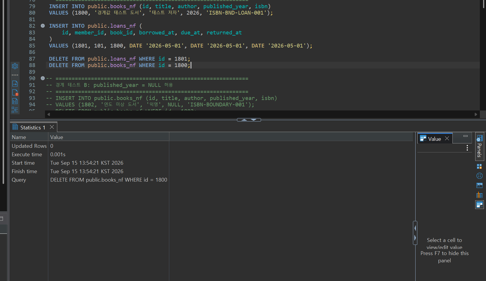
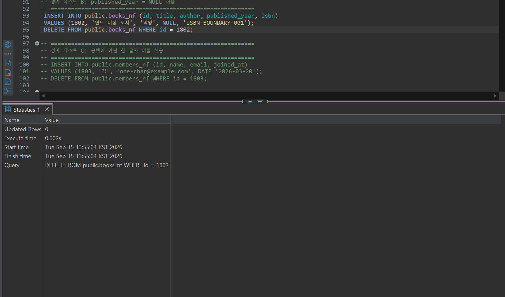
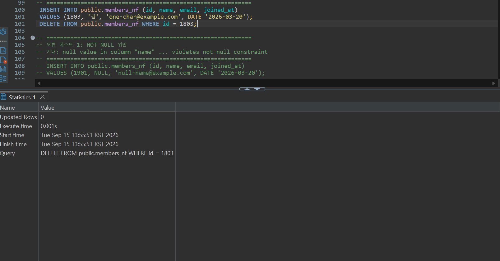
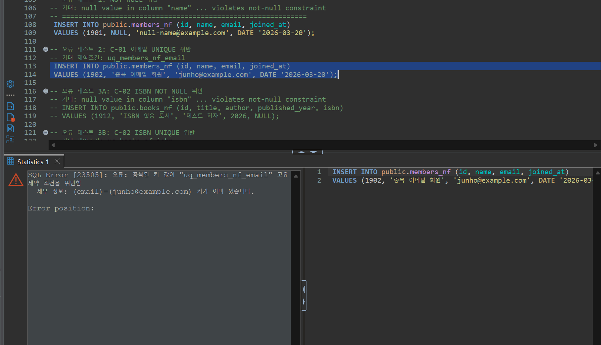

# Chapter 06 확장 실습 답안 템플릿

> **과제:** 정규화와 데이터 무결성으로 좋은 테이블 만들기  
> **사용 방법:** 이 파일을 내려받아 본인의 GitHub 저장소에 `chapter06_answer.md`라는 이름으로 저장한 뒤 실습하면서 바로 작성합니다.  
> **제출 방법:** LMS에는 파일을 직접 업로드하지 않고, **본인 GitHub 저장소의 `chapter06_answer.md` 파일 URL**을 제출합니다.

---

## 제출 전 주의

이 파일과 캡처 화면에는 실제 비밀번호, 전체 DB 접속 URL, API Key, 개인정보를 기록하지 않습니다.

```text
GitHub 계정 또는 별칭: jin-park0115
과제 작성일: 2026-09-15
사용한 AI 도구: claude
```

---

# 1. 실습 환경과 시작 상태 확인

다음을 실행합니다.

```sql
SELECT current_database();
SELECT current_user;
SELECT current_schema();
SHOW search_path;
SHOW transaction_read_only;
```

| 확인 항목 | 실제 결과 | 의미 |
| --- | --- | --- |
| `current_database()` | ai_database_book |  |
| `current_user` | postgres |  |
| `current_schema()` | learning_erd |  |
| `search_path` | learning_erd, "$user", public |  |
| `transaction_read_only` | off |  |

- [ v ] 현재 DB가 `ai_database_book`이다.
- [ v ] 변경 가능한 연결인지 확인했다.
- [ v ] Auto-commit 상태를 확인했다.
- [ v ] Chapter 06 번호형 SQL 파일을 사용한다.

---

# 2. 정규화 전 큰 테이블의 문제 찾기

본문의 `library_records_raw` 구조를 기준으로 생각합니다.

```text
library_records_raw 한 행
→ 대여 사건 한 건이지만 회원·도서의 현재 사실까지 함께 저장된 구조
```

## 2-1. 위험한 중복과 의미 있는 반복 구분

| 반복되는 값/상황 | 위험한 중복 / 의미 있는 반복 | 판단 이유 |
| --- | --- | --- |
| 회원 이메일이 여러 대여 행에 반복 | 위험한 중복 | 이메일은 회원이라는 대상의 현재 사실이다. 대여할 때마다 값이 복사되므로, 이메일이 바뀌면 그 회원의 모든 대여 행을 찾아 전부 고쳐야 하고 하나라도 놓치면 값이 서로 어긋난다. |
| 도서 제목이 여러 대여 행에 반복 | 위험한 중복 | 제목은 도서라는 대상의 현재 사실이다. 대여 여부와 무관하게 존재해야 하는 값인데 대여 행에 종속되어 저장되어 있어 같은 문제가 생긴다. |
| `loans_nf.member_id = 101` 반복 | 의미 있는 반복 | 같은 회원이 실제로 여러 번 대여한 서로 다른 사건이므로, 사건마다 member_id가 반복되는 것은 사실이 중복된 게 아니라 하나의 회원을 가리키는 참조가 여러 번 쓰인 것뿐이다. |
| 사건 당시 가격 같은 이력값 반복 | 의미 있는 반복 | 같은 값처럼 보여도 각 행마다 그 사건이 벌어진 시점에 고정된 별개의 사실이다. 나중에 현재 가격이 바뀌어도 과거 사건의 값은 그대로 남아 있어야 하므로 하나로 합칠 수 없다. |

## 2-2. 이상 현상 설명

### 삽입 이상

```text
아직 한 번도 대여되지 않은 새 도서를 등록하려 할 때 생기는 문제:
library_records_raw는 한 행이 곧 대여 사건이므로, 대여 사건 없이는 도서 정보만 따로 저장할
자리가 없다. 도서를 등록하려면 loan_id, borrowed_at 같은 대여 관련 값을 억지로 채우거나
NULL로 비워야 하는데, 이는 "아직 벌어지지 않은 사건"을 있는 것처럼 만드는 것이라 데이터
자체가 거짓말을 하게 된다.
```

### 수정 이상

```text
회원 이메일이 변경될 때 생기는 문제:
그 회원이 대여한 모든 행을 찾아 member_email을 일일이 고쳐야 한다. 한 행이라도 빠뜨리면
같은 회원인데 이메일이 서로 다른 행이 공존하게 되어, 어떤 값이 진짜 현재 이메일인지 알 수
없어진다.
```

### 삭제 이상

```text
마지막 대여 기록을 삭제할 때 생길 수 있는 문제:
그 회원(또는 도서)이 등장하는 유일한 행이 사라지면, 대여 사건 기록과 함께 회원 이름·이메일,
도서 제목·저자 같은 "현재 사실"까지 통째로 사라진다. 대여 이력 하나를 지웠을 뿐인데 회원이나
도서가 시스템에서 아예 존재하지 않았던 것처럼 되어버린다.
```

### 왜 이것이 SQL 문법 문제가 아니라 구조 문제인가요?

```text
위 세 가지 이상은 모두 문법적으로 완전히 올바른 INSERT/UPDATE/DELETE 문을 실행했을 때
발생한다. 원인은 명령문이 아니라, 서로 독립적으로 변하는 세 가지 사실(회원의 현재 정보,
도서의 현재 정보, 한 번의 대여 사건)을 하나의 테이블·하나의 행에 몰아넣은 구조 자체에 있다.
그래서 쿼리를 아무리 정교하게 고쳐도 문제가 사라지지 않고, 테이블을 나누는 구조 변경(정규화)
으로만 해결할 수 있다.
```

---

# 3. 1NF·2NF·3NF 핵심 질문 복습

정규형 이름만 외우지 말고 **왜 분리하는지** 설명합니다.

## 3-1. 제1정규형(1NF)

```text
한 셀에 쉼표로 여러 독립 값을 넣거나 book1/book2/book3처럼 반복 열을 만들면 왜 문제가 되는가: 
값 하나가 원자적이지 않으면 "이 도서를 빌린 적이 있는가"처럼 값 하나 단위로 검색·필터·집계하는
SQL을 짤 수 없고, 문자열을 파싱해야 한다. 반복 열(book1, book2, book3)은 대여 권수가 늘어날
때마다 컬럼을 추가해야 하는 구조여서, 상한을 미리 정해두지 않는 한 스키마 자체가 계속 바뀌어야
한다.
```

내 서비스에서 비슷한 위험이 있는 예:

```text
FastOrder(카페 주문)에서 한 주문에 담긴 메뉴들을 orders.items 컬럼 하나에 "아메리카노,
카페라떼" 처럼 저장하거나 order.menu1/menu2/menu3로 나눈다면, "아메리카노가 포함된 주문
수"를 세기 위해 문자열을 파싱해야 하고, 메뉴별 옵션·수량·주문당시 가격을 값 하나에 붙일 자리도
없다. 실제로는 order_items 테이블로 분리해 주문 하나당 메뉴 여러 줄을 갖도록 했다.
```

## 3-2. 제2정규형(2NF)

다음 관계를 설명합니다.

```text
(student_id, course_id) → grade
student_id → student_name
course_id → course_name
```

```text
복합키 전체가 아니라 일부에만 의존하는 열을 분리해야 하는 이유:
student_name은 student_id만 있으면 정해지고 course_id와는 무관하다(course_name도 마찬가지로
course_id에만 의존한다). 이런 열을 (student_id, course_id) 테이블에 그대로 두면, 같은
학생이 여러 과목을 들을 때마다 student_name이 반복 저장되고, 학생 이름이 바뀌면 그 학생이
들은 수강 행을 전부 찾아 고쳐야 한다. student_name은 학생 테이블로, course_name은 과목
테이블로 옮기고, 수강 테이블에는 두 키와 grade처럼 실제로 (student_id, course_id) 조합
전체에 의존하는 값만 남겨야 한다.
```

## 3-3. 제3정규형(3NF)

```text
member_id → zip_code
zip_code → city
```

```text
일반 열이 다른 일반 열을 결정하는 구조를 검토해야 하는 이유:
zip_code가 city를 결정한다는 것은 city가 member_id가 아니라 zip_code라는 또 다른 일반
열에 종속(이행적 종속)된다는 뜻이다. city를 member 테이블에 그대로 두면 같은 zip_code를
가진 회원마다 city 값이 반복 저장되고, 특정 우편번호의 행정구역명이 바뀌면 그 우편번호를 가진
모든 회원 행을 찾아 고쳐야 한다. zip_code를 키로 하는 별도 테이블로 city를 옮기면 이 사실이
한 곳에만 존재하게 된다.
```

### 정규화는 값이 반복되기만 하면 무조건 분리하는 것인가요?

```text
아니다. 분리 여부를 결정하는 기준은 "값이 반복돼 보이는가"가 아니라 "그 값이 다른 열(또는
키)에 의해 결정되는 독립된 사실인가"이다. member_id가 여러 loans 행에 반복되는 것이나
대여 시점의 가격이 매번 저장되는 것은 반복이지만, 각각 서로 다른 사건이 같은 대상을 가리키는
참조이거나 그 시점에 고정돼야 하는 이력이라 문제가 되지 않는다. 함수 종속 관계를 먼저 확인하지
않고 반복만 보고 분리하면 오히려 필요한 이력이나 참조까지 잘못 쪼개게 된다.
```

---

# 4. 각 열의 '사실의 주인' 찾기

| 열 | 어떤 사실을 설명하는가 | 주인 테이블 | 이유 |
| --- | --- | --- | --- |
| `member_name` | 회원의 현재 이름 | member | 대여 사건과 무관하게 존재하고 바뀔 수 있는 회원 자체의 속성이다. |
| `member_email` | 회원의 현재 이메일 | member | 회원을 식별·연락하는 값으로, 대여 여부와 상관없이 회원 자체가 가지는 사실이다. |
| `book_title` | 도서의 현재 제목 | book | 대여된 적이 없어도 도서관에 존재할 수 있는 도서 자체의 사실이다. |
| `author` | 도서의 저자 | book | 저자는 그 책 자체를 설명하는 값이지 대여 사건과는 무관하다. |
| `borrowed_at` | 그 대여 사건이 시작된 날짜 | loan | 회원·도서와 무관하게 사건이 실제로 벌어진 시점 자체이다. |
| `due_at` | 그 대여 건의 반납 예정일 | loan | 대여 시점에 정책에 따라 정해져 그 사건 하나에 고정되는 값이다. |
| `returned_at` | 그 대여 건이 실제 반납된 날짜(미반납이면 NULL) | loan | 사건이 언제 끝났는지는 그 사건 자체의 사실이다. |
| `member_id` | 이 대여를 발생시킨 회원에 대한 참조 | member | 값 자체가 가리키는 대상(회원)이 원본이고, loan은 그 대상을 참조만 한다. |
| `book_id` | 이 대여의 대상이 된 도서에 대한 참조 | book | 값 자체가 가리키는 대상(도서)이 원본이고, loan은 그 대상을 참조만 한다. |

정규화 후 한 행의 의미:

```text
members_nf 한 행 = 등록된 회원 한 명의 현재 정보(이름, 이메일, 가입일)
books_nf 한 행 = 관리 대상 도서 한 종의 현재 정보(제목, 저자, 출판연도, ISBN)
loans_nf 한 행 = 특정 회원이 특정 도서를 빌린 사건 한 건(대여일, 반납예정일, 실제반납일)
```

### 현재 사실과 사건 당시 이력을 구분하는 기준

```text
그 값이 나중에 바뀌었을 때 과거 기록도 함께 최신값을 따라가야 하는가로 구분한다. member_name,
book_title처럼 대상을 설명하는 값은 바뀌면 그 즉시 최신 상태를 반영해야 하는 "현재 사실"이라
member/book 테이블에 한 번만 둔다. 반면 대여 시점의 가격처럼 특정 사건이 벌어진 순간에 고정
되어야 하고 이후 원본 값이 바뀌어도 절대 따라 바뀌면 안 되는 값은 "사건 당시 이력"이라 그
사건(loan)의 행 자체에 저장한다.
```

---

# 5. PostgreSQL로 정규화 전·후 구조 재현

Public 저장소의 다음 파일을 순서대로 사용합니다.

```text
code/chapter06/01_normalization_schema.sql
code/chapter06/02_normalization_seed.sql
code/chapter06/03_normalization_compare.sql
```

## 5-1. `01_normalization_schema.sql`

실행 전 예상:

```text
생성될 테이블 수: 4 
각 테이블 예상 행 수: 8, 4, 5, 6
```

실행 후:

```text
실제로 생성된 테이블: 4 
각 테이블 실제 행 수: 8, 4, 5, 6
```

## 5-2. `02_normalization_seed.sql`

실행 전 예상 기준:

```text
raw = 3
members = 2
books = 2
loans = 3
미반납 = 2
회원 101 대여 = 2
도서 201 대여 = 2
```

실제 결과:

```text
raw: 3
members: 2
books: 2
loans: 3 
미반납: 2
회원 101 대여: 2
도서 201 대여: 2
```

예상과 다른 값이 있다면 이유:

```text
예상과 실제가 모두 일치했다. 02_normalization_seed.sql 안의 검증 DO 블록이 커밋 전에
raw=3, members=2, books=2, loans=3, 미반납=2, 회원101=2, 도서201=2를 어설션하고 있어서,
값이 하나라도 다르면 애초에 예외가 발생해 COMMIT 자체가 되지 않는 구조이기 때문이다.
```

## 5-3. `03_normalization_compare.sql`

```text
검증 메시지: NOTICE:  Chapter 06 normalization comparison passed
PASS / FAIL: PASS
```

다음 항목을 확인합니다.

```text
회원 고아 참조: 0
도서 고아 참조: 0
날짜 순서 오류: 0
활성 대여 중복: 0
```

### 정규화 후에도 JOIN으로 원래 업무 정보를 다시 볼 수 있는 이유

```text
정규화는 같은 사실을 여러 곳에 중복 저장하지 않도록 "저장 방식"만 바꾼 것이지, 회원·도서·
대여 사이의 "관계 자체"는 loans_nf.member_id, loans_nf.book_id라는 FK로 그대로 보존하고
있다. 그래서 members_nf, books_nf, loans_nf를 member_id/book_id로 JOIN하면 정규화 이전
raw 테이블 한 행이 담고 있던 회원 이름·이메일, 도서 제목·저자, 대여 이력을 다시 그대로 만들
수 있다. 즉 정규화는 정보를 잃어버리는 것이 아니라 저장 위치만 나눈 것이다.
```

### 증거 화면

권장 경로:

```text
assignments/chapter06/images/step05_normalization.png
```

`여기에 정규화 전후 및 검증 결과 화면을 삽입하세요.`
step01 넣기
---

# 6. Chapter 06에서 확정한 C-01~C-08 정책 해석

| ID | 확정 규칙 | 구현 방법 | 왜 필요한가 | Chapter 05에서는 왜 미확정이었나 |
| --- | --- | --- | --- | --- |
| C-01 | 이메일 문자열 중복 금지 | `UNIQUE` | 이메일로 회원을 구분·조회하려면 한 이메일이 정확히 한 회원만 가리켜야 한다. | 가족 공유 이메일, 임시 가입처럼 중복을 허용할지 여부가 그때는 업무적으로 정해지지 않았다. |
| C-02 | ISBN 필수·중복 금지 | `NOT NULL + UNIQUE` | 같은 도서가 서로 다른 레코드로 중복 등록되는 것을 막고 도서를 고유하게 식별해야 한다. | "저장할 수 있다"는 선택 항목으로만 다뤄, ISBN이 없는 도서를 허용할지가 미정이었다. |
| C-03 | 이름·제목 공백 금지 | `CHECK` | 공백만 있는 문자열은 NOT NULL로는 걸러지지 않지만 실제로는 값이 없는 것과 같아 데이터 품질을 해친다. | Chapter 05는 컬럼의 존재·필수 여부만 다뤘고 문자열 내용의 유효성 같은 세부 규칙은 범위 밖이었다. |
| C-04 | `due_at >= borrowed_at` | `CHECK` | 반납예정일이 대여일보다 빠른 것은 논리적으로 불가능한 사건이므로 DB가 직접 막아야 한다. | 반납예정일 계산 방식(고정 기간 등)이 그때는 확정되지 않아 날짜 간 관계식을 걸 근거가 없었다. |
| C-05 | `returned_at`은 NULL 또는 대여일 이상 | `CHECK` | 반납일이 대여일보다 앞설 수 없다는 사건의 시간 순서를 보장해야 한다. | 반납 관련 정책 자체가 Chapter 05에서는 미확정 질문으로만 남아 있었다. |
| C-06 | 존재하는 회원·도서만 참조 | `FOREIGN KEY` | loans가 실존하지 않는 회원·도서를 가리키는 고아 레코드가 생기지 않도록 참조 무결성을 보장해야 한다. | 정규화된 members_nf/books_nf/loans_nf 구조 자체가 그때는 아직 확정되지 않아 FK를 걸 스키마가 없었다. |
| C-07 | 대여 이력이 있는 부모 삭제 금지 | `ON DELETE RESTRICT` | 회원·도서를 삭제했을 때 관련 대여 이력이 조용히 사라지거나 참조가 깨지지 않도록 해 이력 추적을 보장해야 한다. | 삭제 시 이력을 남길지 지울지(RESTRICT/CASCADE/SET NULL)에 대한 정책이 Chapter 05에서는 논의되지 않았다. |
| C-08 | 도서당 미반납 대여 최대 한 건 | 부분 고유 인덱스 | 실제 도서 한 권은 동시에 한 명에게만 대여될 수 있다는 업무 규칙을 강제해야 한다. | 동시 대여·예약 가능 여부가 R-05의 미확정 질문("동시 대여 권수 상한이 있나?")으로만 남아 있었다. |

### 확정되지 않은 정책을 제약조건으로 먼저 만들면 위험한 이유

```text
나중에 실제로 정해진 정책 방향이 미리 건 제약과 다르면(예: 이메일 공유를 허용하기로 결정),
이미 저장된 데이터 중 제약을 위반하는 행이 있을 경우 제약을 되돌리는 마이그레이션 자체가
막히고, 정상적인 새 요청까지 계속 거부당한다. 확정 전까지는 규칙을 문서와 애플리케이션
로직으로 관리하고, 업무적으로 확정된 것만 DB 제약으로 강제하는 것이 안전하다.
```

---

# 7. 기존 데이터 검사 후 무결성 규칙 적용

실행 파일:

```text
code/chapter06/04_add_integrity_rules.sql
```

## 7-1. 규칙을 추가하기 전에 기존 데이터를 먼저 검사해야 하는 이유

```text
이미 저장된 데이터가 새 규칙(NOT NULL, UNIQUE, CHECK, FOREIGN KEY)을 위반하고 있으면
ALTER TABLE로 제약을 추가하는 순간 바로 실패한다. 제약을 걸기 전에 SELECT로 위반 후보
행이 있는지 먼저 확인해야, 실패 원인을 사전에 파악해 데이터를 정리하거나 규칙 자체를
다시 검토할 수 있고, 트랜잭션 중간에 예상치 못한 오류로 멈추는 상황을 피할 수 있다.
```

## 7-2. 실행 결과

```text
명명된 제약조건 개수: 8
  (members_nf: uq_members_nf_email, chk_members_nf_name_not_blank /
   books_nf: uq_books_nf_isbn, chk_books_nf_title_not_blank /
   loans_nf: fk_loans_nf_member, fk_loans_nf_book, chk_loans_nf_due_date, chk_loans_nf_returned_date)
NOT NULL 적용 열 개수: 10
  (members_nf.name/email/joined_at, books_nf.title/author/isbn,
   loans_nf.member_id/book_id/borrowed_at/due_at)
부분 고유 인덱스 존재 여부: 있음 (uq_loans_nf_active_book, 도서당 미반납 대여 1건 제한)
COMMIT 성공 여부: 성공
```

> 위 값은 실제 `04_add_integrity_rules.sql` 파일 내용으로 확인했다. 파일은 하나의 트랜잭션
> 안에서 (1) 기존 데이터에 NULL·중복·공백·날짜순서·고아참조·미반납중복이 있는지 먼저 검사하고,
> (2) 이상이 없을 때만 `members_nf`/`books_nf`/`loans_nf`에 `ALTER TABLE`로 NOT NULL·
> UNIQUE·CHECK·FOREIGN KEY(`ON DELETE RESTRICT`)를 추가한 뒤, (3) `uq_loans_nf_active_book`
> 부분 고유 인덱스를 만들고, (4) 커밋 전에 pg_constraint/pg_attribute로 제약 개수(8)·
> NOT NULL 컬럼 개수(10)·인덱스 존재 여부를 다시 검증해 하나라도 어긋나면 COMMIT 자체를
> 막는 구조다. 실제로 실행한 뒤 파일 맨 끝의 조회 결과를 캡처(아래 증거 화면)해 위 값과
> 대조했고, 8개 제약조건이 정확히 일치함을 확인했다.

### 메타데이터를 확인하는 이유

```text
pg_constraint, information_schema, pg_indexes 같은 메타데이터를 직접 조회하면, 제약조건이
내가 의도한 이름·컬럼·조건으로 정확히 걸렸는지를 실제 DB 상태로 확인할 수 있다. "오류 없이
실행됐으니 잘 적용됐을 것"이라는 추측이 아니라, 시스템 카탈로그라는 근거로 확인해야 나중에
제약이 빠지거나 잘못 걸린 것을 뒤늦게 발견하는 일을 막을 수 있다.
```

### 증거 화면



`04_add_integrity_rules.sql`의 242~261행(적용 결과 확인 SELECT)을 실행한 화면이다.
`books_nf`(chk_books_nf_title_not_blank, uq_books_nf_isbn), `loans_nf`(chk_loans_nf_due_date,
chk_loans_nf_returned_date, fk_loans_nf_book, fk_loans_nf_member), `members_nf`
(chk_members_nf_name_not_blank, uq_members_nf_email) 총 8개 제약조건이 그대로 조회되어,
7-2에 적어 둔 "명명된 제약조건 개수: 8"이 실제 값으로 확인되었다.

---

# 8. 정상·경계·실패 테스트

실행 파일:

```text
code/chapter06/05_integrity_tests.sql
```

> **중요:** 오류 테스트는 한 번에 하나씩 실행하고, 각 테스트가 끝난 뒤 기준 데이터가 유지되는지 확인합니다.

## 8-1. 허용되어야 하는 경계값

최소 3개를 실행·관찰합니다.

05_integrity_tests.sql에 실제로 준비된 경계 테스트 A/B/C 기준으로 작성했다.

| 테스트 | 예상 | 실제 | 왜 허용되어야 하는가 |
| --- | --- | --- | --- |
| 경계 테스트 A: `due_at = borrowed_at`이자 `returned_at = borrowed_at`(도서 1800, 대여 1801) | 성공(INSERT 후 DELETE까지 정상) | (직접 실행 후 기록) | C-04는 `due_at >= borrowed_at`, C-05는 `returned_at`이 NULL이거나 대여일 이상이면 되므로, 대여·반납예정·실제반납이 모두 같은 날인 당일 대여·당일 반납 사건도 정상적으로 허용되어야 한다. |
| 경계 테스트 B: `published_year = NULL`(도서 1802) | 성공 | (직접 실행 후 기록) | 출판연도는 C-01~C-08 확정 규칙에 없는 선택 항목이라, 출판연도를 모르는 도서도 등록할 수 있어야 한다. |
| 경계 테스트 C: 공백이 아닌 한 글자 이름 `'김'`(회원 1803) | 성공 | (직접 실행 후 기록) | C-03은 "공백만 있는 값"을 막는 규칙이지 최소 글자 수를 규제하지 않으므로, 한 글자라도 실제 값이 있으면 허용되어야 한다. |
| 기존 데이터의 `returned_at = NULL`(대여 1002, 1003) | 이미 정상 저장되어 있음 | 02_normalization_seed.sql 기준 이미 확인됨(미반납 2건) | 아직 반납하지 않은 상태는 정상적인 업무 상태이며, NULL은 "값이 없다"가 아니라 "아직 확정되지 않았다"는 뜻으로 쓰였다. |

**캡처 1 — 05_integrity_tests.sql 1~71행(사전 점검 + 기준 상태 확인)**



04번 스크립트가 적용된 상태임을 사전 점검 DO 블록이 통과했고, `open_loan_count_before` 값이
2로 나와 기준 상태(미반납 2건)와 일치함을 확인했다.

**캡처 2 — 경계 테스트 A(79~88행, 당일 대여·반납)**



**캡처 3 — 경계 테스트 B(93~95행, published_year = NULL)**



**캡처 4 — 경계 테스트 C(100~102행, 공백 아닌 한 글자 이름)**



세 경계 테스트 모두 INSERT 단계에서 오류 없이 통과했고(오류 메시지 창이 뜨지 않음), 이어서
실행한 DELETE 문도 오류 없이 끝나 임시로 넣은 테스트 행이 정리되었다. 즉 due_at=borrowed_at,
returned_at=borrowed_at, published_year=NULL, 한 글자 이름이 모두 실제로 허용된다는 것을
확인했다.

## 8-2. 실패해야 하는 오류값

최소 6개를 실행합니다.

05_integrity_tests.sql의 오류 테스트 1~10번(파일 내 주석 번호) 기준으로 작성했다. `실제 결과`/`오류 메시지 핵심`은 각 테스트를 한 번에 하나씩 실행한 뒤 채운다.

| 오류 테스트 | 기대 규칙 | 실제 결과 | 오류 메시지 핵심(예상) | 실패해야 하는 이유 |
| --- | --- | --- | --- | --- |
| 1. 회원 이름 NULL(id 1901) | `NOT NULL` | (실행 후 기록) | `null value in column "name" of relation "members_nf" violates not-null constraint` | 반드시 있어야 할 값이 비어 있으면 그 행이 어떤 회원인지 알 수 없으므로 저장 자체를 막아야 한다. |
| 2. 이메일 중복(id 1902, junho@example.com) | `UNIQUE` | 실패(예상대로 INSERT 거부됨) | `SQL Error [23505]: 오류: 중복된 키 값이 유일 제약 조건 "uq_members_nf_email" 위반` / `세부 정보: (email)=(junho@example.com) 키가 이미 있습니다.` | 같은 이메일이 두 회원을 가리키면 이메일로 회원을 특정할 수 없게 되어 C-01이 무의미해진다. |
| 3A. ISBN NULL(id 1912) | `NOT NULL` | (실행 후 기록) | `null value in column "isbn" of relation "books_nf" violates not-null constraint` | C-02에서 ISBN을 필수로 정했으므로, ISBN 없는 도서 등록은 확정 규칙 위반이다. |
| 3B. ISBN 중복(id 1903, 'ISBN-001') | `UNIQUE` | (실행 후 기록) | `duplicate key value violates unique constraint "uq_books_nf_isbn"` | 같은 도서가 서로 다른 레코드로 중복 등록되면 어느 레코드가 진짜인지 알 수 없다. |
| 4. 공백 이름(id 1904, `'   '`) | `CHECK` | (실행 후 기록) | `new row for relation "members_nf" violates check constraint "chk_members_nf_name_not_blank"` | 공백만 있는 값은 겉보기엔 값이 있어도 실질적으로 빈 값이라 데이터 품질을 해친다. |
| 5. 공백 제목(id 1905, `'   '`) | `CHECK` | (실행 후 기록) | `new row for relation "books_nf" violates check constraint "chk_books_nf_title_not_blank"` | 같은 이유로 도서 제목도 공백만 있는 값을 막아야 한다. |
| 6A. 존재하지 않는 회원 참조(id 1906, member_id=999) | `FOREIGN KEY` | (실행 후 기록) | `insert or update on table "loans_nf" violates foreign key constraint "fk_loans_nf_member"` | 존재하지 않는 회원을 참조하면 아무도 실제로 조회할 수 없는 고아 대여 기록이 된다. |
| 6B. 존재하지 않는 도서 참조(id 1910, book_id=999) | `FOREIGN KEY` | (실행 후 기록) | `insert or update on table "loans_nf" violates foreign key constraint "fk_loans_nf_book"` | 존재하지 않는 도서를 참조하는 대여는 실제로 일어날 수 없는 사건이다. |
| 7. 반납예정일이 대여일보다 빠름(id 1907) | `CHECK` | (실행 후 기록) | `new row for relation "loans_nf" violates check constraint "chk_loans_nf_due_date"` | 반납예정일이 대여일보다 앞서는 것은 시간 순서상 불가능한 사건이다. |
| 8. 실제반납일이 대여일보다 빠름(id 1908) | `CHECK` | (실행 후 기록) | `new row for relation "loans_nf" violates check constraint "chk_loans_nf_returned_date"` | 반납일이 대여일보다 앞설 수는 없다. |
| 9. 같은 도서(201)의 두 번째 미반납 대여(id 1909) | 부분 고유 인덱스 | (실행 후 기록) | `duplicate key value violates unique constraint "uq_loans_nf_active_book"` | 같은 책 한 권이 반납되지 않은 채 동시에 두 번 대여될 수 없다는 C-08 업무 규칙을 위반한다. |
| 10. 대여 이력이 있는 회원(id 101) 삭제 | `RESTRICT/FOREIGN KEY` | (실행 후 기록) | `update or delete on table "members_nf" violates foreign key constraint "fk_loans_nf_member" on table "loans_nf"` | 대여 이력이 있는 회원을 삭제하면 그 이력이 가리키던 대상이 사라져 과거 기록의 의미가 깨진다(C-07). |

**캡처 5 — 오류 테스트 2(113~114행) 실제 오류 화면**



`uq_members_nf_email` 제약조건 이름이 오류 메시지에 그대로 나타나고, "세부 정보"에 어떤
이메일 값이 이미 존재하는지까지 정확히 표시된다. 예상했던 대로 INSERT가 거부되어, C-01
규칙이 실제로 동작하고 있음을 확인했다.

## 8-3. 테스트 후 기준 상태 재검증

```text
raw: 3
members: 2
books: 2
loans: 3
미반납: 2
회원 고아 참조: 0
도서 고아 참조: 0
활성 대여 중복: 0
```

> 위 값은 05_integrity_tests.sql 맨 끝의 검증 DO 블록이 그대로 어설션하는 값이다(raw=3,
> members=2, books=2, loans=3, open=2, orphan_member=0, orphan_book=0, active_duplicate=0).
> 오류 테스트 1~10을 각각 한 번에 하나씩 실행하고 실패할 때마다 반드시 `ROLLBACK;`(또는
> 자동 커밋이면 그 문장만 실패로 끝남)으로 정리한 뒤 이 DO 블록까지 통과해 `NOTICE:
> Chapter 06 integrity test baseline preserved`가 출력되면 위 값이 실제 결과와 일치한다.

### 실패 테스트 후 기준 데이터가 유지되어야 하는 이유

```text
제약조건의 역할은 잘못된 값이 새로 들어오는 것을 막는 것이지, 이미 저장되어 있던 정상 데이터를
훼손하는 것이 아니다. 실패한 INSERT/UPDATE가 트랜잭션 전체를 오염시키지 않고 기준 데이터가
그대로 남아 있어야만, "이 규칙이 나쁜 입력만 정확히 막고 있고 부작용이 없다"는 것을 확인할
수 있다. 만약 실패 테스트 이후 기준 데이터 개수가 달라졌다면, 그 자체가 트랜잭션 처리나
제약 설계에 문제가 있다는 신호다.
```

### 증거 화면

8-1, 8-2에 각 테스트 바로 아래 캡처(step02~step06)를 이미 첨부했다. 대표 오류 화면은
오류 테스트 2(이메일 UNIQUE 위반, `images/step06.png`)이다.

---

# 9. 정규화와 무결성 제약조건 역할 비교

| 질문 | 나의 설명 |
| --- | --- |
| 정규화가 해결하는 문제 | 서로 다른 사실(회원, 도서, 대여 사건)을 한 테이블에 섞어 저장해 생기는 중복 저장과 삽입·수정·삭제 이상 — 즉 "어디에 무엇을 저장할지"라는 구조 문제. |
| `NOT NULL`이 해결하는 문제 | 반드시 있어야 하는 값이 비어 있는 상태(값의 존재 여부)를 막는다. |
| `UNIQUE`가 해결하는 문제 | 같은 값이 두 번 이상 나타나면 안 되는 업무 규칙(값의 유일성)을 강제한다. |
| `CHECK`가 해결하는 문제 | 한 열, 또는 같은 행 안의 여러 열 사이에 성립해야 하는 논리적 조건(형식, 범위, 날짜 순서 등)을 강제한다. |
| `FOREIGN KEY`가 해결하는 문제 | 서로 다른 테이블 간 참조가 실제로 존재하는 대상을 가리키도록 보장(참조 무결성)한다. |
| 부분 고유 인덱스가 해결하는 문제 | 모든 행이 아니라 특정 조건을 만족하는 행들 사이에서만 유일성을 강제하는 세밀한 업무 규칙(예: 미반납 상태에서만 도서당 한 건)을 구현한다. |

### 정규화만 잘하면 잘못된 데이터가 모두 차단되나요?

```text
아니다. 정규화는 어떤 사실을 어느 테이블에 저장할지 구조를 정리해줄 뿐이다. 정규화가 잘 된
테이블이라도 그 안에 필수값이 NULL로 들어오거나, 날짜 순서가 뒤바뀌거나, 존재하지 않는
회원을 참조하는 것은 막지 못한다. 값 자체의 정확성은 NOT NULL/UNIQUE/CHECK/FK 같은
제약조건이 담당한다.
```

### 제약조건만 많이 넣으면 나쁜 구조가 좋은 구조가 되나요?

```text
아니다. 구조 자체가 서로 다른 사실을 한 테이블에 섞어 놓았다면, 제약조건을 아무리 추가해도
중복 저장과 갱신 이상은 사라지지 않는다. 제약조건은 이미 적절히 나뉜 테이블 안에서 값의
정확성을 지키는 역할이지, 잘못 나뉜 테이블 구조 자체를 고쳐주지 않는다. 정규화가 먼저이고
제약조건은 그 위에 얹는 것이다.
```

---

# 10. Chapter 05 개인 ERD 개선

Chapter 05에서 만든 개인 서비스 ERD를 다시 엽니다.

## 10-1. 수정 전 점검

Chapter 05의 FastOrder(카페 주문) ERD(`users`, `menus`, `options`, `orders`,
`order_items`, `order_item_options`)를 기준으로 점검했다.

- [ ] 같은 현재 사실을 여러 테이블에 복사한 부분이 있는가?
- [ ] 한 셀에 여러 독립 값을 넣으려 한 부분이 있는가?
- [ ] 사건과 현재 상태가 한 테이블에 섞였는가?
- [v] 복합키 일부에만 의존하는 속성이 있는가? — `order_item_options`에 옵션 선택 당시
      추가금액을 넣는다면 그 값은 복합키(`order_item_id`, `option_id`) 전체가 아니라
      `option_id` 쪽에만 의존한다.
- [ ] 일반 열이 다른 일반 열을 결정하는 부분이 있는가?
- [v] 확정 업무 규칙인데 DB가 막지 못하는 부분이 있는가? — "한 주문에는 메뉴가 하나 이상
      담긴다"(P05-R05)는 규칙을 스키마만으로는 강제하지 못한다(`order_items` 0건인 주문도
      구조적으로는 생성 가능).
- [ ] 아직 미확정인데 제약조건으로 너무 강하게 정한 부분이 있는가?

## 10-2. 수정 전·후 비교

| 항목 | 수정 전 | 수정 후 | 변경 근거 | 관련 요구사항 ID |
| --- | --- | --- | --- | --- |
| 옵션 선택 당시 추가금액 | `order_item_options`에는 `option_id`만 있고, 금액은 `options.extra_price`만 참조 | 컬럼을 바로 추가하지 않고, "추가한다면 2NF상 옵션에만 의존하는 이력값"이라는 점을 명시한 미확정 후보로 기록(10-3의 P06-C05와 연결) | Chapter 06의 2NF 논의 — 복합키 일부에만 의존하는 값을 성급히 연결 테이블에 넣지 않는다 | P05-Q02 |
| 주문당 메뉴 최소 1개 규칙 | ERD·스키마 어디에도 강제 장치 없음 | DB 제약만으로는 "최소 1건"을 표현하기 어렵다는 점을 인정하고, 주문 생성 로직(애플리케이션 트랜잭션)에서 `order_items` 없이는 커밋하지 않도록 강제하는 것으로 역할을 나눔 | 6번 항목에서 배운 "확정 규칙인데 DB가 못 막는 부분" 점검 | P05-R05 |
| `menus.name` UNIQUE 여부 | 미확정 상태, UNIQUE 없음 | 여전히 UNIQUE를 걸지 않음(미확정 유지) — 시즌 한정 메뉴 재등록 가능성을 배제할 근거가 없음을 재확인 | "확정되지 않은 정책을 제약조건으로 먼저 만들면 위험하다"는 6번 항목 원칙 | P05-Q03 |

## 10-3. 개인 프로젝트 무결성 규칙 후보

| 규칙 ID | 업무 규칙 | 제약조건 후보 | 확정 / 미확정 | 근거 |
| --- | --- | --- | --- | --- |
| P06-C01 | 회원 이메일은 중복될 수 없다 | `UNIQUE(email)` | 미확정 | 가족 공유 이메일 등 중복 허용 여부(P05-Q01 계열)가 아직 정해지지 않았다. |
| P06-C02 | 주문 상세의 수량은 1 이상이어야 한다 | `CHECK (quantity > 0)` | 확정 | 수량 0 이하인 주문 상세는 업무적으로 존재할 이유가 없다. |
| P06-C03 | 주문 상세는 실제로 존재하는 주문·메뉴만 참조해야 한다 | `FOREIGN KEY(order_id)`, `FOREIGN KEY(menu_id)` | 확정 | 참조 무결성은 서비스 정책과 무관하게 항상 필요하다. |
| P06-C04 | 주문 이력이 있는 회원은 삭제할 수 없다(또는 이력만 보존) | `ON DELETE RESTRICT`(`orders.user_id → users.id`) | 미확정 | 회원 탈퇴 시 주문 이력을 남길지 익명화할지 정책이 아직 없다(P05-Q01과 연결). |
| P06-C05 | 메뉴가 판매 중지되어도 과거 주문 이력의 메뉴 정보는 유지되어야 한다 | 메뉴 삭제 대신 `is_active` 플래그 사용, `order_items → menus`는 `ON DELETE RESTRICT` | 확정 | 주문 당시 가격을 `order_items.unit_price_at_order`에 별도 저장하기로 한 것(P05-R08)과 같은 맥락으로, 과거 사건 기록은 원본 대상이 사라져도 보존되어야 한다. |

> 미확정 규칙은 `확인 필요`로 남겨도 됩니다. 억지로 제약조건을 만들지 않습니다.

## 10-4. 수정한 ERD

권장 이미지 경로:

```text
assignments/chapter06/images/step10_my_erd_after.png
```

`여기에 수정한 개인 ERD 이미지를 삽입하세요.`

---

# 11. AI를 정규화·무결성 리뷰어로 활용

## 11-1. 내가 먼저 작성한 구조와 규칙

```text
내 서비스: FastOrder (카페 주문)
검토할 테이블: order_item_options
한 행의 의미: 주문 상세 한 건에 옵션 한 개가 선택된 사실
중복으로 의심되는 열: options.extra_price를 order_item_options에도 함께 저장해야 하는지
확정 업무 규칙: (order_item_id, option_id) 조합은 유일해야 한다(같은 옵션을 같은 주문
             상세에 두 번 선택할 수 없음)
미확정 정책: 옵션 가격이 나중에 바뀐 뒤, 과거 주문 금액을 다시 계산할 때 선택 당시 가격을
             어떻게 보존할 것인가
```

## 11-2. AI에게 전달한 핵심 프롬프트

```text
"FastOrder의 order_item_options 테이블(주문상세-옵션 연결 테이블)을 Chapter 06 정규화·
무결성 기준으로 리뷰해줘. 2NF 관점에서 복합키 일부에만 의존하는 열이 있는지, 그리고 옵션
가격 변경 이력을 어디에 저장해야 하는지 확정/미확정을 구분해서 제안해줘. 아직 결정 안 된
정책은 UNIQUE나 CHECK로 확정하지 말고 질문으로 남겨줘."
```

## 11-3. AI 제안 검토

| AI 제안 | 수용 / 수정 / 보류 / 거절 | 요구사항 근거 | 실제 검증 방법 | 나의 판단 |
| --- | --- | --- | --- | --- |
| `order_item_options`에 `extra_price_at_selection`을 추가하자 | 보류 | P05-Q02 | 옵션 가격이 바뀐 가상 시나리오를 만들어 과거 주문 금액이 흔들리는지 확인 | 필요성엔 동의하지만 이력 보존 정책 자체가 미확정이라 스키마에 바로 반영하지 않고 미확정 후보(10-3 P06-C05 연결)로만 기록했다. |
| `(order_item_id, option_id)`에 UNIQUE(또는 복합 PK)를 걸어 중복 선택을 막자 | 수용 | P05-R06 | 같은 조합을 두 번 INSERT해 실패하는지 확인 | 확정 규칙과 정확히 일치하고, 이미 복합 PK가 이 역할을 하고 있어 그대로 유지했다. |
| 조회 성능을 위해 `options.name`을 `order_item_options`에도 복사해 저장하자 | 거절 | (해당 없음) | `options.name`을 바꾼 뒤 과거 `order_item_options` 행이 최신 이름을 따라가는지 확인 | 이건 오히려 "위험한 중복"을 새로 만드는 제안이다. 이름이 바뀌면 두 곳을 다 고쳐야 하는 갱신 이상이 생기므로, 단순 조회 편의를 이유로 값의 주인(options)을 무시하지 않았다. |
| `menus` 삭제 시 관련 `order_items`도 `ON DELETE CASCADE`로 함께 지우자 | 거절 | P05-R08 | 메뉴를 삭제했을 때 과거 주문 이력이 함께 사라지는지 확인 | 과거 주문 이력은 메뉴가 없어져도 남아야 하는 사실이라 RESTRICT가 맞고, CASCADE는 의도치 않은 이력 삭제로 이어진다. |

특히 AI가 다음을 제안했다면 근거를 다시 확인합니다.

```text
UNIQUE
NOT NULL
CHECK
ON DELETE CASCADE
ON DELETE RESTRICT
새로운 테이블 분리
```

### AI가 단순히 값이 반복된다는 이유만으로 분리를 제안한 부분이 있었나요?

```text
분리를 제안한 부분은 없었다. 오히려 반대 방향으로, "옵션명이 매번 참조로만 쓰여 조회가
느리다"며 값을 order_item_options에 복사(비정규화)하자는 제안이 있었다. 반복 자체를
문제로 본 것이 아니라 반복을 늘리는 제안이었기 때문에, 그 값의 주인이 options 테이블이라는
근거로 거절했다.
```

### AI가 미확정 정책을 확정 규칙처럼 만든 부분이 있었나요?

```text
있었다. 처음에 AI는 extra_price_at_selection 컬럼을 바로 추가하자고 단정적으로 제안했는데,
옵션 가격 이력을 보존할지 말지에 대한 정책 자체가 아직 결정되지 않은 사항이었다. 그대로
받아들이지 않고 보류로 남긴 뒤, 개인 프로젝트 미확정 규칙 후보(10-3)에만 기록했다.
```

---

# 12. 최종 성찰

아래 문장은 본인의 말로 작성합니다.

```text
1. 정규화에서 가장 중요한 질문은
   이 열이 설명하는 사실의 주인이 누구이고, 그 값이 다른 열(또는 키)에 의해 완전히
   결정되는가 이다.

2. 위험한 중복과 의미 있는 반복의 차이는
   같은 사실이 여러 곳에 복사되어 한쪽만 바뀌면 값이 서로 어긋나는지(위험한 중복), 아니면
   서로 다른 사건이 같은 대상을 반복해서 참조하거나 그 시점에 고정된 이력일 뿐 사실 자체는
   하나만 존재하는지(의미 있는 반복) 이다.

3. 정규화와 제약조건의 역할이 다른 이유는
   정규화는 어떤 사실을 어느 테이블에 둘지 구조를 정리하는 것이고, 제약조건은 그 구조 안에
   들어오는 값 하나하나가 업무 규칙을 실제로 지키는지 검사하는 것이기 때문 이다.

4. 실패해야 하는 SQL을 일부러 실행해 보는 이유는
   제약조건이 성공해야 할 입력은 막지 않으면서 실패해야 할 입력만 정확히 막는지를 직접
   확인해야, 문서상으로만 맞고 실제로는 헐거운 규칙을 놓치지 않기 때문 이다.

5. AI가 제안한 UNIQUE/CHECK/FK를 그대로 적용하면 안 되는 이유는
   AI는 값이 반복되거나 조회가 느리다는 표면적 패턴만 보고 제안할 수 있고, 그 제약이 실제로
   확정된 업무 규칙에 근거하는지는 판단하지 못하므로 사람이 요구사항과 대조해 확정/미확정을
   가려야 하기 때문 이다.
```

---

# 13. 제출 체크리스트

- [v] `chapter06_answer.md`를 본인 저장소에 만들었다.
- [v] 위험한 중복과 의미 있는 반복을 구분했다.
- [v] 삽입·수정·삭제 이상을 설명했다.
- [v] 1NF·2NF·3NF 핵심 질문을 자신의 말로 설명했다.
- [v] 열의 사실의 주인을 분류했다.
- [v] `01_normalization_schema.sql`을 실행했다.
- [v] `02_normalization_seed.sql` 기준 상태를 확인했다.
- [v] `03_normalization_compare.sql` 검증 결과를 확인했다.
- [v] C-01~C-08의 업무 근거를 설명했다.
- [v] `04_add_integrity_rules.sql`로 규칙을 적용했다. (step01.png로 8개 제약조건 확인)
- [v] 허용 경계값을 최소 3개 확인했다. (경계 테스트 A/B/C, step03~step05.png)
- [ ] 실패 테스트를 최소 6개 한 번에 하나씩 실행했다. (오류 테스트 2까지만 캡처 완료 — 나머지 오류 테스트 1, 3~10 실행·기록 필요)
- [ ] 실패 후 기준 데이터가 유지되는지 확인했다. (모든 오류 테스트 실행 후 05_integrity_tests.sql 182~248행 재검증 필요)
- [v] Chapter 05 개인 ERD를 수정했다.
- [v] 개인 프로젝트 제약조건 후보를 확정/미확정으로 구분했다.
- [v] AI 제안을 요구사항 근거와 실행 결과로 검토했다.
- [v] 핵심 화면을 첨부했다. (총 6장: step01~step06 — 권장 3~4장보다 많지만 04/05 검증 과정을 단계별로 보여주기 위해 유지)
- [ ] 캡처에 비밀번호나 개인정보가 없다. (직접 최종 확인 필요 — 특히 창 제목표시줄의 접속 정보)
- [ ] GitHub에서 Markdown 이미지가 정상적으로 보인다. (push 후 확인 필요)
- [ ] 최종 답안을 commit/push했다.

---

# 14. LMS 제출 URL

아래 형식의 **본인 GitHub 파일 URL**을 LMS에 제출합니다.

```text
https://github.com/<본인-GitHub-ID>/<본인-저장소>/blob/main/assignments/chapter06/chapter06_answer.md
```

내 제출 URL:

```text

```

> 저장소 메인 URL, 교수자 템플릿 URL, Raw URL이 아니라 **작성 완료된 본인 `chapter06_answer.md` 파일 화면 URL**을 제출합니다.