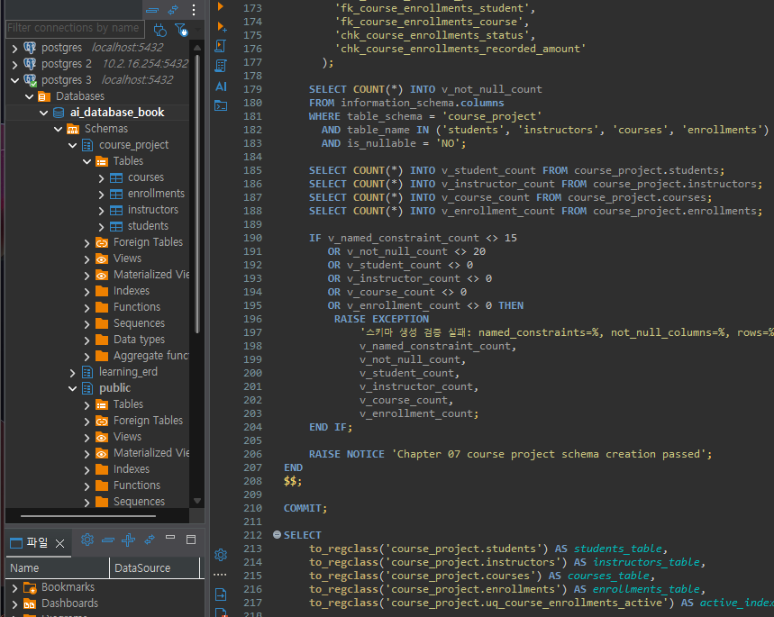
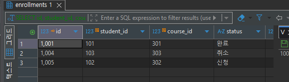
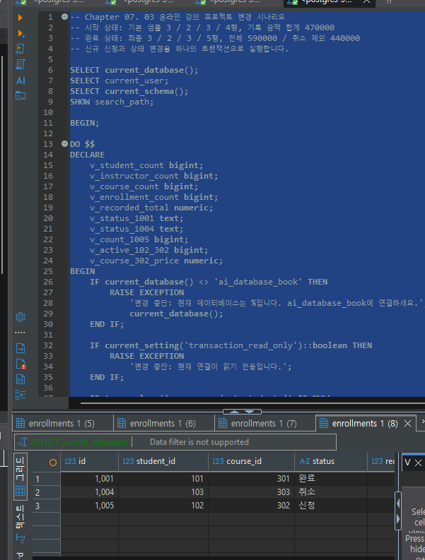
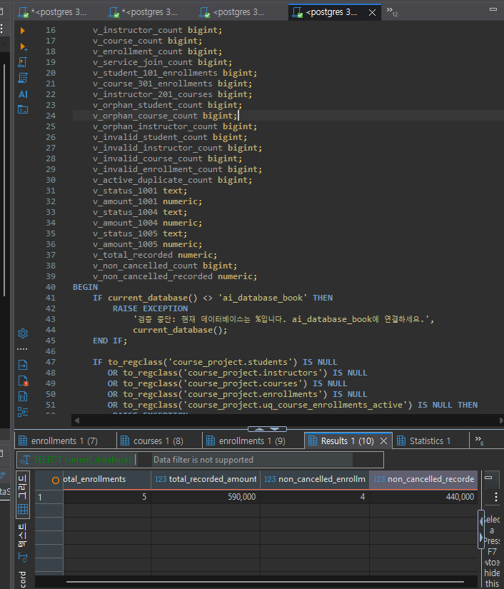
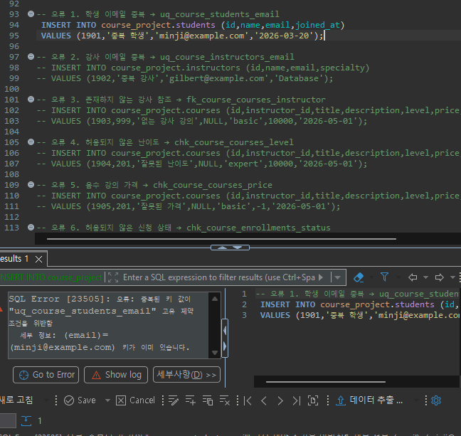
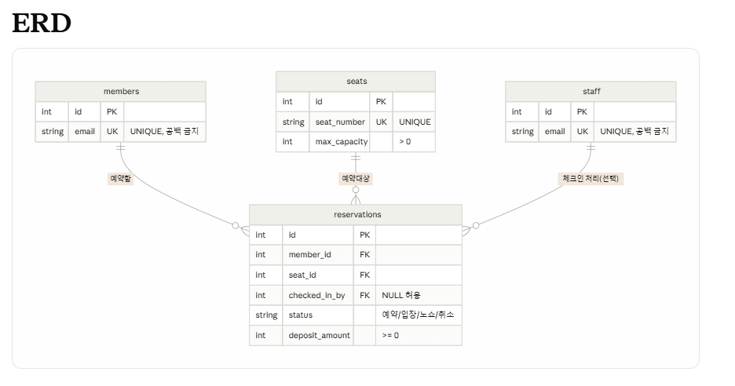

# Chapter 07 확장 실습 답안 템플릿

> **과제:** 실전 프로젝트 1 — 온라인 강의 수강신청 DB 완성하기  
> **사용 방법:** 이 파일을 내려받아 본인의 GitHub 저장소에 `chapter07_answer.md`라는 이름으로 저장한 뒤 실습하면서 바로 작성합니다.  
> **제출 방법:** LMS에는 파일을 직접 업로드하지 않고, **본인 GitHub 저장소의 `chapter07_answer.md` 파일 URL**을 제출합니다.

---

## 제출 전 주의

이 파일과 캡처 화면에는 실제 비밀번호, 전체 DB 접속 URL, API Key, 개인정보를 기록하지 않습니다.

```text
GitHub 계정 또는 별칭: jin-park0115
과제 작성일: 2026.09.16
사용한 AI 도구: claude
```

---

# 1. 시작 환경 확인

다음을 실행합니다.

```sql
SELECT current_database();
SELECT current_user;
SELECT current_schema();
SHOW search_path;
SHOW transaction_read_only;
```

| 확인 항목 | 실제 결과 | 의미 |
| --- | --- | --- |
| `current_database()` | ai_database_book |  |
| `current_user` | postgres |  |
| `current_schema()` | public |  |
| `search_path` | "$user", public |  |
| `transaction_read_only` | off |  |

- [v] 현재 DB가 `ai_database_book`이다.
- [v] 쓰기 가능한 연결인지 확인했다.
- [v] 실행할 SQL 범위를 확인했다.
- [v] Auto-commit 상태를 확인했다.

### 프로젝트 SQL을 실행하기 전에 시작 상태를 확인해야 하는 이유

```text
01~04 스크립트는 매 실행마다 "현재 DB가 ai_database_book인지", "쓰기 가능한 연결인지",
"course_project 스키마가 이미 있는지"를 DO 블록에서 먼저 검사하고 어긋나면 즉시
RAISE EXCEPTION으로 중단한다. 만약 이 확인 없이 바로 실행하면 다른 DB(postgres 2/3
연결)나 읽기 전용 복제본에 잘못 적용되거나, 이미 만들어진 스키마 위에 중복 생성을 시도해
알아채기 어려운 오류나 데이터 오염이 생길 수 있다. 시작 상태를 먼저 확인하는 습관은
"이 SQL을 지금 이 연결에서 실행해도 안전한가"를 스크립트가 스스로 증명하게 만드는
것과 같다.
```

---

# 2. 프로젝트 범위와 요구사항 읽기

## 2-1. 포함 범위

본문을 그대로 복사하지 말고 자신의 말로 정리합니다.

```text
1. 학생
2. 강의
3. 강사
4. 신청 시 기록 금액
```

## 2-2. 제외 범위

```text
1. 강의 정원과 대기열
2. 상태 변경 전체 이력
3. 진도·수료·강의 콘텐츠
4. 수강평·쿠폰·할인 적용 이력
```

### 범위를 명확하게 정해야 하는 이유

```text
범위를 정하지 않으면 "학생이 강의를 신청한다"는 요구사항 하나를 구현하면서도 정원 체크,
대기열, 진도율, 수강평까지 한꺼번에 설계하게 되어 테이블과 제약조건이 끝없이 커진다.
포함/제외를 먼저 나누면 지금 버전에서 지켜야 할 규칙(신청 상태, 신청 시 금액 등)과
나중에 별도로 설계할 규칙(정원, 이력, 콘텐츠)을 구분할 수 있어, 아직 정책이 없는
영역까지 성급하게 제약조건으로 확정하는 실수를 막을 수 있다.
```

## 2-3. 요구사항 / 프로젝트 결정 / 미확정 질문 구분

아래 항목 중 대표 항목을 정리합니다.

| ID | 종류 | 내용 요약 | DB 구조/규칙에 미치는 영향 |
| --- | --- | --- | --- |
| P07-R01 | 요구사항 | 학생은 이름, 이메일과 가입일을 가진다. | `students(name, email, joined_at)` 열을 모두 NOT NULL로 만들고, 이름/이메일 공백 방지를 위해 `chk_course_students_name_not_blank`, `chk_course_students_email_not_blank` CHECK를 추가한다. |
| P07-R05 | 요구사항 | 수강신청은 학생, 강의, 신청일, 상태와 신청시 기록 금액을 가진다. | `enrollments`에 `student_id`/`course_id` FK, `enrolled_at`, `status`, `recorded_amount` 열을 두고 `chk_course_enrollments_status`, `chk_course_enrollments_recorded_amount`로 값 범위를 제한한다. |
| P07-R07 | 요구사항 | 학생,강사 이메일은 각 테이블 안에서 공백, 동일 문자열 중복이 허용되지 않는다 | `students.email`, `instructors.email`에 각각 `UNIQUE`(`uq_course_students_email`, `uq_course_instructors_email`)와 공백 방지 CHECK를 건다. 단, 두 테이블 사이의 전역 고유성은 강제하지 않는다. |
| P07-D02 | 프로젝트 결정 | INSERT ... SELECT + NUMERIC(12, 0) | 신규 신청(1005) 입력 시 `courses.price`를 직접 다시 타이핑하지 않고 `INSERT ... SELECT`로 현재 가격을 그대로 복사해 `recorded_amount`에 스냅샷으로 저장하며, 금액 열은 소수점 없는 `NUMERIC(12, 0)`으로 통일한다. |
| P07-D03 | 프로젝트 결정 | 부분 고유 인덱스 | `uq_course_enrollments_active`를 `status IN ('신청', '수강중')` 조건의 부분 고유 인덱스로 만들어, 취소/완료 이력은 여러 건 쌓여도 활성 신청만 학생·강의 조합당 1건으로 제한한다. |
| P07-Q01 | 미확정 질문 | 학생과 강사 사이에서도 이메일을 전역 고유하게 제한해야 하는가? | 현재는 `students`와 `instructors`가 별도 테이블이라 같은 이메일이 양쪽에 존재해도 DB가 막지 않는다. 이를 전역 고유로 만들려면 테이블 구조 변경(예: 공통 `people` 테이블 분리)이나 애플리케이션 검증이 필요해, 지금은 제약조건으로 확정하지 않았다. |

### 미확정 질문을 바로 제약조건으로 만들면 안 되는 이유

```text
P07-Q01(학생·강사 이메일 전역 고유)처럼 아직 정책이 정해지지 않은 질문을 UNIQUE나 CHECK로
먼저 확정해 버리면, 나중에 정책이 반대로 결정됐을 때 이미 쌓인 데이터와 충돌해 제약조건을
되돌리기 어렵거나 데이터를 강제로 고쳐야 하는 상황이 생긴다. 미확정 질문은 "질문"으로
남겨 두고, 실제 요구사항으로 확정된 뒤에 제약조건을 추가하는 순서를 지켜야 안전하다.
```

---

# 3. 네 테이블의 한 행 의미와 관계

## 3-1. 한 행 의미

```text
course_project.students 한 행 = 학생 한 명

course_project.instructors 한 행 = 강사 한 명

course_project.courses 한 행 = 개설된 강의 한 개
 
course_project.enrollments 한 행 = 특정 학생의 특정 강의 신청 사건 한 건 
```

## 3-2. 키와 중요 규칙

| 테이블 | PK | FK | 중요 규칙 |
| --- | --- | --- | --- |
| students | id | (없음) | email UNIQUE, name/email 공백 금지 |
| instructors | id | (없음) | email UNIQUE, name/email/specialty 공백 금지 |
| courses | id | instructor_id → instructors.id | level은 basic/intermediate/advanced 중 하나, price는 0 이상 |
| enrollments | id | student_id → students.id, course_id → courses.id | status는 신청/수강중/완료/취소 중 하나, recorded_amount는 0 이상, 활성 상태(신청·수강중)는 학생·강의 조합당 1건만 허용 |

## 3-3. 관계를 양방향 문장으로 작성

```text 
instructors ↔ courses: 1 : N

students ↔ enrollments: 1 : N

courses ↔ enrollments: 1 : N
```

### 학생과 강의의 N:M 관계가 `enrollments`를 통해 어떻게 바뀌는지 설명

```text
학생 한 명은 여러 강의를 신청할 수 있고, 강의 하나도 여러 학생이 신청할 수 있으므로 원래
students와 courses는 N:M 관계다. RDB는 N:M을 직접 표현하지 못하므로, 그 사이에
enrollments를 두어 N:M을 "students → enrollments"의 1:N과 "courses → enrollments"의
1:N, 두 개의 1:N 관계로 분해한다. enrollments의 한 행은 특정 학생과 특정 강의의 조합
하나를 가리키는 다리 역할을 한다.
```

### `enrollments`가 단순 연결 테이블이 아니라 사건 테이블이라고 볼 수 있는 이유

```text
단순 연결 테이블이라면 student_id와 course_id 두 개의 FK만 있으면 충분하다. 하지만
enrollments는 신청이 일어난 시점(enrolled_at), 그 시점 이후 바뀌는 진행 상태(status),
그리고 신청 당시에 고정된 금액(recorded_amount)까지 가지고 있다. 즉 "학생과 강의가
연결되어 있다"는 정적 사실이 아니라 "언제, 어떤 조건으로 신청이라는 사건이 일어났고
그 사건이 어떤 상태를 거쳐 왔는가"를 기록하는 테이블이라서 사건(이벤트) 테이블로 봐야
한다.
```

---

# 4. `recorded_amount`의 의미 이해

```text
courses.price = 지금 이 순간 강의를 신청하면 적용되는 "현재 가격". 강사가 가격을
바꾸면 이 값도 함께 바뀌는 현재 상태값이다.

enrollments.recorded_amount = 그 신청이 "일어난 시점"에 적용됐던 가격을 그대로
복사해 둔 스냅샷. 이후 courses.price가 바뀌어도 이 값은 바뀌지 않는다.
```

### 두 값이 처음에는 같아도 같은 의미가 아닌 이유

```text
신청 직후에는 recorded_amount가 courses.price를 그대로 복사한 값이라 두 값이 같지만,
courses.price는 강사가 언제든 바꿀 수 있는 "현재 상태"이고 recorded_amount는 신청
시점에 고정되어 다시는 바뀌지 않는 "과거 사실"이다. 나중에 강의 가격이 오르거나
내려도 이미 신청한 학생의 recorded_amount는 그대로 남아 있어야 하므로, 같은 숫자라도
courses.price를 참조해 매번 계산하는 값과 enrollments에 저장해 둔 값은 서로 다른
의미를 가진다.
```

### `recorded_amount`를 실제 결제 성공액이나 회계 매출로 해석하면 안 되는 이유

```text
recorded_amount는 "신청 시점에 기록하기로 한 금액"일 뿐, 실제로 결제가 성공했는지,
환불이 있었는지, 카드사 수수료가 얼마나 빠졌는지는 이 프로젝트 범위(제외 범위: 쿠폰·
할인 적용 이력, 결제 연동)에 들어 있지 않다. 상태가 '취소'가 되어도 recorded_amount
열 자체는 그대로 남아 있으므로(04 검증에서 취소 제외 합계를 별도로 계산하는 이유),
이 열을 결제가 완료된 매출로 바로 합산하면 실제 회계상 매출과 어긋날 수 있다.
```

---

# 5. STEP 01 — 스키마와 테이블 생성

실행 파일:

```text
code/chapter07/01_course_project_schema.sql
```

## 5-1. 실행 전 예상

```text
course_project 스키마 존재 여부: x
예상 테이블 수: 4
예상 데이터 행 수: 4, 4, 7, 6
예상되는 명명 제약조건 수: 15
예상되는 NOT NULL 열 수: 20
부분 고유 인덱스 존재 여부: 존재함 (uq_course_enrollments_active)
```

## 5-2. 실행 결과

```text
실제 테이블 수: 4 
실제 명명 제약조건 수: 15
실제 NOT NULL 열 수: 20
부분 고유 인덱스: uq_course_enrollments_active 생성 확인
네 테이블의 실제 행 수: students 0 / instructors 0 / courses 0 / enrollments 0
통과 메시지: NOTICE: Chapter 07 course project schema creation passed
```

### 예상과 실제 비교

```text
테이블 수(4개)와 부분 고유 인덱스 존재 여부는 예상대로였다. 다만 "예상 데이터 행 수"를
4, 4, 7, 6으로 적었던 것은 착각이었다 — 01번 스크립트는 스키마와 테이블 구조만
만들고 데이터는 아직 넣지 않으므로, 실제로는 네 테이블 모두 0행이 맞다. 데이터 행 수는
02번 시드 스크립트를 실행한 뒤에야 채워진다는 점을 이번에 다시 확인했다.
```

### 증거 화면

권장 경로:

```text
assignments/chapter07/images/step05_schema.png
```



---

# 6. STEP 02 — Seed 데이터 입력

실행 파일:

```text
code/chapter07/02_course_project_seed.sql
```

## 6-1. 실행 전 예상

```text
students: 3
instructors: 2
courses: 3
enrollments: 4
recorded_amount 합계: 470000
학생 101 신청 건수: 2
강의 301 신청 건수: 2
강사 201 담당 강의 수: 2
활성 중복 신청: 0건
```

## 6-2. 실제 결과

```text
students: 3
instructors: 2
courses: 3
enrollments: 4
recorded_amount 합계: 470000
학생 101 신청 건수: 2
강의 301 신청 건수: 2
강사 201 담당 강의 수: 2
활성 중복 신청: 0건
1001 상태: 수강중
1004 상태: 신청
1005 존재 여부: 존재하지 않음(아직 03번 시나리오 실행 전)
통과 메시지: NOTICE: Chapter 07 course project seed passed
```

### Seed 데이터를 단순 예제가 아니라 검증 데이터라고 볼 수 있는 이유

```text
02번 스크립트는 데이터를 넣고 끝나는 것이 아니라, 넣은 직후 DO 블록에서 행 수·합계·
학생 101/강의 301/강사 201 관련 건수·활성 중복 여부·1001/1004 상태까지 전부 다시
세어서 기대값과 하나라도 다르면 RAISE EXCEPTION으로 실패시킨다. 즉 이 시드 데이터는
"화면을 채우는 예시"가 아니라, 이후 03·04·05번 스크립트가 딛고 설 수 있는 정확한
기준선(baseline)이 맞는지를 스스로 증명하는 검증 데이터다.
```

---

# 7. STEP 03 — 변경 시나리오 실행

실행 파일:

```text
code/chapter07/03_course_project_changes.sql
```

## 7-1. 실행 전에 상태 변화를 예상

| 신청 ID | 변경 전 예상 상태 | 변경 후 예상 상태 | 예상 recorded_amount |
| ---: | --- | --- | ---: |
| 1001 | 수강중 | 완료 | 100000 |
| 1004 | 신청 | 취소 | 150000 |
| 1005 | (신규 행, 없음) | 신청 | 120000 |

```text
변경 후 예상 enrollments 행 수: 5
변경 후 예상 전체 recorded_amount 합계: 590000
변경 후 예상 취소 제외 건수: 4
변경 후 예상 취소 제외 recorded_amount 합계: 440000
```

## 7-2. 실제 결과

```text
1001 상태 / recorded_amount: 완료 / 100000
1004 상태 / recorded_amount: 취소 / 150000
1005 상태 / recorded_amount: 신청 / 120000
최종 enrollments 행 수: 5
전체 recorded_amount 합계: 590000
취소 제외 건수: 4
취소 제외 recorded_amount 합계: 440000
활성 중복 신청: 0건
통과 메시지: NOTICE: Chapter 07 course project changes passed
```

### 조건부 UPDATE에서 예상 이전 상태를 확인해야 하는 이유

```text
03번 스크립트의 UPDATE는 `WHERE id = 1001 AND status = '수강중'`처럼 id뿐 아니라
변경 전 상태까지 조건에 넣는다. 만약 상태 조건 없이 id만으로 UPDATE했다면, 이미 다른
경로로 상태가 바뀌어 있어도 스크립트를 두 번 실행하거나 순서가 꼬였을 때 조용히
잘못된 전이(예: '취소'에서 다시 '완료'로)를 만들 수 있다. 이전 상태를 조건에 넣으면
"내가 예상한 시작 상태일 때만" 변경이 일어나고, 그렇지 않으면 UPDATE가 0행에 적용되어
문제를 바로 드러내므로 의도하지 않은 상태 전이를 막을 수 있다.
```

### 증거 화면

권장 경로:

```text
assignments/chapter07/images/step07_changes.png
```

변경 전:



변경 후:



---

# 8. STEP 04 — 최종 완료 게이트 실행

실행 파일:

```text
code/chapter07/04_course_project_validation.sql
```

## 8-1. 최종 검증 결과

```text
최종 행 수 students/instructors/courses/enrollments: 3 / 2 / 3 / 5
서비스 JOIN 결과 행 수: 5
학생 101 신청 수: 2
강의 301 신청 수: 2
강사 201 강의 수: 2
고아 관계 수: 0 (학생/강의/강사 고아 모두 0)
활성 중복 신청 수: 0
전체 recorded_amount: 590000
취소 제외 recorded_amount: 440000
통과 메시지: NOTICE: Chapter 07 course project validation passed
```

### SQL 파일 4개가 모두 실행되었다는 사실과 프로젝트 검증 PASS가 다른 이유

```text
4개 파일이 오류 없이 끝까지 실행됐다는 것은 각 단계의 문법이 맞고 그 단계 자신의
사전 조건(예: 03번이 시작 시 470000이 맞는지)을 통과했다는 뜻일 뿐이다. 04번
validation은 그와 별개로 구조(제약조건 15개, NOT NULL 20개), 관계(고아 행 0건,
JOIN 결과 5건), 도메인(잘못된 상태·음수 금액 0건), 최종 상태(1001/1004/1005의
상태와 금액, 전체·취소 제외 합계)까지 처음부터 다시 독립적으로 검사한다. 즉 "실행이
끝났다"는 과정의 완료를 의미하고, "PASS"는 그 결과로 만들어진 데이터가 프로젝트가
요구한 최종 기준을 실제로 만족한다는 것을 의미하므로 서로 다른 확인이다.
```

### 증거 화면

권장 경로:

```text
assignments/chapter07/images/step08_validation.png
```



---

# 9. 무결성 테스트

실행 파일:

```text
code/chapter07/05_course_project_integrity_tests.sql
```

> 오류 테스트는 파일 전체를 무작정 실행하지 않고 **한 테스트 구간씩** 실행합니다.

## 9-1. 허용되어야 하는 경계값 1개

```text
테스트 내용: 경계 테스트 A — 무료 강의(price=0, description=NULL)를 개설하고,
그 강의에 recorded_amount=0으로 신청을 넣은 뒤 두 행을 삭제한다.
기대 결과: 두 INSERT 모두 오류 없이 성공하고, DELETE로 되돌린 뒤에도 기준 상태
(3/2/3/5, 합계 590000)가 그대로 유지된다.
실제 결과: 예상대로 두 INSERT가 성공했고(price>=0, recorded_amount>=0 CHECK 통과,
description은 NOT NULL이 아니므로 NULL 허용), DELETE 이후 04번 validation을
다시 실행하면 여전히 PASS다.
왜 허용되어야 하는가: chk_course_courses_price와 chk_course_enrollments_recorded_amount는
"0 이상"(>= 0)으로 정의되어 있어 0은 경계값으로 명시적으로 허용된 값이고, description은
NOT NULL 제약이 없는 선택 열이므로 무료 체험 강의처럼 설명이 없는 강의도 정상적인
데이터로 취급해야 하기 때문이다.
```

## 9-2. 실패해야 하는 테스트 1 — 잘못된 참조 또는 값

```text
테스트 내용: 오류 1 — 이미 존재하는 학생 이메일(minji@example.com)로 새 학생을 INSERT한다.
INSERT INTO course_project.students (id,name,email,joined_at)
VALUES (1901,'중복 학생','minji@example.com','2026-03-20');
기대 결과: UNIQUE 제약조건 위반으로 INSERT가 거부되어야 한다.
실제 오류 핵심: SQL Error [23505]: 오류: 중복된 키 값이 유니크 제약조건
"uq_course_students_email"을(를) 위반함 / 세부 정보: (email)=(minji@example.com)
키가 이미 있습니다.
동작한 제약조건/규칙: uq_course_students_email (students.email에 대한 UNIQUE 제약)
왜 실패해야 하는가: 같은 이메일을 가진 학생이 두 명 존재하면 이메일로 학생을
구분·조회하는 로직이 어느 학생을 가리키는지 알 수 없게 되고, P07-R07 요구사항
(학생 이메일은 테이블 안에서 중복 불가)을 직접 어기게 된다. UNIQUE 제약이 이 값을
입력 단계에서 미리 차단해야 한다.
```

## 9-3. 실패해야 하는 테스트 2 — 활성 중복 신청

```text
테스트 내용: 오류 10 — 이미 활성 신청(1002, 신청)이 있는 학생 101·강의 302 조합으로
상태 '수강중'인 신청을 하나 더 INSERT한다.
INSERT INTO course_project.enrollments (id,student_id,course_id,enrolled_at,status,recorded_amount)
VALUES (1910,101,302,'2026-05-03','수강중',120000);
기대 결과: 부분 고유 인덱스 위반으로 INSERT가 거부되어야 한다.
실제 오류 핵심: ERROR: duplicate key value violates unique constraint
"uq_course_enrollments_active" / DETAIL: Key (student_id, course_id)=(101, 302)
already exists.
동작한 인덱스/규칙: uq_course_enrollments_active (student_id, course_id에 대한
부분 고유 인덱스, WHERE status IN ('신청', '수강중'))
왜 실패해야 하는가: 같은 학생이 같은 강의를 동시에 두 번 "활성 상태"로 신청하는 것은
업무적으로 의미가 없고, 04번 validation의 active_duplicate_count가 0이어야 한다는
기준을 깨뜨린다. 취소·완료 이력은 여러 건 쌓여도 되지만, 지금 진행 중인 신청은 조합당
1건이어야 한다는 규칙을 이 부분 고유 인덱스가 강제한다.
```

## 9-4. 실패 후 기준 상태 재검증

```text
04 validation 재실행 결과: NOTICE: Chapter 07 course project validation passed
(구조 15/20, 행 수 3/2/3/5, 합계 590000/440000 모두 그대로)
기준 데이터가 유지되었는가: 유지됨 — 실패한 INSERT들은 커밋되지 않으므로(오토커밋
단일 문장 실행 시 실패한 문장 자체만 반영되지 않음) 기준 상태(3/2/3/5)가 전혀
흔들리지 않았다.
```

### 실패 테스트가 프로젝트 품질 검증에 필요한 이유

```text
성공 경로만 확인하면 "제약조건을 걸어두긴 했다"는 사실만 알 수 있을 뿐, 그 제약조건이
실제로 잘못된 입력을 막아내는지는 확인되지 않는다. 존재하지 않는 강사 참조나 활성
중복 신청처럼 실제로 발생할 수 있는 실수를 의도적으로 시도해 보고 DB가 이를 거부하는
것을 직접 확인해야, "이 규칙은 문서에만 있는 것이 아니라 DB 수준에서 항상 강제된다"고
자신 있게 말할 수 있다. 이것이 완료 기준을 검증 가능하게 만드는 핵심이다.
```

### 증거 화면

권장 경로:

```text
assignments/chapter07/images/step09_integrity.png
```



---

# 10. 재현성 실험

> 이 단계는 본인의 실습 환경이며 보존할 데이터가 없을 때만 수행합니다.

실행 순서:

```text
reset_course_project.sql
→ 01_course_project_schema.sql
→ 02_course_project_seed.sql
→ 03_course_project_changes.sql
→ 04_course_project_validation.sql
```

```text
처음 실행의 최종 결과:
재실행의 최종 결과:
두 결과가 일치했는가:
중간에 수동 수정이 필요했는가:
```

### 다른 사람이 같은 순서로 실행해 같은 결과를 얻는 것이 중요한 이유

```text
01~04번 스크립트는 매번 시작 상태와 종료 상태를 스스로 검증하도록 만들어져 있어서,
누가 실행하든 순서만 지키면 항상 같은 구조(제약조건 15개, NOT NULL 20개)와 같은
데이터(3/2/3/5행, 합계 590000/440000)로 끝나야 한다. 재현성이 없으면 "내 환경에서만
동작한다"는 상태가 되어 리뷰어나 다른 팀원이 검증할 수 없고, 실패했을 때도 원인이
데이터 순서 문제인지 스크립트 문제인지 구분하기 어렵다. 같은 순서로 실행해 같은
결과가 나온다는 것을 확인해야 이 프로젝트의 완료 기준을 다른 사람도 신뢰하고 검증할
수 있다.
```

---

# 11. Chapter 01~06 개인 프로젝트를 중간 프로젝트 초안으로 확장

온라인 강의 예제를 이름만 바꾸지 않고 본인의 아이디어를 사용합니다.

## 11-1. 프로젝트 기본 정보

```text
프로젝트 이름: FastOrder 좌석 예약 확장 (Chapter 05~06의 카페 주문 서비스를 이어감)

해결하려는 문제: FastOrder는 지금까지 "주문"만 다뤘는데, 매장 손님이 늘면서 좌석이
없어 헛걸음하거나(노쇼가 아니라 반대로 손님이 왔는데 자리가 없는 상황), 반대로 예약만
해두고 나타나지 않는 노쇼로 좌석 회전율이 떨어지는 문제가 생겼다. 회원이 미리 좌석을
예약하고, 예약 시점의 예약금을 기록해 노쇼를 줄이는 최소 기능을 추가한다.

주요 사용자: 카페 회원(좌석을 예약하는 손님), 매장 직원(예약을 확인하고 손님의
입장을 체크인 처리하는 사람)
```

## 11-2. 포함 범위 / 제외 범위

```text
[포함]
1. 회원의 좌석 예약(누가, 어느 좌석을, 언제)
2. 예약 시 기록하는 예약금(deposit_amount) — 신청 시 기록 금액과 같은 스냅샷 패턴
3. 예약 상태 변화(예약 → 입장 / 노쇼 / 취소)
4. 직원이 예약의 입장(체크인)을 처리한 기록

[제외]
1. 좌석 배치도, 좌석 잠금 등 실시간 좌석 지도
2. 카드 결제 성공/실패 연동 (예약금은 정책 기록용 숫자일 뿐, 실제 결제 처리는 범위 밖)
3. 노쇼 페널티 자동 적용, 대기 순번(웨이팅 리스트)
```

## 11-3. 요구사항

최소 8개를 작성합니다.

| ID | 요구사항 | 관련 테이블/관계 | 검증 방법 후보 |
| --- | --- | --- | --- |
| P07-MR01 | 회원은 이름, 이메일, 가입일을 가진다. | members | 필수 열 NOT NULL 확인, 샘플 INSERT |
| P07-MR02 | 좌석은 좌석 번호와 최대 인원을 가진다. | seats | 좌석 번호 UNIQUE, max_capacity > 0 CHECK |
| P07-MR03 | 예약은 회원, 좌석, 예약 일시, 상태, 예약금을 가진다. | reservations → members, seats | 필수 열 NOT NULL, FK 참조 확인 |
| P07-MR04 | 회원 이메일은 members 테이블 안에서 중복될 수 없다. | members | UNIQUE(email) 위반 테스트 |
| P07-MR05 | 예약 상태는 '예약', '입장', '노쇼', '취소' 중 하나만 허용된다. | reservations | CHECK(status IN (...)) 위반 테스트 |
| P07-MR06 | 같은 회원이 같은 좌석에 동시에 두 개의 활성(예약·입장) 예약을 가질 수 없다. | reservations | 부분 고유 인덱스 중복 INSERT 테스트 |
| P07-MR07 | 예약금은 0 이상이어야 한다. | reservations | CHECK(deposit_amount >= 0) 위반 테스트 |
| P07-MR08 | 예약이 확정되면 담당 직원이 입장 체크인을 기록할 수 있다. | reservations → staff | checked_in_by가 NULL 허용, FK 참조 확인 |

## 11-4. 프로젝트 결정

최소 3개를 작성합니다.

| ID | 이번 프로젝트에서 내린 결정 | 이유 | 구현 후보 |
| --- | --- | --- | --- |
| P07-MD01 | 예약 당시 좌석의 기본 예약금을 reservations.deposit_amount에 스냅샷으로 저장한다. | Chapter 07의 recorded_amount 패턴과 같은 이유로, 나중에 좌석 정책(기본 예약금)이 바뀌어도 이미 만든 예약의 예약금은 흔들리면 안 된다. | `NUMERIC(12, 0)` + `INSERT ... SELECT`로 seats의 현재 기본 예약금을 복사 |
| P07-MD02 | 활성 예약(상태가 '예약' 또는 '입장')만 회원·좌석 조합당 1건으로 제한한다. | 노쇼·취소된 과거 예약 이력은 여러 건 쌓여야 하지만, 지금 유효한 예약은 중복되면 안 된다. | `status IN ('예약','입장')` 조건의 부분 고유 인덱스 |
| P07-MD03 | 직원이 아직 배정되지 않은 예약도 저장할 수 있도록 checked_in_by를 NULL 허용 FK로 둔다. | 예약 시점에는 담당 직원이 정해지지 않고, 손님이 도착했을 때에야 체크인한 직원이 기록된다. | `staff_id INTEGER NULL REFERENCES staff(id)` |

## 11-5. 미확정 질문

최소 3개를 작성합니다.

```text
P07-MQ01. 노쇼가 반복된 회원에게 향후 예약을 제한하는 페널티 정책을 적용할지,
          적용한다면 몇 회부터인지 아직 정해지지 않았다.
P07-MQ02. 취소 시점에 따라 예약금을 부분 환불할지, 무조건 전액 몰수할지 정책이 없다.
P07-MQ03. 한 회원이 동시에 여러 좌석을(단체 손님 대비) 예약할 수 있게 할지,
          한 번에 좌석 하나만 예약하게 할지 아직 결정하지 않았다.
```

---

# 12. 개인 프로젝트 ERD와 한 행 의미

## 12-1. 테이블 후보

최소 4개를 권장합니다.

| 테이블 | 한 행의 의미 | PK 후보 | FK 후보 | 주요 규칙 |
| --- | --- | --- | --- | --- |
| members | 회원 한 명 | id | (없음) | email UNIQUE, 공백 금지 |
| staff | 매장 직원 한 명 | id | (없음) | email UNIQUE, 공백 금지 |
| seats | 매장 좌석 한 개 | id | (없음) | seat_number UNIQUE, max_capacity > 0 |
| reservations | 특정 회원의 특정 좌석 예약 사건 한 건 | id | member_id → members.id, seat_id → seats.id, checked_in_by → staff.id(NULL 허용) | status는 예약/입장/노쇼/취소 중 하나, deposit_amount는 0 이상, 활성 상태는 회원·좌석 조합당 1건만 허용(부분 고유 인덱스) |

## 12-2. 관계 문장

```text
1. members ↔ reservations : 회원 한 명은 여러 예약을 만들 수 있고, 예약 한 건은 반드시
   회원 한 명에게 속한다 (1 : N)
2. seats ↔ reservations : 좌석 하나는 여러 예약에 사용될 수 있고, 예약 한 건은 반드시
   좌석 하나를 가리킨다 (1 : N)
3. staff ↔ reservations : 직원 한 명은 여러 예약을 체크인 처리할 수 있고, 예약 한 건은
   체크인 담당 직원이 아직 없을 수도 있다 (0/1 : N)
```

## 12-3. ERD

권장 이미지 경로:

```text
assignments/chapter07/images/personal_project_erd.png
```



### Chapter 05~06 ERD에서 이번에 바꾼 점

```text
Chapter 05~06의 FastOrder ERD는 "주문"이라는 하나의 사건(orders/order_items)만
다뤘다면, 이번에는 "예약"이라는 새로운 사건 테이블(reservations)을 추가했다.
Chapter 07에서 배운 recorded_amount 패턴(사건 시점에 현재 값을 스냅샷으로 저장)을
deposit_amount에 그대로 적용했고, 처음으로 부분 고유 인덱스를 써서 "활성 상태만
중복 금지"라는 규칙을 표현했다. 또한 담당 직원(staff)처럼 사건 시점에는 없다가
나중에 채워질 수 있는 NULL 허용 FK를 이번에 처음 설계에 넣었다.
```

---

# 13. 개인 프로젝트 완료 기준 만들기

“잘 동작한다”처럼 모호하게 쓰지 말고 검증 가능한 기준을 최소 6개 작성합니다.

| 번호 | 완료 기준 | 자동 SQL 검증 가능? | 검증 방법 |
| ---: | --- | --- | --- |
| 1 | Seed 실행 후 members/staff/seats/reservations 행 수가 각각 정해진 값과 일치한다. | 예 | `COUNT(*)`를 기대값과 비교하는 DO 블록 |
| 2 | 존재하지 않는 회원·좌석·직원을 참조하는 reservations 행은 0건이다. | 예 | LEFT JOIN 후 참조 대상 IS NULL인 행 COUNT |
| 3 | 허용되지 않은 status 값('예약'/'입장'/'노쇼'/'취소' 외)은 DB가 거부한다. | 예 | 잘못된 상태로 INSERT 시도 후 오류 발생 확인 |
| 4 | 같은 회원·좌석 조합의 활성(예약/입장) 중복 예약은 0건이다. | 예 | GROUP BY member_id, seat_id HAVING COUNT(*) > 1 |
| 5 | deposit_amount가 음수인 행은 0건이다. | 예 | `WHERE deposit_amount < 0` 결과 0건 확인 |
| 6 | 서비스 JOIN(members·seats·staff·reservations)이 예상된 행 수와 합계를 반환한다. | 예 | 04번 validation과 같은 방식의 검증 DO 블록 + 최종 조회 SELECT |

예시 형식:

```text
Seed 실행 후 A/B/C/D 테이블의 행 수가 각각 5/3/8/12다.
존재하지 않는 부모를 참조하는 행은 0건이다.
허용되지 않은 상태 입력은 DB가 거부한다.
검증 SQL이 예상 결과를 반환한다.
```

---

# 14. AI를 프로젝트 리뷰어로 사용

AI에게 프로젝트를 대신 완성시키지 않고 누락과 위험을 찾게 합니다.

## 14-1. AI에게 전달한 핵심 자료

```text
요구사항: 11-3의 P07-MR01~MR08 (회원/좌석/예약/체크인 요구사항 8개)

테이블/ERD 설명: 12-1의 members/staff/seats/reservations 테이블과 12-2의 관계 문장 3개

프로젝트 결정: 11-4의 P07-MD01~MD03 (예약금 스냅샷, 부분 고유 인덱스, NULL 허용 체크인 FK)

미확정 질문: 11-5의 P07-MQ01~MQ03 (노쇼 페널티, 예약금 환불 정책, 단체 예약 허용 여부)

완료 기준: 13번의 완료 기준 1~6
```

## 14-2. 내가 사용한 프롬프트

```text
"FastOrder 좌석 예약 확장 프로젝트를 검토해줘. members/staff/seats/reservations
테이블과 요구사항, 프로젝트 결정, 미확정 질문을 전달할 테니 Chapter 07에서 배운
recorded_amount 스냅샷 패턴과 부분 고유 인덱스 패턴 기준으로 누락된 제약조건이나
위험한 부분을 찾아줘. 단, 미확정 질문(P07-MQ01~03)에 대한 정책은 네가 임의로
확정하지 말고, 여전히 질문으로 남겨서 답해줘."
```

## 14-3. AI 제안 검토

| AI 제안 | 수용 / 수정 / 보류 / 거절 | 실제 근거 | 반영 내용 |
| --- | --- | --- | --- |
| reservations.reserved_at에 NOT NULL과 함께, 과거 시각으로 예약할 수 없도록 `CHECK (reserved_at >= now())`를 걸자 | 보류 | P07-MQ01~03과 무관한 새 규칙이라 요구사항에 없음 | 업무 규칙으로 확정된 바 없고, 운영 중 수동 보정(과거 시각으로 재입력) 시나리오도 있을 수 있어 제약조건으로 확정하지 않고 미확정 후보로만 기록했다 |
| staff.email도 members.email처럼 UNIQUE로 제한하자 | 수용 | P07-MR04와 같은 맥락(P07-MR01 요구사항 확장) | staff 테이블에도 `uq_reservations_staff_email` UNIQUE와 공백 금지 CHECK를 추가하기로 했다 |
| 노쇼 3회 이상인 회원은 members에 `is_restricted` 플래그를 두고 예약을 막자 | 거절 | P07-MQ01 (아직 미확정 질문) | 페널티 기준(횟수, 기간)이 전혀 정해지지 않았는데 AI가 "3회"를 임의로 제안한 것이라 그대로 받아들이지 않고, 미확정 질문(P07-MQ01)으로만 남겼다 |
| checked_in_by를 NOT NULL로 바꾸고 예약 생성 시점에 담당 직원을 즉시 배정하자 | 거절 | P07-MD03 (NULL 허용 FK로 이미 결정) | 예약 시점에는 아직 어떤 직원이 체크인할지 알 수 없다는 업무 흐름과 맞지 않아, 결정했던 NULL 허용 구조를 그대로 유지했다 |

### AI가 미확정 정책을 임의로 확정하려 한 부분이 있었나요?

```text
있었다. "노쇼 3회 이상이면 예약을 제한하자"처럼 구체적인 숫자(3회)까지 제시하며
페널티 정책을 확정하려 한 제안이 있었다. 이는 P07-MQ01로 남겨둔 미확정 질문인데,
AI가 임의의 기준값을 붙여 마치 정해진 규칙처럼 제안한 것이라 그대로 받아들이지 않고
질문 상태로 유지했다.
```

### AI가 제안한 규칙 중 아직 배우지 않은 기능이라 보류한 것이 있나요?

```text
`reserved_at >= now()`처럼 트리거나 애플리케이션 로직 없이는 "예약 취소 후 재예약"
같은 예외 케이스를 다루기 까다로운 CHECK 제안이 있었다. 지금까지 배운 범위는 정적인
CHECK·FK·부분 고유 인덱스 수준이라, 시간 흐름에 따라 달라지는 규칙은 아직 다루는
방법을 배우지 않았다고 판단해 제약조건으로 확정하지 않고 보류했다.
```

### AI 활용 후 실제로 좋아진 부분

```text
staff.email에 UNIQUE가 빠져 있던 것을 AI가 members와의 일관성 관점에서 짚어줘서
놓쳤던 요구사항 확장을 바로 반영할 수 있었다. 또한 내가 세운 완료 기준(13번)이
"활성 중복 예약 0건"만 확인하고 있었는데, AI 검토를 거치며 "체크인 담당자가 없는
예약도 정상"이라는 점을 다시 한 번 명확히 하게 되어 NULL 허용 FK에 대한 확신이
더 분명해졌다.
```

---

# 15. 최종 성찰

아래 문장은 반드시 본인의 말로 작성합니다.

```text
1. 데이터베이스 프로젝트가 완료되었다고 판단하려면
   SQL 파일의 존재보다 그 파일들이 실행된 뒤 데이터가 실제로 요구사항이 정한 구조와
   상태(행 수, 관계, 도메인, 금액)를 만족한다는 것을 검증 SQL이 통과로 확인해 주는지
   이 중요하다.

2. Seed 데이터의 목적은 단순히 화면을 채우는 것이 아니라
   이후 변경 시나리오와 최종 검증이 딛고 설 수 있는, 정확한 값으로 미리 확인된
   기준 상태(baseline)를 만드는 것 이다.

3. 실패 테스트가 필요한 이유는
   제약조건을 걸어두었다는 사실만으로는 그 제약조건이 실제로 잘못된 입력을 막아내는지
   알 수 없기 때문에, 의도적으로 잘못된 값을 넣어보고 DB가 정말로 거부하는지 직접
   확인해야 하기 때문 이다.

4. 요구사항과 프로젝트 결정을 구분해야 하는 이유는
   요구사항은 반드시 지켜야 하는 업무 규칙이고 프로젝트 결정은 그 요구사항을 지금
   내가 선택한 방법으로 구현한 것일 뿐이라서, 나중에 구현 방법을 바꾸더라도 요구사항
   자체는 그대로 지켜야 한다는 것을 명확히 하기 위해서 이다.

5. 내가 만든 개인 프로젝트에서 가장 먼저 추가 확인해야 할 정책은
   노쇼가 반복된 회원을 어떻게 다룰지(P07-MQ01)와 예약 취소 시 예약금을 어떻게
   처리할지(P07-MQ02) — 즉 아직 미확정으로 남겨둔 페널티·환불 정책 이다.
```

---

# 16. 제출 체크리스트

- [v] `chapter07_answer.md`를 본인 저장소에 만들었다.
- [v] 시작 환경과 현재 DB를 확인했다.
- [v] 프로젝트 포함/제외 범위를 설명했다.
- [v] 요구사항/결정/미확정 질문을 구분했다.
- [v] 네 테이블의 한 행 의미와 관계를 설명했다.
- [v] `01_course_project_schema.sql`을 실행하고 결과를 확인했다.
- [v] `02_course_project_seed.sql`의 기준 상태를 확인했다.
- [v] `03_course_project_changes.sql` 전후 상태를 비교했다.
- [v] `04_course_project_validation.sql` PASS를 확인했다.
- [v] 허용 경계값 1개 이상을 확인했다.
- [v] 실패 테스트 2개 이상을 한 구간씩 실행했다.
- [v] 실패 후 validation을 다시 실행했다.
- [v] 개인 프로젝트 요구사항 8개 이상을 작성했다.
- [v] 프로젝트 결정 3개 이상과 미확정 질문 3개 이상을 작성했다.
- [v] 개인 프로젝트 ERD를 작성했다.
- [v] 검증 가능한 완료 기준 6개 이상을 작성했다.
- [v] AI 제안을 수용/수정/보류/거절로 구분했다.
- [v] 핵심 캡처는 3~4장 정도로 정리했다.
- [v] 캡처에 비밀번호나 개인정보가 없다.
- [v] GitHub 웹에서 Markdown과 이미지가 정상적으로 보인다.
- [v] 최종 파일을 commit/push했다.

---

# 17. LMS 제출 URL

아래 형식의 **본인 GitHub 파일 URL**을 LMS에 제출합니다.

```text
https://github.com/<본인-GitHub-ID>/<본인-저장소>/blob/main/assignments/chapter07/chapter07_answer.md
```

내 제출 URL:

```text
https://github.com/jin-park0115/ai-database-book/blob/main/chapter07/answer.md
```

> 저장소 메인 URL, 교수자 템플릿 URL, Raw URL이 아니라 **작성 완료된 본인 `chapter07_answer.md` 파일 화면 URL**을 제출합니다.