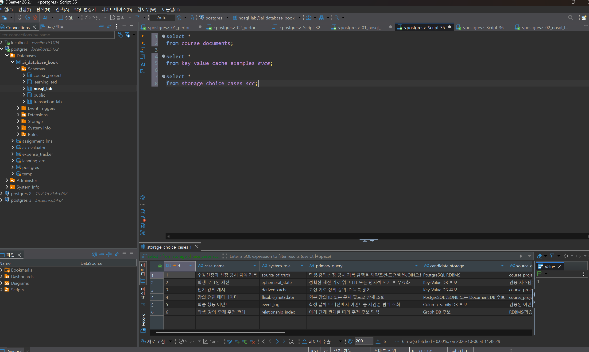
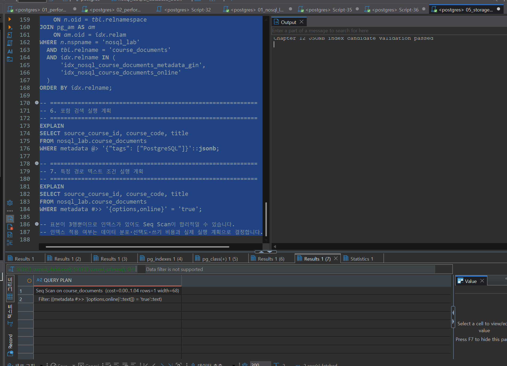
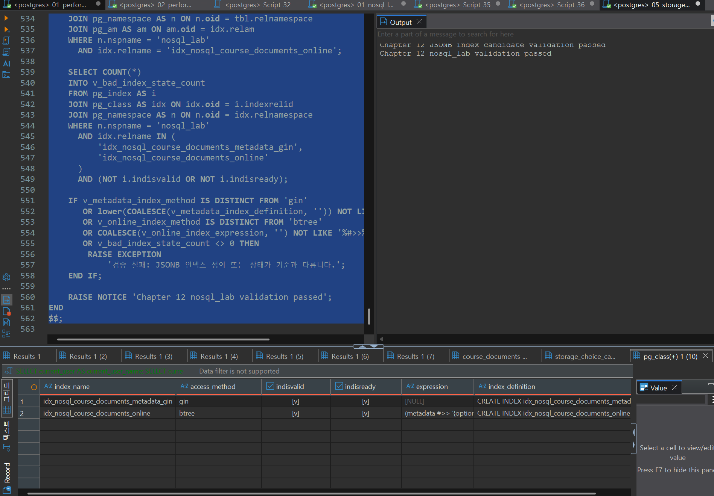

# Chapter 12 확장 실습 답안 템플릿

> **과제:** 조회 패턴으로 RDBMS와 NoSQL 선택하기  
> **사용 방법:** 이 파일을 내려받아 본인의 GitHub 저장소에 `chapter12_answer.md`라는 이름으로 저장한 뒤 실습하면서 바로 작성합니다.  
> **제출 방법:** LMS에는 파일을 직접 업로드하지 않고, **본인 GitHub 저장소의 `chapter12_answer.md` 파일 URL**을 제출합니다.

---

## 제출 전 주의

이 파일과 캡처 화면에는 실제 비밀번호, 전체 DB 접속 URL, API Key, 개인정보를 기록하지 않습니다.

```text
GitHub 계정 또는 별칭: jin-park0115
과제 작성일: 2026-10-06
PostgreSQL 버전: PostgreSQL 18.4
사용한 AI 도구: Claude Code
```

> 이번 장에서는 MongoDB, Redis, Cassandra, Graph DB 같은 별도 서버를 반드시 설치하지 않습니다.  
> 제공된 PostgreSQL `nosql_lab`을 이용해 **원본·파생·캐시·문서·저장소 선택 기준**을 실습합니다.

---

# 1. 시작 환경과 Chapter 07 기준 상태 확인

다음을 실행합니다.

```sql
SELECT current_database();
SELECT current_user;
SELECT current_schema();
SHOW search_path;
```

| 확인 항목 | 실제 결과 | 의미 |
| --- | --- | --- |
| `current_database()` | ai_database_book | 지금 접속해 있는 데이터베이스. 실습 스크립트는 `ai_database_book`을 기대하므로 다르면 사전 검사에서 중단된다 |
| `current_user` | postgres | SQL을 실행하는 접속 계정. 스키마·테이블 생성 권한이 있는지 판단하는 기준이다 |
| `current_schema()` | public | 스키마를 생략한 객체가 만들어지는 기본 위치. 실습 SQL은 `nosql_lab.`처럼 스키마를 명시하므로 public이어도 기존 테이블과 섞이지 않는다 |
| `search_path` | public, "$user" | 스키마 이름 없이 테이블을 찾을 때 탐색하는 순서. 의도치 않은 같은 이름 테이블을 참조하지 않도록 확인한다 |

Chapter 07·08 기준 상태도 확인합니다.

```text
students = 3
instructors = 2
courses = 3
enrollments = 5

전체 recorded_amount = 590000
활성 = 3건 / 340000
취소 제외 = 4건 / 440000
```

### 기준 상태를 유지한 채 별도 `nosql_lab`에서 실습하는 이유

```text
course_project는 Chapter 07·08에서 확정한 Source of Truth(원본) 데이터이고, 학생 3 / 강사 2 /
강의 3 / 신청 5, 금액 590000·340000·440000이라는 기준값은 이후 Chapter의 검증 스크립트가
그대로 전제로 사용한다. JSONB 문서, 캐시, 저장소 선택 사례 같은 실험용 데이터를 원본 테이블에
섞어 넣으면 기준값이 틀어지고, 실험 중 UPDATE·DELETE 실수가 원본을 되돌릴 수 없이 오염시킬 수 있다.
별도 nosql_lab 스키마에서 실습하면 원본은 읽기만 하고(source_course_id로 매핑만 참조),
실험 데이터는 필요하면 스키마 단위로 정리할 수 있어 원본과 파생 데이터의 경계를 지킬 수 있다.
```

---

# 2. 온라인 강의 데이터의 시스템 역할 분류

다음 데이터를 분류합니다.

| 데이터 | 시스템 역할 | Source of Truth 여부 | 잃어버리면 재구축 가능? | 이유 |
| --- | --- | --- | --- | --- |
| 수강신청 | Source of Truth | O | X | 누가 어떤 강의를 언제 신청·취소했는지에 대한 유일한 원본 기록이다. 다른 데이터에서 역으로 만들어낼 수 없으므로 트랜잭션과 백업으로 보호해야 한다 |
| 신청 당시 금액 | Source of Truth | O | X | `recorded_amount`는 신청 시점의 금액을 확정해 기록한 값이다. 이후 강의 가격이 바뀌면 현재 가격으로 다시 계산할 수 없으므로 원본으로 보존해야 한다 |
| 로그인 세션 | Ephemeral State | X | O (재로그인) | 짧은 시간 동안만 유효한 임시 상태다. 잃어버려도 사용자가 다시 로그인하면 새로 만들어지므로 TTL이 있는 Key-Value 저장소에 적합하다 |
| 인기 강의 TOP 3 | Derived Cache | X | O (집계 재실행) | 수강신청 원본을 집계해 만든 파생 결과다. 캐시를 지워도 원본에서 다시 계산할 수 있고, 잠시 오래된 값이 보여도 치명적이지 않다 |
| 강의 태그/옵션 | Flexible Metadata | △ (해당 속성에 한해 원본) | X (별도 원본이 없다면) | 강의마다 항목이 달라 고정 컬럼으로 두기 어려운 부가 속성이다. JSONB 같은 유연한 구조가 맞지만, 다른 곳에 복사본이 없다면 잃어버렸을 때 복구할 수 없으므로 백업 대상이다 |
| 학습 행동 이벤트 | Event Log | O (발생 사실 기록) | X | 언제 어떤 행동이 일어났는지를 추가만 하는(append-only) 기록이다. 대량으로 쌓이고 시간 범위 조회가 많으며, 지나간 이벤트는 다시 발생시킬 수 없으므로 유실되면 복구할 수 없다 |
| 추천 관계 | Relationship Index | X | O (원본에서 재계산) | 수강신청·학습 이벤트를 바탕으로 “이 강의를 들은 사람이 들은 강의” 같은 관계를 미리 계산한 인덱스다. 원본에서 다시 만들 수 있는 파생 데이터다 |

사용 가능한 역할 예:

```text
Source of Truth
Derived Cache
Ephemeral State
Flexible Metadata
Event Log
Relationship Index
```

### 시스템 역할별 의미 정리

| 역할 | 의미 | 특징 | 잃어버리면? | 어울리는 저장 방식 예 |
| --- | --- | --- | --- | --- |
| Source of Truth | 비즈니스 사실을 최종적으로 판단하는 유일한 원본 데이터 | 정확성·일관성이 최우선이다. 트랜잭션, 제약조건, 백업, 접근 통제가 필요하다 | 복구 불가 (백업으로만 복구) | RDBMS (PostgreSQL 테이블) |
| Derived Cache | 원본을 집계·가공해 빠르게 읽으려고 만든 복사본 | 조회 속도가 목적이고 잠깐 오래된 값(stale)은 허용한다. TTL·갱신 정책이 필요하다 | 원본에서 다시 계산해 재구축 가능 | Key-Value (Redis 등), 집계 테이블 |
| Ephemeral State | 짧은 시간만 의미가 있는 임시 상태 (세션, 인증 코드, 장바구니 임시값 등) | 만료 시간(TTL)이 핵심이다. 오래 보관할 필요가 없다 | 사용자가 다시 로그인하거나 다시 요청하면 새로 생성 | Key-Value (TTL 지원) |
| Flexible Metadata | 항목마다 구조가 달라 고정 컬럼으로 두기 어려운 부가 속성 (태그, 옵션 등) | 스키마 변경 없이 속성을 추가할 수 있다. 대신 형식 검증과 조회 조건 관리가 필요하다 | 다른 곳에 원본이 없다면 복구 불가 | PostgreSQL JSONB, Document DB |
| Event Log | "언제 무슨 일이 있었는지"를 시간 순으로 추가만 하는(append-only) 기록 | 수정하지 않고 계속 쌓인다. 양이 많고 시간 범위 조회와 분석이 중심이다 | 이미 일어난 사건은 다시 만들 수 없어 복구 불가 | 로그 테이블, Column-Family, 이벤트 스트림 |
| Relationship Index | 엔티티 사이의 연결(추천, 팔로우, 선수강 관계 등)을 탐색하기 쉽게 정리한 구조 | 여러 단계 관계를 따라가는 조회에 강하다. 보통 원본에서 계산해 만든다 | 원본에서 다시 계산해 재구축 가능 | Graph DB, 관계 테이블 |

### Source of Truth와 파생 저장소를 구분해야 하는 이유

```text
두 저장소에 서로 다른 값이 들어 있을 때 어느 쪽을 믿고 어느 쪽을 고칠지 미리 정해 두지 않으면
불일치가 생겼을 때 판단할 기준이 없다. 원본은 유실되면 복구할 수 없으므로 트랜잭션·제약조건·
백업·접근 통제를 엄격하게 적용해야 하고, 파생 저장소(캐시·추천 인덱스 등)는 원본에서 다시
만들 수 있으므로 약간의 지연이나 유실을 허용하는 대신 빠른 조회에 맞춰 설계할 수 있다.
이 구분이 있어야 저장소별로 일관성 수준, 동기화 방식, 장애 시 fallback, 재구축 절차를 다르게 정할 수 있고,
캐시를 원본처럼 취급해 잘못된 값이 굳어지는 사고를 막을 수 있다.
```

---

# 3. 저장소보다 먼저 조회·쓰기 패턴 정의

최소 6개의 읽기/쓰기 문장을 작성합니다.

| ID | 읽기/쓰기 문장 | 키/조건 | 정렬/범위 | 예상 빈도 | 일관성 요구 | 함께 원자적으로 맞아야 하는 데이터 |
| --- | --- | --- | --- | --- | --- | --- |
| Q01 | (쓰기) 학생이 강의를 수강신청하면 신청 행과 신청 당시 금액을 기록한다 | `student_id`, `course_id` | 없음 (단건 INSERT) | 신청 기간에 높음 | 강한 일관성 (즉시 반영, 중복 신청 금지) | 신청 행 + `recorded_amount` + 좌석 수 차감 |
| Q02 | (읽기) 학생이 내 수강 목록을 신청일 최신순으로 조회한다 | `student_id = ?` | `enrolled_at DESC` | 매우 높음 | 강한 일관성 (방금 신청한 강의가 바로 보여야 함) | 없음 (읽기 전용) |
| Q03 | (읽기) 요청마다 로그인 세션을 정확한 키로 확인한다 | `student:{id}:session` | 없음 (정확 키 조회) | 매우 높음 (모든 요청) | 만료 시각만 정확하면 됨 | 없음 |
| Q04 | (읽기) 메인 화면에서 인기 강의 TOP 3를 보여준다 | 고정 키 `course:popular:v1:top3` | 신청 수 내림차순 상위 3개 | 매우 높음 | 최종 일관성 (몇 분~1시간 지연 허용) | 없음 (원본에서 재계산) |
| Q05 | (읽기) 태그·옵션 조건(예: online = true)으로 강의를 검색한다 | `metadata @> '{"options":{"online":true}}'` | 강의 ID 순 | 중간 | 약간의 지연 허용 | 없음 |
| Q06 | (쓰기/읽기) 학습 행동 이벤트를 계속 추가하고, 학생·기간별로 조회한다 | `student_id`, 날짜 파티션 | `occurred_at` 시간 범위 | 쓰기 매우 높음, 읽기 중간 | 유실만 없으면 됨 (분석은 지연 허용) | 없음 (append-only) |

### 기술 이름보다 조회 패턴을 먼저 작성해야 하는 이유

```text
저장소마다 잘하는 접근 방식이 다르다. Key-Value는 정확한 키 조회, Document는 문서 단위 읽기,
Column-Family는 파티션 키와 시간 범위 조회, Graph는 여러 단계 관계 탐색에 강하다.
어떤 키로 몇 번 읽고 쓰는지, 정렬과 범위가 무엇인지, 어느 데이터가 함께 원자적으로 맞아야 하는지
먼저 정하지 않으면 기술 이름을 보고 고르게 되고, 실제 요구와 맞지 않아 성능도 일관성도 놓친다.
예를 들어 Q01처럼 신청 행·금액·좌석 수가 한 트랜잭션으로 맞아야 하는 패턴은 RDBMS가 맞고,
Q03·Q04처럼 고정 키로 빠르게 읽고 지연을 허용하는 패턴만 Key-Value 후보가 된다.
즉 조회 패턴이 먼저 있어야 "PostgreSQL로 충분한지"와 "새 저장소가 필요한지"를 근거로 판단할 수 있다.
```

---

# 4. `nosql_lab` 생성과 기준 데이터 확인

다음 파일을 순서대로 실행합니다.

```text
code/chapter12/01_nosql_lab_schema.sql
code/chapter12/02_nosql_lab_seed.sql
```

## 4-1. 기준 행 수

| 테이블 | 기대 행 수 | 실제 행 수 | 일치? |
| --- | ---: | ---: | --- |
| `nosql_lab.course_documents` | 3 | 3 | O |
| `nosql_lab.key_value_cache_examples` | 4 | 4 | O |
| `nosql_lab.storage_choice_cases` | 6 | 6 | O |

## 4-2. 원본 매핑 확인

| source_course_id | 기대 course_code | 실제 title | 원본과 일치? |
| ---: | --- | --- | --- |
| 301 | `COURSE-301` | 데이터베이스 입문 | O |
| 302 | `COURSE-302` | 정규화 실습 | O |
| 303 | `COURSE-303` | 파이썬 데이터 분석 | O |

### 증거 화면

권장 경로:

```text
assignments/chapter12/images/step04_nosql_lab.png
```



`ai_database_book` DB의 `nosql_lab` 스키마에서 세 테이블을 조회했다. 화면의 `storage_choice_cases`는
6행이고, 역할이 source_of_truth / ephemeral_state / derived_cache / flexible_metadata / event_log /
relationship_index로 하나씩 들어 있다. 2번에서 분류한 6가지 역할과 같은 구성이다.
이 중 후보 저장소가 `PostgreSQL RDBMS`인 사례는 원본(수강신청과 신청 당시 금액) 1건이고,
나머지는 Key-Value·JSONB/Document·Column-Family·Graph DB "후보"로만 기록되어 있다.

---

# 5. PostgreSQL JSONB 혼합 문서 실습

다음을 실행합니다.

```text
code/chapter12/03_document_jsonb_queries.sql
```

## 5-1. 일반 컬럼과 JSONB 영역 구분

| 항목 | 일반 컬럼 / JSONB | 그렇게 둔 이유 |
| --- | --- | --- |
| `source_course_id` | 일반 컬럼 | 원본 `course_project.courses.id`와 연결하는 키다. 원본 대조와 재구축의 기준이므로 타입과 NOT NULL을 보장해야 한다 |
| `course_code` | 일반 컬럼 | 문서를 식별하는 안정된 업무 키(`COURSE-301`)다. 정확 조회와 UPDATE 조건에 쓰인다 |
| `title` | 일반 컬럼 | 모든 강의에 반드시 있는 핵심 값이고 원본과 일치해야 하므로 컬럼으로 두고 대조한다 |
| `level` | 일반 컬럼 | 모든 강의에 있고 자주 필터링·정렬하는 값이다. 허용 값 검증(CHECK)이 필요하다 |
| `document_version` | 일반 컬럼 | 낙관적 잠금에 쓰는 정수 버전이다. `WHERE document_version = ?` 조건과 `>= 1` 제약이 필요하다 |
| `tags` | JSONB | 강의마다 개수와 값이 다른 배열이다. 고정 컬럼으로 만들기 어렵고 `@>` 포함 검색이 편하다 |
| `options` | JSONB | online·certificate처럼 강의마다 추가·삭제될 수 있는 가변 옵션이다 |
| `instructor_snapshot` | JSONB | 상세 화면 표시용으로 원본 강사 정보를 복사한 파생 스냅샷이다. 원본이 아니므로 구조를 유연하게 둔다 |

### `level`을 JSONB 안에 넣지 않고 일반 컬럼으로 둔 이유

```text
level은 모든 강의에 반드시 있는 안정된 속성이고, 원본 course_project.courses.level과
일치해야 하며, 목록 필터·정렬에 자주 쓰인다. 일반 컬럼으로 두면 NOT NULL·CHECK 제약으로
허용 값을 DB가 보장하고, 원본과 단순 비교로 대조할 수 있으며, 일반 B-tree 인덱스와
통계를 그대로 쓸 수 있다. JSONB 안에 두면 키 누락·오타·타입 불일치를 DB가 막지 못하고
조회할 때마다 경로 연산자와 형 변환이 필요해진다. 즉 "구조가 고정된 핵심 값은 컬럼,
강의마다 달라지는 부가 속성만 JSONB"가 기준이다.
```

### `instructor_snapshot`이 Source of Truth가 아닌 이유

```text
instructor_snapshot은 seed 시점에 course_project.instructors에서 이름·전문 분야를 복사해 넣은
값(copied_at 포함)이다. 강사 정보가 바뀌는 곳은 원본 instructors 테이블이고, 스냅샷은
자동으로 따라 바뀌지 않는다. 그래서 두 값이 다르면 항상 원본이 맞고, 스냅샷은
source_instructor_id로 원본과 대조해 다시 만들면 된다. 화면 표시를 빠르게 하려는 파생 복사본이므로
Source of Truth가 아니라 원본에서 재구축 가능한 데이터다.
```

## 5-2. JSONB 조회 결과

```text
사용한 JSONB 조건: metadata @> '{"tags": ["PostgreSQL"]}' (태그 포함 검색)
                  metadata #>> '{options,online}' = 'true' (특정 경로 값 비교)
예상 결과: 태그 조건 → COURSE-301 1행 / online 조건 → COURSE-301, COURSE-302 2행
실제 결과: 태그 조건 → 301 / COURSE-301 / 데이터베이스 입문 1행
          online 조건 → 301 데이터베이스 입문, 302 정규화 실습 2행 (303 파이썬 데이터 분석은 online=false라 제외)
```

```sql
-- 태그 포함 검색
SELECT source_course_id, course_code, title
FROM nosql_lab.course_documents
WHERE metadata @> '{"tags": ["PostgreSQL"]}'::jsonb;

-- 특정 JSON 경로 조건
SELECT source_course_id, course_code, title
FROM nosql_lab.course_documents
WHERE metadata #>> '{options,online}' = 'true'
ORDER BY source_course_id;
```

## 5-3. 낙관적 잠금 관찰

```text
읽은 document_version: 1 (COURSE-301, certificate = true)
UPDATE 조건에 사용한 version: WHERE course_code = 'COURSE-301' AND document_version = 1
예상 영향 행 수: 1
실제 영향 행 수: 1 (NOTICE: Chapter 12 optimistic document update passed inside transaction)
                → 트랜잭션 안에서 certificate = false, document_version = 2 확인
                → ROLLBACK 후 certificate = true, document_version = 1로 복구 확인
```

### 영향 행 수가 0이면 무엇을 의심해야 하나요?

```text
1. 내가 읽은 뒤 다른 사용자(세션)가 먼저 문서를 수정해 document_version이 이미 2 이상으로 올라간 경우
   → 버전 충돌이므로 덮어쓰지 말고 최신 문서를 다시 읽어 변경을 다시 적용하거나 사용자에게 알린다.
2. WHERE 조건의 course_code 오타나 대상 문서가 삭제된 경우
3. metadata -> 'options'가 객체가 아니어서(문서 구조가 바뀜) jsonb_typeof 조건이 거짓이 된 경우
영향 행 수 0은 "오류 없이 성공"이 아니라 "아무것도 바뀌지 않음"이므로 반드시 확인해 예외 처리해야 한다.
```

### 실습에서 ROLLBACK 후 기준 상태를 유지하는 이유

```text
이후 실습 파일(04~07)과 최종 검증 스크립트는 COURSE-301이 certificate = true,
document_version = 1인 상태를 전제로 검사한다. 수정을 COMMIT하면 다시 실행할 때
버전 조건이 맞지 않아 0행이 되고 검증도 실패한다. 실습의 목적은 낙관적 잠금 동작을
관찰하는 것이므로 트랜잭션 안에서 결과만 확인하고 ROLLBACK해 누구나 같은 상태에서
반복 실행할 수 있게 한다.
```

---

# 6. Key-Value 캐시 개념 실습

다음을 실행합니다.

```text
code/chapter12/04_key_value_cache_queries.sql
```

## 6-1. Seed 기준

```text
전체 캐시 = 4
Seed 시점 유효 = 3
Seed 시점 만료 = 1
```

| 항목 | 기대 | 실제 |
| --- | ---: | ---: |
| 전체 | 4 | 4 |
| Seed 시점 유효 | 3 | 3 |
| Seed 시점 만료 | 1 | 1 |

## 6-2. Seed 기준과 현재 시각 기준 차이

```text
현재 유효 캐시 수: 1 (feature:recommendation:v1만 유효 — 만료 정책이 없는 키)
seed 후 1시간이 지나 student:101:session(30분)과 course:popular:v1:top3(1시간)가 모두 만료됨
```

### 현재 유효 건수를 고정 정답으로 사용하면 안 되는 이유

```text
현재 유효 여부는 expired_at > CURRENT_TIMESTAMP로 계산하므로 같은 데이터라도 언제 실행하느냐에
따라 결과가 달라진다. seed 직후에는 3건이지만 30분 뒤에는 세션이 만료되어 2건, 1시간 뒤에는
인기 강의 캐시도 만료되어 1건이 된다. 그래서 재현 가능한 검증 기준은 created_at과 비교한
Seed 시점 기준(4 / 3 / 1)을 쓰고, 현재 기준 값은 관찰 결과로만 기록해야 한다.
```

## 6-3. 정확 키 조회

```text
조회한 키: student:101:session (Seed 기준 유효 조건)
          course:popular:v2:top3 (존재하지 않는 키로 캐시 미스 시뮬레이션)
결과: student:101:session → 1행 ({"student_id": 101, "login_device": "browser", "status": "active"})
     course:popular:v2:top3 → cache_value NULL, cache_status = cache_miss
캐시 미스 여부: student:101:session은 Seed 기준 히트(현재 시각 기준으로는 만료),
              course:popular:v2:top3는 키 버전이 v1과 달라 캐시 미스
```

### Key-Value 제품의 TTL과 eviction을 같은 개념으로 보면 안 되는 이유

```text
TTL 만료(expiration)는 키마다 정해 둔 시간이 지나 그 키가 무효가 되는 것으로, 언제 사라질지
예측할 수 있다. eviction은 메모리가 부족할 때 LRU·LFU 같은 정책에 따라 아직 만료되지 않은 키도
제거하는 것이다. 즉 TTL이 남아 있어도 eviction으로 캐시가 사라질 수 있으므로, 애플리케이션은
"TTL 동안은 반드시 있다"고 가정하면 안 되고 언제든 캐시 미스가 나면 원본에서 다시 읽도록 만들어야 한다.
```

### 이 PostgreSQL 테이블이 실제 Redis 같은 Key-Value DB가 아닌 이유

```text
expired_at은 값을 적어 둔 컬럼일 뿐이고, 시간이 지나도 자동으로 행이 삭제되거나 조회에서
빠지지 않는다. 조회할 때마다 WHERE 조건으로 직접 거르고, 정리도 DELETE를 직접 실행해야 한다.
또한 메모리 기반 저장, eviction 정책, 원자적 INCR·SETNX 같은 명령, 복제·클러스터 구조가 없고
디스크 기반 테이블과 WAL·MVCC를 그대로 거친다. 이 테이블은 키·값·만료·캐시 미스 개념을
관찰하기 위한 시뮬레이션이지 Key-Value DB의 성능과 동작을 대신하지 않는다.
```

---

# 7. 캐시 장애 사고 실험

상황:

```text
PostgreSQL 원본에서는 인기 강의 순위가 변경되었다.
캐시에는 이전 TOP 3가 남아 있다.
```

다음에 답합니다.

```text
신뢰해야 할 원본: course_project.courses + course_project.enrollments (취소 제외 신청 수 집계)
사용자에게 오래된 값을 허용할 수 있는 시간: 최대 1시간 (seed의 TTL 1시간과 같은 기준, 결제·좌석과 무관한 노출 정보)
캐시 갱신 방식: 정기 배치(daily_batch)로 원본을 다시 집계해 갱신하고, 순위에 영향을 주는
               신청·취소가 발생하면 해당 키를 삭제(invalidate)해 다음 조회 때 다시 만든다.
캐시 삭제 후 재생성 방법: 키를 삭제 → 다음 요청에서 캐시 미스 → 원본에서 TOP 3 집계 SQL 실행
                        → 새 버전 키(course:popular:v2:top3)에 TTL과 함께 저장 → 이전 버전 키 폐기
캐시 서버 장애 시 fallback: 캐시를 건너뛰고 PostgreSQL 원본에서 직접 집계해 반환한다.
                          원본 부하가 크면 짧은 시간 동안 고정 기본 목록을 보여준다.
동시 재생성 요청이 몰릴 때의 위험: 캐시가 만료되는 순간 많은 요청이 동시에 미스를 내고 모두
                              원본 집계를 실행해 DB에 부하가 몰린다(cache stampede).
                              → 잠금·요청 병합으로 한 요청만 재생성하고 나머지는 이전 값을 잠시 사용한다.
```

### 캐시가 Source of Truth가 되어서는 안 되는 이유

```text
캐시는 TTL 만료·eviction·장애로 언제든 사라질 수 있고, 원본보다 늦게 갱신되어 오래된 값을 가질 수 있다.
트랜잭션·제약조건·백업이 원본 수준으로 보장되지 않기 때문에, 캐시에만 있는 값을 기준으로
판단하거나 캐시에 쓴 값을 원본으로 되돌려 쓰면 잘못된 값이 확정되고 복구할 근거도 사라진다.
불일치가 생기면 항상 원본이 이기고, 캐시는 원본에서 다시 만들 수 있어야 한다.
```

---

# 8. 저장 방식 선택 사례 검토

다음을 실행합니다.

```text
code/chapter12/05_storage_choice_review.sql
```

각 사례에서 최소 다음 정보를 확인합니다.

| 사례 | system_role | primary_query | 후보 저장소 | consistency | sync 전략 | recovery 전략 | decision_status |
| --- | --- | --- | --- | --- | --- | --- | --- |
| 1 | source_of_truth | 학생·강의·신청 당시 기록 금액을 제약조건·트랜잭션·JOIN으로 처리 | PostgreSQL RDBMS | 강한 무결성과 다중 변경 원자성 필요 | 원본 데이터베이스 내부 트랜잭션으로 처리 | Chapter 11 백업·복원 원칙으로 원본 복구 | adopted |
| 2 | ephemeral_state | 정확한 세션 키로 읽고 TTL 또는 명시적 폐기 후 무효화 | Key-Value DB 후보 | 세션 생성 직후 읽기와 만료·폐기 정책이 중요 | 세션 생성·폐기 이벤트와 TTL 정책 | 원본 인증 상태 확인 후 세션 재발급 | poc_planned |
| 3 | derived_cache | 고정 키로 상위 강의 ID 목록 읽기 | Key-Value DB 후보 | 일시적으로 오래된 값 허용 가능 | 배치·변경 이벤트 갱신과 캐시 미스 재생성 | 원본 집계로 키 재생성, 오래된 버전 폐기 | poc_planned |
| 4 | flexible_metadata | 원본 강의 ID 또는 문서 필드로 상세 조회 | PostgreSQL JSONB 또는 Document DB 후보 | 핵심 제목·난이도는 원본과 일치, 부가 정보는 지연 가능 | 원본 변경 이벤트·문서 버전·주기적 대조 | source_course_id로 원본 대조 후 문서 재구축 | candidate |
| 5 | event_log | 학생·날짜 파티션에서 이벤트를 시간순 범위 조회 | Column-Family DB 후보 | 중복·늦은 도착·재처리 허용 범위 정의 필요 | event_id 멱등성·실패 대기열·분석 파이프라인 | 원본 이벤트 보관본에서 파티션 재생성 | hold |
| 6 | relationship_index | 여러 단계 관계를 따라 추천 후보 탐색 | Graph DB 후보 | 원본보다 지연된 파생 관계 허용 | 변경 이벤트·주기적 재구축·대조 작업 | 원본에서 전체 관계 인덱스 재생성 | candidate |

결정 상태:

```text
candidate
poc_planned
hold
adopted
rejected
```

### 후보 저장소와 실제 채택을 구분해야 하는 이유

```text
"Key-Value DB 후보"는 조회 패턴상 맞을 수도 있다는 가설일 뿐, 실제 데이터 규모·지연·장애 복구·
운영 비용을 검증한 결과가 아니다. 후보를 바로 채택으로 기록하면 검증 없이 새 저장소가 늘어나고
동기화·백업·보안 책임이 생긴다. candidate → poc_planned → adopted/rejected처럼 단계를 나눠
PoC 성공 기준을 통과한 것만 채택해야, 결정의 근거와 아직 열려 있는 판단을 구분해 관리할 수 있다.
```

### 현재 데이터에서 `adopted`가 PostgreSQL 원본 1건뿐인 이유를 자신의 말로 설명

```text
지금 실제로 운영되고 검증까지 끝난 저장소는 course_project를 담고 있는 PostgreSQL뿐이다.
수강신청과 신청 당시 금액은 여러 변경이 원자적으로 맞아야 하는 원본이라 RDBMS가 이미 정답이고,
Chapter 07~11에서 제약조건·트랜잭션·백업 복원까지 확인했다. 반면 세션·인기 캐시·메타데이터·
이벤트·추천 관계는 아직 PoC를 하지 않았거나(poc_planned), 조회 패턴과 규모가 확정되지 않았다(candidate, hold).
검증하지 않은 저장소를 채택하지 않았기 때문에 adopted가 원본 1건만 남은 것이다.
```

---

# 9. 저장 모델 비교표

제품 이름보다 저장 모델을 비교합니다.

| 후보 | 잘 맞는 접근 패턴 | 트랜잭션/일관성 고려 | 재구축 가능성 | 운영·보안·백업 부담 | 현재 판단 |
| --- | --- | --- | --- | --- | --- |
| PostgreSQL RDBMS | 여러 테이블 JOIN, 제약조건이 필요한 쓰기, 집계 | ACID 트랜잭션, PK·FK·CHECK로 강한 일관성 | 원본이므로 백업으로만 복구 | 이미 운영 중이라 추가 부담 없음 | adopted (원본) |
| PostgreSQL JSONB | 가변 속성 포함 검색(`@>`), 특정 경로 조회 | 같은 DB 트랜잭션 안에서 처리, 단 JSON 내부 구조는 앱이 검증 | 원본 컬럼에서 파생된 부분은 재구축 가능 | 기존 DB 안이라 낮음, 문서 스키마 버전 관리 필요 | 부가 메타데이터에 우선 적용 |
| Key-Value | 정확한 키 조회, TTL 기반 세션·캐시 | 키 단위 원자성만, 원본과는 최종 일관성 | 캐시·세션은 원본에서 재생성 가능 | 새 서버, 메모리·eviction·장애 fallback·접근 통제 필요 | poc_planned (세션·인기 캐시) |
| Document | 문서 한 건 단위 읽기·쓰기, 구조가 자주 바뀌는 데이터 | 문서 단위 원자성, 여러 문서 간 일관성은 약함 | 원본 대조 키가 있으면 재구축 가능 | 새 DB 운영, 백업·스키마 마이그레이션 부담 | candidate (JSONB로 충분한지 먼저 확인) |
| Column-Family | 파티션 키 + 시간 범위의 대량 쓰기·조회 | 조정 가능한 일관성, JOIN·트랜잭션 제한 | 이벤트 보관본이 있으면 재생성 가능 | 클러스터 운영, 파티션 설계·핫스팟 관리 부담 큼 | hold (규모 미확정) |
| Graph | 여러 단계 관계 탐색(추천, 경로) | 원본보다 지연된 파생 관계 허용 | 원본에서 전체 재구축 가능 | 새 DB, 동기화 파이프라인과 재구축 시간 관리 | candidate (재귀 CTE·JOIN과 비교 필요) |

### “NoSQL은 항상 더 빠르다”가 잘못된 설명인 이유

```text
속도는 저장소 종류가 아니라 "조회 패턴과 저장 구조가 맞는가"로 결정된다. Key-Value는 정확한 키 조회가
빠르지만 조건 검색·집계·JOIN은 못 하거나 느리고, Column-Family는 파티션 키에 맞는 범위 조회만 빠르다.
반대로 PostgreSQL도 적절한 인덱스가 있으면 대부분의 조회가 충분히 빠르다. 또 NoSQL은 일관성·트랜잭션을
일부 포기해 속도를 얻는 경우가 많고, 원본과의 동기화·네트워크 왕복이 추가되면 전체 응답은 오히려
느려질 수 있다. 측정 없이 "항상 빠르다"고 말하는 것은 근거 없는 일반화다.
```

### 저장소가 하나 추가될 때 새로 생기는 운영 책임 최소 5개

```text
1. 원본과의 동기화: 변경 전파 방식, 지연 허용 범위, 불일치 탐지와 대조 작업
2. 백업·복구: 별도 백업 정책, 복구 절차, 원본에서의 재구축 시간 검증
3. 보안·접근 통제: 계정·권한, 네트워크 노출 차단, 암호화, 비밀번호·키 관리
4. 모니터링·장애 대응: 메모리·디스크·지연 지표, 알림, 장애 시 fallback 경로
5. 버전 업그레이드·패치와 용량 관리, 그리고 팀이 새 기술을 학습·운영할 인력과 비용
```

---

# 10. JSONB 인덱스 후보 관찰

다음을 실행합니다.

```text
code/chapter12/06_jsonb_index_candidates.sql
```

본문 후보:

```text
metadata @> ...
→ GIN 후보

metadata #>> '{options,online}' = 'true'
→ 표현식 B-tree 후보
```

## 10-1. 생성된 인덱스

| 인덱스 | 대상 표현식/컬럼 | 대응 조회 | 실제 정의 확인 |
| --- | --- | --- | --- |
| `idx_nosql_course_documents_metadata_gin` | `metadata` 전체 (GIN, 기본 `jsonb_ops`) | `metadata @> '{"tags": ["PostgreSQL"]}'`, `metadata ? 'instructor_snapshot'` | `CREATE INDEX idx_nosql_course_documents_metadata_gin ON nosql_lab.course_documents USING gin (metadata)` |
| `idx_nosql_course_documents_online` | `(metadata #>> '{options,online}')` (표현식 B-tree) | `metadata #>> '{options,online}' = 'true'` | `CREATE INDEX idx_nosql_course_documents_online ON nosql_lab.course_documents USING btree ((metadata #>> '{options,online}'::text[]))` |



두 인덱스를 만든 뒤 정의 검증에서 `Chapter 12 JSONB index candidate validation passed`가 출력되었다.
그러나 `metadata #>> '{options,online}' = 'true'` 조건의 실행 계획은
`Seq Scan on course_documents (cost=0.00..1.04 rows=1 width=68)` + `Filter`로 나왔다.
인덱스가 있어도 3행짜리 테이블에서는 순차 스캔이 더 싸다고 플래너가 판단한 결과다.

### 데이터가 3행뿐이라 인덱스가 있어도 Seq Scan이 합리적일 수 있는 이유

```text
3행은 테이블 전체가 한 페이지 안에 들어가므로 순차 스캔은 페이지 하나만 읽으면 끝난다.
인덱스를 쓰면 인덱스 페이지를 읽은 뒤 다시 테이블 페이지를 읽어야 해서 오히려 I/O가 늘어난다.
플래너는 통계로 비용을 비교해 더 싼 Seq Scan을 고르는 것이 정상이다. 이번 실습은 성능 향상을 증명하는
것이 아니라 조회 형태에 맞는 인덱스 구조를 확인하는 것이고, 실제 적용은 데이터가 충분히 많고
선택도가 높을 때 EXPLAIN ANALYZE로 다시 판단해야 한다.
```

### `jsonb_ops`와 `jsonb_path_ops`를 무조건 같은 것으로 보면 안 되는 이유

```text
기본 jsonb_ops는 키와 값을 각각 인덱싱해 @>, ?, ?|, ?&, @?, @@ 등 여러 연산자를 지원한다.
jsonb_path_ops는 경로+값을 해시로 묶어 인덱싱하므로 크기가 더 작고 @> 포함 검색이 빠를 수 있지만,
? 같은 키 존재 연산자는 지원하지 않는다. 그래서 metadata ? 'instructor_snapshot' 같은 조회가 있다면
jsonb_path_ops 인덱스는 쓰이지 않는다. 어떤 연산자로 조회하는지 확인하고 연산자 클래스를 골라야 한다.
```

---

# 11. 최종 자동 검증

다음을 실행합니다.

```text
code/chapter12/07_nosql_lab_validation.sql
```

기대 메시지:

```text
Chapter 12 nosql_lab validation passed
```

```text
실제 검증 메시지: NOTICE: Chapter 12 nosql_lab validation passed
```

검증되는 주요 내용:

```text
Chapter 07 기준 상태 유지
nosql_lab = 3 / 4 / 6
강의 301~303 원본 매핑
instructor_snapshot 원본 대조
JSONB 구조와 document_version 기준 유지
Seed 캐시 = 4 / 3 / 1
저장소 선택 근거 공백 0
adopted 사례 1
JSONB 인덱스 정의
```

### 자동 검증이 통과해도 저장소 선택이 자동으로 정답이 되는 것은 아닌 이유

```text
검증 스크립트는 행 수, 원본 매핑, JSON 구조, 인덱스 정의처럼 "실습 데이터가 기준대로 만들어졌는지"만
확인한다. 실제 서비스의 데이터 규모, 트래픽, 지연 허용 범위, 장애 시 복구 시간, 운영 인력과 비용은
검증하지 않는다. 검증 통과는 실습 환경이 올바르다는 뜻일 뿐이고, 어떤 저장소를 채택할지는
조회 패턴과 PoC 측정 결과로 따로 판단해야 한다.
```

### 증거 화면

권장 경로:

```text
assignments/chapter12/images/step11_validation.png
```



`07_nosql_lab_validation.sql` 전체 실행 결과 Output에 `Chapter 12 nosql_lab validation passed`가 출력되었다.
처음 실행에서는 `constraints=25` 기준에 대해 `actual=51`로 실패했는데, PostgreSQL 18부터 NOT NULL도
`pg_constraint`(contype = 'n')에 기록되어 NOT NULL 26개가 함께 세어졌기 때문이다.
검증 쿼리에 `AND contype <> 'n'`을 추가해 NOT NULL을 제외하자 25개로 기준과 일치했고 검증이 통과했다.
아래 결과 탭에서 GIN·B-tree 인덱스 2개가 모두 `indisvalid`, `indisready` = true인 것도 확인했다.

---

# 12. 개인 프로젝트의 데이터 역할 분류

Chapter 07부터 발전시킨 개인 프로젝트를 사용합니다.

최소 6개 데이터 항목을 분류합니다.

개인 프로젝트: Chapter 07부터 설계한 좌석 예약 서비스 (members / seats / staff / reservations)

| 데이터 | 시스템 역할 | Source of Truth? | 대표 조회/쓰기 | 트랜잭션 필요? | 재구축 가능? | 저장소 후보 |
| --- | --- | --- | --- | --- | --- | --- |
| 좌석 예약 (`reservations`, 예약금 스냅샷 포함) | Source of Truth | O | 좌석·시간대 이중예약 확인 후 INSERT, 회원별 예약 목록 조회 | O (좌석 잠금 + INSERT 원자성) | X | PostgreSQL RDBMS |
| 회원·좌석·직원 정보 (`members`, `seats`, `staff`) | Source of Truth | O | ID로 단건 조회, 예약 시 FK 참조 | O (FK·CHECK) | X | PostgreSQL RDBMS |
| 로그인 세션 | Ephemeral State | X | 요청마다 세션 키 정확 조회, 로그아웃 시 폐기 | X | O (재로그인) | Key-Value 후보 (현재는 앱 세션으로 충분) |
| 시간대별 남은 좌석 현황 | Derived Cache | X | 예약 화면에서 날짜·시간별 빈 좌석 수 조회 | X | O (reservations 집계) | PostgreSQL 집계 쿼리, 트래픽이 크면 Key-Value 캐시 |
| 좌석 부가 속성 (콘센트, 창가, 모니터 등) | Flexible Metadata | △ (해당 속성의 원본) | 옵션 조건으로 좌석 검색 | X | X (백업 필요) | PostgreSQL JSONB |
| 입장·퇴장 기록 | Event Log | O (발생 사실) | append-only INSERT, 회원·기간별 이용 기록 조회 | X (단건 INSERT) | X | PostgreSQL 로그 테이블 (날짜 파티션 검토) |

---

# 13. 개인 프로젝트 저장 전략 결정

## 13-1. Source of Truth

```text
내 프로젝트의 Source of Truth: PostgreSQL의 members, seats, staff, reservations 테이블
그 이유: 좌석 예약은 "같은 좌석·시간대에 활성 예약이 없음을 확인"과 "예약 생성"이 하나의 트랜잭션으로
        묶여야 이중예약을 막을 수 있고, FK·CHECK·부분 고유 인덱스로 무결성을 DB가 보장해야 한다.
        예약과 예약금 스냅샷은 다른 데이터에서 다시 만들 수 없는 원본 기록이다.
```

## 13-2. PostgreSQL만 유지할지, 다른 저장 모델을 검토할지

```text
현재 결정: PostgreSQL만 사용 + 좌석 부가 속성에 JSONB 추가
(Key-Value는 남은 좌석 현황 캐시용 후보로만 기록하고 지금은 도입하지 않음)
```

### 결정 근거

```text
주요 조회 패턴: 좌석·시간대 이중예약 확인과 예약 INSERT, 회원별 예약 목록, 날짜별 빈 좌석 조회
              → 대부분 조건 검색과 JOIN이며 PostgreSQL 인덱스로 처리 가능
일관성 요구: 예약은 강한 일관성 필요(이중예약 금지). 빈 좌석 현황만 몇 초 지연 허용
파생 데이터 여부: 빈 좌석 현황은 reservations에서 계산되는 파생 데이터
재구축 가능 여부: 원본(예약·회원·좌석)은 재구축 불가, 빈 좌석 현황은 집계로 언제든 재계산 가능
운영 부담: 저장소를 하나만 쓰면 동기화·장애 fallback 설계가 필요 없음
백업/복구 부담: PostgreSQL 백업·복원(Chapter 11) 한 가지 절차만 관리하면 됨
현재 팀 역량: 1인 개발로 SQL·PostgreSQL에는 익숙하지만 Redis 등 추가 서버 운영 경험이 없음
```

> **“현재는 PostgreSQL만 사용한다”도 충분히 좋은 결론입니다.**  
> 기술을 추가하지 않는 이유를 조회 패턴·일관성·운영 책임으로 설명할 수 있어야 합니다.

---

# 14. 작은 PoC 설계

후보 저장 방식 하나를 골라 실제 도입 전에 확인할 PoC를 설계합니다.

```text
후보 저장 방식: Key-Value (Redis 계열)
시스템 역할: Derived Cache — 날짜·시간대별 남은 좌석 현황
Source of Truth 여부: X (원본은 PostgreSQL reservations, seats)
키/문서/파티션/관계 구조: 키 = seat_availability:v1:{yyyy-mm-dd}:{time_slot}
                       값 = {"available_seat_ids": [...], "available_count": n, "generated_at": ...}
                       TTL = 60초
대표 읽기 2개: 1) 예약 화면에서 특정 날짜·시간대의 빈 좌석 목록 조회
             2) 메인 화면에서 오늘 각 시간대의 남은 좌석 수 조회
대표 쓰기 1개: 예약 생성·취소 COMMIT 후 해당 날짜·시간대 키 삭제(invalidate)
원본 동기화 방법: 캐시에 직접 값을 쓰지 않고, 원본 COMMIT 후 키 삭제 → 다음 조회에서 원본 집계로 재생성
중복/재시도 시 멱등성 처리: 키 삭제는 여러 번 실행해도 결과가 같음. 재생성은 원본 집계 결과로 덮어쓰기만 함
장애 시 fallback: 캐시 서버 연결 실패 시 PostgreSQL에서 직접 집계해 반환 (예약 자체는 캐시와 무관하게 동작)
재구축 방법: 캐시 전체 삭제 후 조회 요청에 따라 원본 집계로 자연 재생성
보안 요구: 외부 네트워크 노출 금지, 비밀번호 인증, 회원 개인정보는 캐시 값에 넣지 않음
백업/복구 방법: 백업하지 않음. 파생 데이터이므로 유실 시 원본에서 재생성
```

## PoC 성공 기준

최소 5개를 작성합니다.

```text
1. 캐시 히트 시 빈 좌석 조회 응답 시간이 PostgreSQL 직접 집계 대비 의미 있게 줄어든다 (p95 기준 측정)
2. 예약 생성·취소 COMMIT 후 다음 조회에서 변경된 좌석 현황이 반영된다 (불일치 최대 60초 이내)
3. 캐시 서버를 강제로 중지해도 예약·조회 기능이 PostgreSQL fallback으로 정상 동작한다
4. 캐시 키 만료 순간 동시 요청 100건에서도 원본 집계 쿼리가 소수 회로 제한된다 (stampede 방지)
5. 캐시 전체 삭제 후 원본만으로 모든 키가 재생성되고, 원본 집계 결과와 캐시 값이 100% 일치한다
```

---

# 15. AI를 저장소 선택 리뷰어로 활용

## 15-1. 내가 AI에게 제공한 정보

```text
Source of Truth: PostgreSQL members / seats / staff / reservations
반복 조회/쓰기 패턴: 좌석·시간대 예약 INSERT, 회원별 예약 목록, 날짜·시간대별 빈 좌석 조회, 입장·퇴장 기록 INSERT
트랜잭션 범위: 좌석 행 FOR UPDATE 잠금 → 활성 예약 확인 → reservations INSERT를 한 트랜잭션으로
허용 가능한 불일치: 예약 데이터는 0, 빈 좌석 현황 화면은 최대 1분
재구축 가능 여부: 원본 불가, 빈 좌석 현황은 집계로 재생성 가능
운영·보안·백업 조건: 1인 개발, 단일 PostgreSQL 서버, Chapter 11 방식의 pg_dump 백업, 추가 서버 운영 경험 없음
```

## 15-2. AI 제안 검토

| AI 제안 | 수용 / 수정 / 보류 / 거절 | 근거 |
| --- | --- | --- |
| 예약·회원·좌석은 PostgreSQL에 두고 트랜잭션과 제약조건으로 이중예약을 막는다 | 수용 | 여러 변경이 원자적으로 맞아야 하는 원본이고 Chapter 09에서 검증한 방식과 같다 |
| 빈 좌석 현황을 Redis에 캐시하고 예약 시 캐시 값을 직접 감소시킨다 | 수정 | 캐시 값을 직접 수정하면 원본과 어긋날 수 있다. 원본 COMMIT 후 키 삭제 → 재생성 방식으로 바꿨다 |
| 좌석 부가 속성을 MongoDB 같은 Document DB로 분리한다 | 거절 | 데이터가 적고 조회도 단순해 PostgreSQL JSONB로 충분하다. 새 DB 운영 부담만 늘어난다 |
| 입장·퇴장 기록을 Cassandra 같은 Column-Family DB에 저장한다 | 보류 | 현재 데이터 규모가 작다. 이벤트가 수백만 건 이상 쌓이고 PostgreSQL 파티션으로 감당이 안 될 때 다시 검토한다 |

### AI가 기술 이름만 보고 추천한 부분이 있었나요?

```text
있었다. "이벤트 로그는 Cassandra", "유연한 속성은 MongoDB"처럼 데이터 종류만 보고 대표 제품을
추천했다. 실제 데이터 규모(좌석 수십 개, 하루 예약 수백 건 수준)나 1인 운영이라는 조건은
고려하지 않았고, 현재 규모에서는 PostgreSQL 테이블과 JSONB로 충분히 처리할 수 있다.
```

### AI가 놓친 동기화·복구·운영 비용이 있었나요?

```text
캐시 값을 예약 때마다 직접 증감하자고 하면서, 트랜잭션이 ROLLBACK되거나 캐시 쓰기가 실패했을 때
원본과 캐시가 어긋나는 문제를 언급하지 않았다. 또 캐시 서버 장애 시 fallback, 캐시 만료 순간의
동시 재생성(stampede), Redis 서버의 보안 설정·모니터링·업그레이드 같은 운영 비용도 빠져 있었다.
```

### AI 제안보다 내가 최종적으로 다르게 판단한 부분

```text
AI는 데이터 역할마다 다른 저장소를 쓰는 구조를 제안했지만, 나는 PostgreSQL 하나에 JSONB만 추가하기로 했다.
Key-Value 캐시는 빈 좌석 조회가 실제로 느려지는지 측정한 뒤 PoC로 확인하는 후보로만 남겼고,
도입하더라도 캐시는 원본에서 재생성만 하고 직접 수정하지 않는 방식으로 바꿨다.
```

---

# 16. 이번 Chapter에서 알게 된 점

다음 문장을 자신의 말로 완성합니다.

```text
1. Source of Truth란 여러 저장소의 값이 서로 다를 때 최종적으로 믿어야 하는, 잃어버리면 다시 만들 수 없는 원본 데이터 이다.

2. 파생 저장소를 추가할 때 반드시 생각해야 할 것은 원본과의 동기화 방법, 허용 가능한 불일치 시간, 장애 시 fallback, 원본에서의 재구축 방법 이다.

3. NoSQL을 선택해야 하는 가장 좋은 이유는 “최신 기술”이 아니라 반복되는 조회·쓰기 패턴이 그 저장 모델에 맞고, 측정으로 이점이 확인되었으며, 늘어나는 운영 책임을 감당할 수 있기 때문 이다.

4. 현재 내 프로젝트에서 가장 적절한 저장 전략은 PostgreSQL을 유일한 Source of Truth로 두고 좌석 부가 속성만 JSONB로 저장하며, 캐시는 측정 후 PoC로 검토하는 것 이다.
```

---

# 17. 핵심 증거 화면

권장 3~4장만 사용합니다.

```text
assignments/chapter12/images/step04_nosql_lab.png
assignments/chapter12/images/step05_jsonb.png
assignments/chapter12/images/step06_cache.png
assignments/chapter12/images/step11_validation.png
```

화면 캡처만 제출하지 않습니다. 반드시 각 결과의 의미를 Markdown에 설명합니다.

---

# 18. GitHub 제출 확인

```bash
git status
git add assignments/chapter12
git commit -m "docs: complete chapter12 assignment"
git push
```

GitHub 웹에서 다음을 확인합니다.

```text
chapter12_answer.md가 정상 표시된다.
이미지가 정상 표시된다.
실제 비밀번호·접속 URL·API Key가 없다.
SQL과 결과 해석이 함께 있다.
개인 프로젝트 저장 전략이 작성되어 있다.
AI 제안에 대한 내 판단이 작성되어 있다.
```

---

# 19. LMS 제출 URL

LMS에는 다음 형태의 **본인 파일 URL 하나**를 제출합니다.

```text
https://github.com/<본인-GitHub-ID>/<본인-저장소>/blob/main/assignments/chapter12/chapter12_answer.md
```

다음을 제출하면 안 됩니다.

```text
교수자 답안 템플릿 URL
본인 저장소 메인 URL
로컬 PC 파일 경로
Raw 파일 주소만 제출
```

---

# 최종 자기 점검

- [v] PostgreSQL 연결과 Chapter 07 기준 상태를 확인했다.
- [v] 원본·파생·캐시·이벤트·관계 인덱스를 구분했다.
- [v] 조회/쓰기 패턴을 최소 6개 작성했다.
- [v] `nosql_lab` 3/4/6 기준을 확인했다.
- [v] 일반 컬럼과 JSONB의 역할 차이를 설명했다.
- [v] 낙관적 잠금의 영향 행 수를 해석했다.
- [v] Seed 캐시 4/3/1과 현재 시각 기준을 구분했다.
- [v] 캐시 장애 시 Source of Truth와 복구 흐름을 설명했다.
- [v] 후보 저장소와 실제 채택을 구분했다.
- [v] JSONB 인덱스 후보를 조회 패턴과 연결했다.
- [v] `07_nosql_lab_validation.sql`을 통과했다.
- [v] 개인 프로젝트의 Source of Truth를 정했다.
- [v] NoSQL이 필요 없다면 그 이유도 설명했다.
- [v] PoC 성공 기준을 작성했다.
- [v] AI 제안을 수용/수정/보류/거절로 판단했다.
- [v] 핵심 캡처를 3~4장 이내로 정리했다.
- [v] GitHub 웹에서 Markdown과 이미지를 최종 확인했다.
- [v] LMS에는 본인 `chapter12_answer.md` URL을 제출한다.